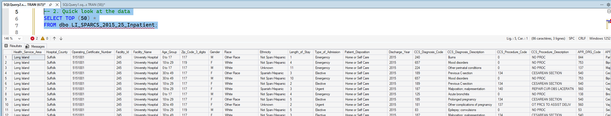

## 🏥 Step 00: SQL Server Setup — SPARCS 2015-25 Inpatient Data

To enable scalable querying and analysis of New York State Long Island Area SPARCS inpatient hospitalization data, I set up a relational data environment using **Microsoft SQL Server** (SQL Server Management Studio 22 - SSMS22).

### ✔️ Steps Completed

#### 1️⃣ Local Database Creation
I created a dedicated SQL Server database to host the SPARCS dataset for controlled querying and further data transformation.  
The SQL code I used is available [here](./00_SQL/00_1.sql).

#### 2️⃣ Secure Import of Public Health Data (CSV → SQL Table)
I imported the 2015 de-identified SPARCS inpatient dataset (339039 rows across 34 columns, ~11,5M entries total) into SQL Server using **SSMS22**.  
During this process, I handled several common ingestion challenges:

- Monetary columns containing `$` and thousand separators  
- ZIP code fields including non-numeric values (e.g., `OOS`)  
- Descriptive hospital and diagnosis fields containing long text  
- Null values in clinical classification fields  

I resolved these by **properly defining column data types and NULL allowance** during the import process to ensure data integrity and successful load.

#### 3️⃣ Corrected System-Generated Table Naming for SQL Compatibility
After import, I identified that the original table name - *HID_SPARCS_De-Identified__2015_20251030* - contained invalid characters (`-`), which caused SQL parsing errors.  
To enforce consistent naming conventions and maintainability, I renamed the table to:

`LI_SPARCS_2015_25_Inpatient`

— a structure that is SQL-safe, readable, and scalable across future yearly datasets.

#### 4️⃣ Validation and Data Quality Checks
I verified:

- Row count after import to ensure complete ingestion  
- Table schema accuracy through inspection in SSMS  
- Queryability via sample `SELECT` statements  

These checks confirmed that the dataset is now fully accessible for downstream transformations, modeling, and visualization.

---

### 📌 Current Status

The dataset is **successfully stored and validated in a SQL Server Database**, ready for the next step: data profiling directly in the SSMS database.