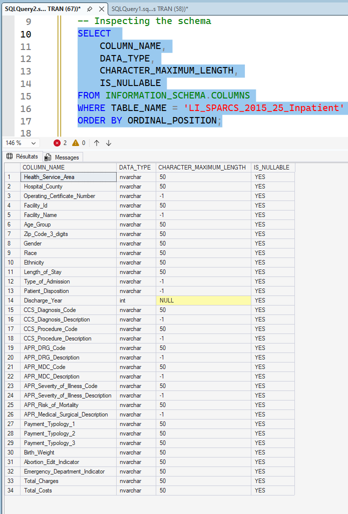

# 00 - Database Creation and Initial Setup

## Purpose

This step establishes the SQL Server foundation for the full analytics pipeline.

It creates the project database, standardizes the source table name for SQL-safe usage, and confirms baseline query readiness before profiling and cleaning.

This is an infrastructure and ingestion-readiness step, not a KPI or modeling step.

---

## Explainability-First Role in the Pipeline

A stable and traceable data foundation is required before any analytical interpretation.

This step ensures:

- A controlled SQL environment exists for all downstream transformations
- Source-table naming is deterministic and reusable across scripts
- Basic ingestion integrity checks are completed before quality diagnostics begin

---

## Scope

### SQL Artifact

- `00_SQL/00_1.sql`

### Evidence Artifacts

- `screenshots/image.png` (row-count validation)
- `screenshots/image-1.png` (schema inspection)
- `screenshots/image-2.png` (queryability check)

### Data Asset

- Source dataset loaded into SQL Server table:
  - `dbo.LI_SPARCS_2015_25_Inpatient`

---

## What Was Executed

`00_SQL/00_1.sql` includes:

- Database creation:
  - `CREATE DATABASE LI_NYHealth;`
- Source-table rename to canonical project naming:
  - from `dbo.HID_SPARCS_De-Identified__2015_20251030`
  - to `dbo.LI_SPARCS_2015_25_Inpatient`

The CSV import itself was completed in SSMS (wizard-driven ingestion), then validated by SQL checks and schema review.

---

## Validation Completed

- Row-count verification after import
- Schema-level inspection in SSMS
- Basic `SELECT` queryability confirmation

These checks establish that the dataset is accessible and operationally ready for profiling.

---

## Output Contract to Step 01

This step delivers a query-ready base table and naming contract consumed by `01_Profiling`:

- Database: `LI_NYHealth`
- Canonical table: `dbo.LI_SPARCS_2015_25_Inpatient`
- Initial ingestion verified for downstream profiling scripts

---

## Position in End-to-End Lifecycle

- `00_DB_Creation`: database and ingestion readiness (this step)
- `01_Profiling`: data quality diagnostics
- `02_Data_Cleaning`: deterministic standardization and fixes
- `03_Analytical_Data_Modeling`: analytical schema design
- `04_Analytical_Validation`: reconciliation and QA
- `05_KPI_Dev`: KPI definition and certification
- `06_PBI_Semantic_Model`: semantic model and governed measures
- `07_Excel_Executive_Analytics`: executive consumption in Excel

---

## Visual Snapshot



---

## Folder Contents

```text
00_DB_Creation/
|-- README.md
|-- screenshots/image.png
|-- screenshots/image-1.png
|-- screenshots/image-2.png
`-- 00_SQL/
    `-- 00_1.sql
```


