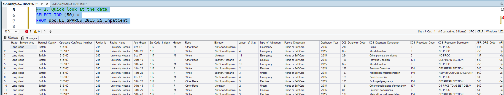
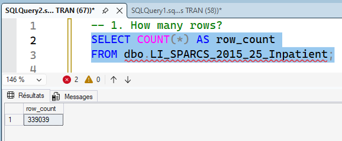

# 00 - Database Creation and Initial Setup

## Purpose

This step establishes the SQL Server foundation for the full analytics pipeline.

It creates the project database, standardizes the source table name for SQL-safe usage, and confirms baseline query readiness before profiling and cleaning.

This is an infrastructure and ingestion-readiness step, not a KPI or modeling step.

---

## Explainability-First Role in the Pipeline

A stable and traceable data foundation is required before any analytical interpretation.

This step ensures:

- A controlled SQL environment exists for all downstream transformations
- Source-table naming is deterministic and reusable across scripts
- Basic ingestion integrity checks are completed before quality diagnostics begin

---

## Scope

### SQL Artifact

- [`00_SQL/00_1.sql`](/00_DB_Creation/00_SQL/00_1.sql)

### Evidence Artifacts

- [`screenshots/row_count_validation.png`](/00_DB_Creation/screenshots/row_count_validation.png) (row-count validation)
- [`screenshots/base_table_queryability_check.png`](/00_DB_Creation/screenshots/base_table_queryability_check.png) (queryability check)

### Data Asset

- Source dataset loaded into SQL Server table:
  - `dbo.LI_SPARCS_2015_25_Inpatient`
  - Original data source:   
    - go to: [https://health.data.ny.gov/Health/Hospital-Inpatient-Discharges-SPARCS-De-Identified](https://health.data.ny.gov/Health/Hospital-Inpatient-Discharges-SPARCS-De-Identified/82xm-y6g8/about_data)
    - Press the blue “Actions” button in the top right corner
    - Select the “Query Data” option.
    - apply a filter to ‘Health Service Area’ setting it to ‘is “Long Island”
    - press the “Apply” button beneath and press the “Export” button in the top right
    - Download the file in the Export Format ‘CSV’:

---

## What Was Executed

[`00_SQL/00_1.sql`](/00_DB_Creation/00_SQL/00_1.sql) includes:

- Database creation:
  - `CREATE DATABASE LI_NYHealth;`
- Source-table rename to canonical project naming:
  - from `dbo.HID_SPARCS_De-Identified__2015_20251030`
  - to `dbo.LI_SPARCS_2015_25_Inpatient`

The CSV import itself was completed in SSMS (wizard-driven ingestion), then validated by SQL checks and schema review.

---

## Validation Completed

- Row-count verification after import
- Schema-level inspection in SSMS
- Basic `SELECT` queryability confirmation

These checks establish that the dataset is accessible and operationally ready for profiling.

---

## Output Contract to Step 01

This step delivers a query-ready base table and naming contract consumed by [`01_Profiling`](/01_Profiling/README.md):

- Database: `LI_NYHealth`
- Canonical table: `dbo.LI_SPARCS_2015_25_Inpatient`
- Initial ingestion verified for downstream profiling scripts

---

## Position in End-to-End Lifecycle

- [`00_DB_Creation`](/00_DB_Creation/README.md): database and ingestion readiness (this step)
- [`01_Profiling`](/01_Profiling/README.md): data quality diagnostics
- [`02_Data_Cleaning`](/02_Data_Cleaning/README.md): deterministic standardization and fixes
- [`03_Analytical_Data_Modeling`](/03_Analytical_Data_Modeling/README.md): analytical schema design
- [`04_Analytical_Validation`](/04_Analytical_Validation/README.md): reconciliation and QA
- [`05_KPI_Dev`](/05_KPI_Dev/README.md): KPI definition and certification
- [`06_PBI_Semantic_Model`](/06_PBI_Semantic_Model/README.md): semantic model and governed measures
- [`07_Excel_Executive_Analytics`](/07_Excel_Executive_Analytics/README.md): executive consumption in Excel

---

## Visual Snapshot

<details>
<summary>Show Screenshots</summary>





</details>

---

## Folder Structure

```text
00_DB_Creation/
|-- README.md
|-- 00_SQL/
|   `-- 00_1.sql
`-- screenshots/   (2 validation images)
```


