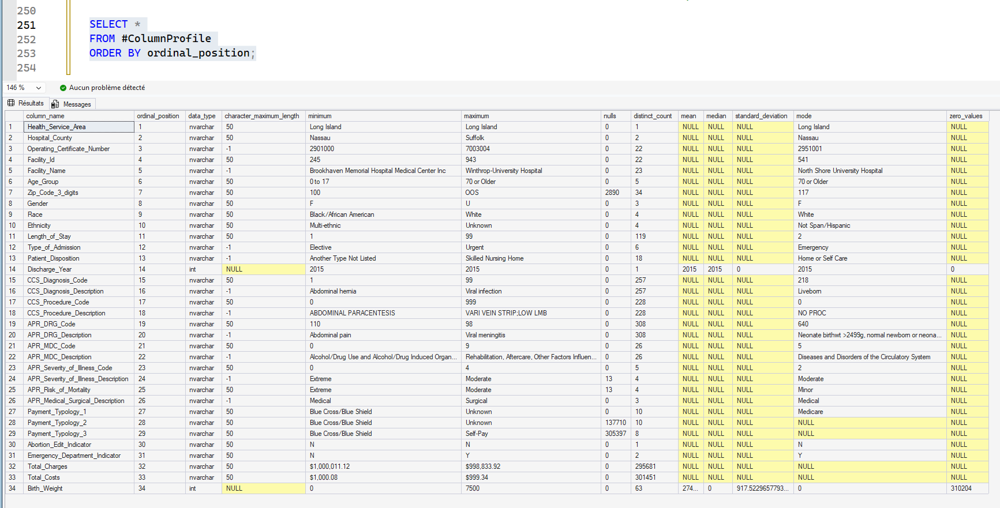

# 01 - Data Profiling

## Purpose

Establishes the source-data quality baseline before cleaning, modeling, and KPI development.

This step is diagnostic only. It does not define KPI logic.

---

## Explainability-First Role

Profiling is a governance gate that identifies issues likely to distort downstream interpretation (clinical, operational, and financial).

Findings are converted into explicit remediation actions for Step 02.

---

## Inputs and Artifacts

Input table:

- `dbo.LI_SPARCS_2015_25_Inpatient`

SQL artifacts:

- `01_SQL/Columns_Profiling.sql`
- `01_SQL/BirthWeight_correction.sql`

Evidence artifact:

- `screenshots/image.png`

---

## Key Findings

- Monetary fields imported as text (`Total_Charges`, `Total_Costs`)
- Geographic placeholders and null patterns in ZIP category inputs
- Inconsistent operational category labels (admission/disposition)
- Missing surrogate encounter identifier at this stage
- Text-width and typing patterns requiring standardization

Birth weight issue was confirmed as a text-typing artifact (lexical max), then corrected with numeric conversion.

---

## Output Contract to Step 02

Step 01 produces a deterministic remediation backlog consumed by `02_Data_Cleaning`:

- Numeric conversion for financial fields
- Category standardization for key operational dimensions
- Unknown/placeholder normalization
- Keying and text-width controls
- Payer grouping readiness

---

## Visual Snapshot

<details>
<summary>Show Screenshots</summary>



</details>

---

## Folder Contents

```text
01_Profiling/
|-- README.md
|-- screenshots/
|   `-- image.png
`-- 01_SQL/
    |-- Columns_Profiling.sql
    `-- BirthWeight_correction.sql
```


