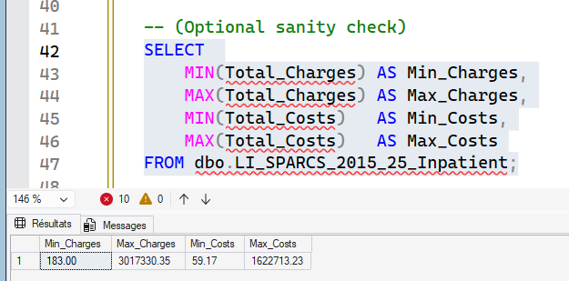

# Step 02 — What We need to Clean and Why

Each of the cleaning steps below connects directly to the issues identified during profiling.  
This ensures the data is 
- medically meaningful, 
- analysis-ready, 
- and aligns with hospital reporting standards.

---

## 1️⃣ Currency Formatting → Convert to DECIMAL  
**Fields Impacted:** `Total_Charges`, `Total_Costs`  
**SQL file:** [here](./02_SQL/2_1_Currency_Formatting.sql) 

These columns included dollar signs ('$') and commas from the original CSV.  
SQL sees those as **text**, meaning:

- You cannot add, average, or compare costs  
- Any financial analysis would be incorrect

➡ Fixing this allows us to calculate **spending**, **profitability**, and **resource utilization**.

---

## 2️⃣ Geographic Anomalies → Standardize ZIP information  
**Field Impacted:** `Zip_Code_3_digits`  
**SQL Sub-Step:** 2.4  

ZIP codes were shortened to 3 digits and included special values like `OOS` (Out-Of-State).  
Without standardization:

- Patients could appear to live “in-state” incorrectly  
- Regional analysis could be misleading  

➡ We now have clear, actionable groups:
- **In-state**
- **Out-of-state**
- **Unknown**

Useful for:
- Hospital service area planning  
- Equity & access reporting  

---

## 3️⃣ Demographic Placeholders → Standardize “Unknown” categories  
**Fields Impacted:** `Race`, `Ethnicity`  
**SQL Sub-Step:** *Coming later in Step 02*  

Some classifications don’t reflect true demographics (e.g., “Unknown”, “Not-Spanish/Hispanic” meaning default rather than patient response).  
Without correction:

- Community health disparities become **misinterpreted**

➡ Standardizing unknown or non-response improves:
- Public health equity monitoring  
- Federal demographic reporting compliance  

---

## 4️⃣ Category Normalization → Cleaner clinical + operational groups  
**Fields Impacted:** `Type_of_Admission`, `Patient_Disposition`  
**SQL Sub-Steps:** 2.5, 2.6  

Original categories were too detailed or inconsistent:  
Examples: “Urgent”, “EMERGENCY”, “Elective”, “Home or Self Care”, “Skilled Nursing Home”  

➡ Grouping into clearer, industry-standard buckets supports:
- ED vs Elective performance tracking  
- Discharge planning quality measures  
- Readmission & mortality analytics  

---

## 5️⃣ Text Overflow → VARCHAR(Max) only when needed  
**Fields Impacted:** Description fields (Diagnosis/Procedure descriptions, etc.)  
**SQL Sub-Step:** Will be applied in schema optimization  

Some text fields were set to unlimited length (`-1`), which:

- Slows down indexing and storage  
- Hurts dashboard query speed  

➡ We will trim them to realistic limits for efficiency and performance.

---

## 6️⃣ Missing Primary Key → Generate Encounter ID  
**Fields Impacted:** All rows  
**SQL Sub-Step:** 2.3  

The dataset did not include a unique encounter identifier.  
This makes it impossible to:

- Track a patient visit consistently  
- Create proper relationships for BI modeling  

➡ A surrogate key (`Encounter_ID`) enables:
- Fact/Dimension modeling
- Traceability and de-duplication

---

## 7️⃣ Payer Granularity → Group Payment Typology codes  
**Fields Impacted:** `Payment_Typology_1`  
**SQL Sub-Step:** 2.7  

There are many insurer codes with similar meaning  
(e.g., multiple variations of commercial insurance).

➡ Grouping makes financial analysis more insightful:
- Medicare vs Medicaid vs Commercial vs Self-Pay  
- Reimbursement rate & cost burden comparisons  

---

# Deliverable Result from Step 02

> **A clean, structured analytical dataset with consistent numeric types, standardized categories, and a primary key — ready for star schema modeling and BI consumption.**
