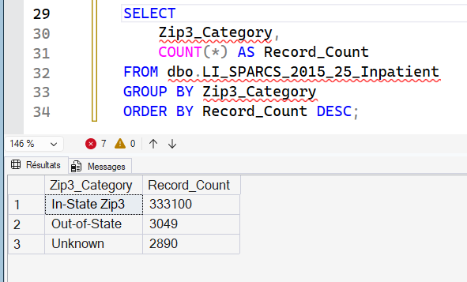
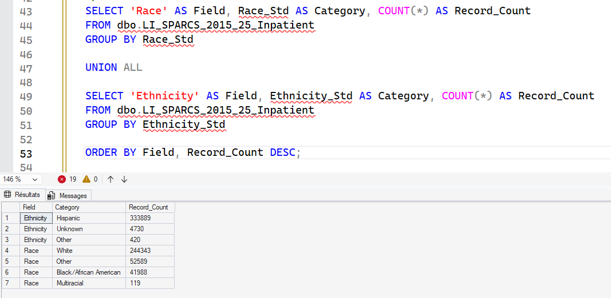
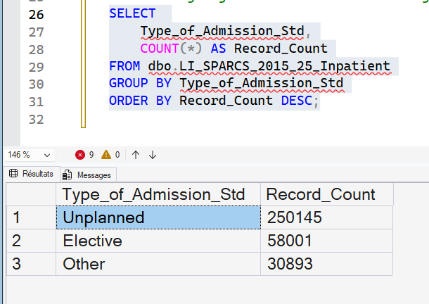
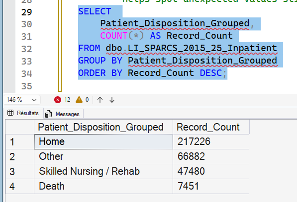
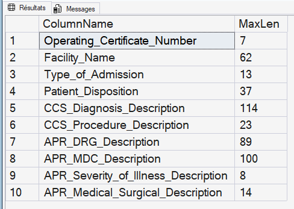
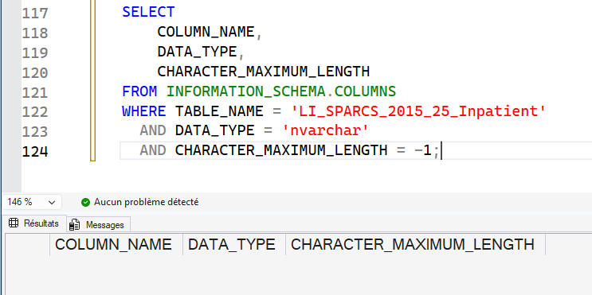

# Step 02 — What We need to Clean and Why

Each of the cleaning steps below connects directly to the issues identified during profiling.  
This ensures the data is 
- medically meaningful, 
- analysis-ready, 
- and aligns with hospital reporting standards.

---

## 1️⃣ Currency Formatting → Convert to DECIMAL  
**Fields Impacted:** `Total_Charges`, `Total_Costs`  
**SQL file:** [here](./02_SQL/2_1_Currency_Formatting.sql) 

These columns included dollar signs ('$') and commas from the original CSV.  
SQL sees those as **text**, meaning:

- You cannot add, average, or compare costs  
- Any financial analysis would be incorrect

➡ Fixing this allows us to calculate **spending**, **profitability**, and **resource utilization**.

---

## 2️⃣ Geographic Anomalies → Standardize ZIP information  
**Field Impacted:** `Zip_Code_3_digits`  
**SQL file:** [here](./02_SQL/2_2_Standardize_ZIP_data.sql)  

ZIP codes were shortened to 3 digits and included special values like `OOS` (Out-Of-State).  
Without standardization:

- Patients could appear to live “in-state” incorrectly  
- Regional analysis could be misleading  

➡ We now have clear, actionable groups:
- **In-state**
- **Out-of-state**
- **Unknown**

Useful for:
- Hospital service area planning  
- Equity & access reporting  

---

## 3️⃣ Demographic Placeholders → Standardize “Unknown” categories  
**Fields Impacted:** `Race`, `Ethnicity`  
**SQL file:** [here](./02_SQL/2_3_Standardize_Unknown_cat.sql) 

Some classifications don’t reflect true demographics (e.g., “Unknown”, “Not-Spanish/Hispanic” meaning default rather than patient response).  
Without correction:

- Community health disparities become **misinterpreted**

➡ Standardizing unknown or non-response improves:
- Public health equity monitoring  
- Federal demographic reporting compliance  

---

## 4️⃣ Category Normalization → Cleaner clinical + operational groups  
**Fields Impacted:** `Type_of_Admission`, `Patient_Disposition`  
**SQL files:** [Type of Admission](./02_SQL/2_4_Admission_Category_Normalization.sql), [Patient Disposition](./02_SQL/2_5_PatientDisposition_Cat_Standardiz.sql)  

Original categories were too detailed or inconsistent:  
Examples: “Urgent”, “EMERGENCY”, “Elective”, “Home or Self Care”, “Skilled Nursing Home”  

➡ Grouping into clearer, industry-standard buckets supports:
- ED vs Elective performance tracking  
- Discharge planning quality measures  
- Readmission & mortality analytics  

### Types of Admissions  

### Validation of Standardized Admission Categories

After grouping unplanned vs elective admissions in sub-step 02.5, we validated the distribution:

| Type_of_Admission_Std | Records |
|----------------------|--------:|
| Unplanned            | 250,145 |
| Elective             | 58,001  |
| Other                | 30,893  |

#### 📏 Is “Other” too large?

We measure this as:

Other % = (30,893 / (250,145 + 58,001 + 30,893)) × 100  
Other % = (30,893 / 339,039) × 100  
Other % ≈ **9.2%**

A practical rule of thumb in analytics:

> If "Other" is **more than about 10%**, it usually means our grouping is too coarse and we are hiding useful detail.

Here, **9.2% is acceptable**. It tells us that:
- Most activity is clearly classified as **Unplanned** or **Elective**
- “Other” represents a smaller set of special admission types (e.g., newborns, transfers, psych cases) that we can optionally explore later, but they do not dominate the dataset.

In the dashboarding phase (Power BI), this split will be visualized as:
- A **pie chart** showing the share of Unplanned vs Elective vs Other
- A **bar chart** showing absolute counts for each category

These checks confirm that our category normalization is **clinically reasonable** and that the “Other” bucket does **not** hide a problematic amount of information.

### Patient Disposition

#### Validation of Standardized Patient Disposition

Grouping the raw `Patient_Disposition` field into broad patient-outcome categories produced the following:

| Patient_Disposition_Grouped | Records |
|----------------------------|--------:|
| Home                       | 217,226 |
| Other                      | 66,882  |
| Skilled Nursing / Rehab    | 47,480  |
| Death                      | 7,451   |

Total records: 339,039 ✅

To evaluate whether the grouping is clinically useful, we checked the share of each category:

- Home: 217,226 / 339,039 ≈ **64.1%**
- Skilled Nursing / Rehab: 47,480 / 339,039 ≈ **14.0%**
- Death: 7,451 / 339,039 ≈ **2.2%**
- **Other: 66,882 / 339,039 ≈ 19.7%**

A common best-practice rule:

> If “Other” exceeds **10–15%**, deeper refinement is needed because we may be hiding important patient pathways.

Here, **~20% of discharges fall into "Other"**, which is too large to ignore.  
It likely contains several operationally distinct and clinically important categories:

- Transfers to another hospital  
- Discharges to psychiatric/behavioral facilities  
- Hospice care transitions  
- Patients leaving Against Medical Advice (AMA)  
- Custodial/law enforcement placements  

📌 **Action for Step 03:**  
Split “Other” into more meaningful sub-groups using a standardized disposition dimension.  
This will improve analysis of:
- Care continuity and readmission risk  
- Post-acute care utilization  
- Patient safety and discharge planning outcomes

➡ This validation confirms the need for a more granular discharge model as part of the star schema.

---

## 5️⃣ Text Overflow → VARCHAR(Max) only when needed  
**Fields Impacted:** Description fields (Diagnosis/Procedure descriptions, etc.)  
**SQL file:** [here](./02_SQL/2_6_nvarcharMax_trimming.sql)

Some text fields were set to unlimited length (`-1`), which:

- Slows down indexing and storage  
- Hurts dashboard query speed  

➡ I trimmed them according to their max length for efficiency and performance:

Length of each column with data type nvarchar(max):  

After I adjusted the nvarchar length for each column, I checked and no column with type nvarchar(max) remains (no output):  

## 6️⃣ Missing Primary Key → Generate Encounter ID  
**Fields Impacted:** All rows  
**SQL Sub-Step:** 2.3  

The dataset did not include a unique encounter identifier.  
This makes it impossible to:

- Track a patient visit consistently  
- Create proper relationships for BI modeling  

➡ A surrogate key (`Encounter_ID`) enables:
- Fact/Dimension modeling
- Traceability and de-duplication

---

## 7️⃣ Payer Granularity → Group Payment Typology codes  
**Fields Impacted:** `Payment_Typology_1`  
**SQL Sub-Step:** 2.7  

There are many insurer codes with similar meaning  
(e.g., multiple variations of commercial insurance).

➡ Grouping makes financial analysis more insightful:
- Medicare vs Medicaid vs Commercial vs Self-Pay  
- Reimbursement rate & cost burden comparisons  

---

# Deliverable Result from Step 02

> **A clean, structured analytical dataset with consistent numeric types, standardized categories, and a primary key — ready for star schema modeling and BI consumption.**
