# 02 - Data Cleaning and Standardization

## Purpose

Implements deterministic SQL remediation from Step 01 findings so the dataset is structurally ready for modeling, validation, and KPI development.

This step standardizes data semantics. It does not define KPI formulas.

---

## Explainability-First Role

Cleaning is governed transformation, not ad-hoc preprocessing.

Each change is explicit SQL logic traceable to prior profiling findings.

---

## Inputs and Artifacts

Input table:

- `dbo.LI_SPARCS_2015_25_Inpatient`

SQL artifacts:

- `02_SQL/2_1_Currency_Formatting.sql`
- `02_SQL/2_2_Standardize_ZIP_data.sql`
- `02_SQL/2_3_Standardize_Unknown_cat.sql`
- `02_SQL/2_4_Admission_Category_Normalization.sql`
- `02_SQL/2_5_PatientDisposition_Cat_Standardiz.sql`
- `02_SQL/2_6_nvarcharMax_trimming.sql`
- `02_SQL/2_7_add_surrogate_PrimaryKey.sql`
- `02_SQL/2_8_payment_typology_grouping.sql`

Evidence artifacts:

- `screenshots/image.png` through `screenshots/image-12.png`

---

## Core Remediation Outputs

- Financial fields converted to numeric (`DECIMAL`) for aggregation reliability
- Standardized category fields for admission, disposition, race/ethnicity, ZIP, and payer
- Bounded text widths replacing unbounded `NVARCHAR(MAX)` where appropriate
- Surrogate encounter key introduced (`Encounter_ID`)

---

## Output Contract to Step 03

Produces a model-ready base with stable keys, normalized categories, and analytically valid numeric fields.

This is the structural handoff to `03_Analytical_Data_Modeling`.

---

## Visual Snapshot

<details>
<summary>Show Screenshots</summary>

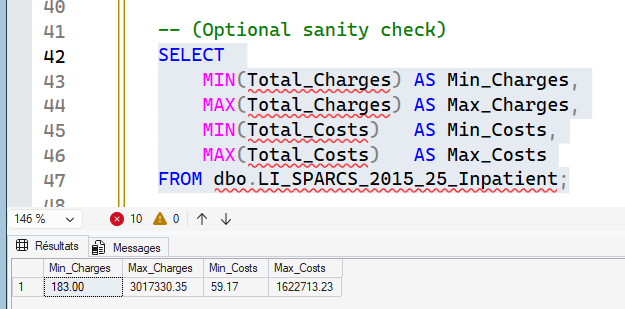
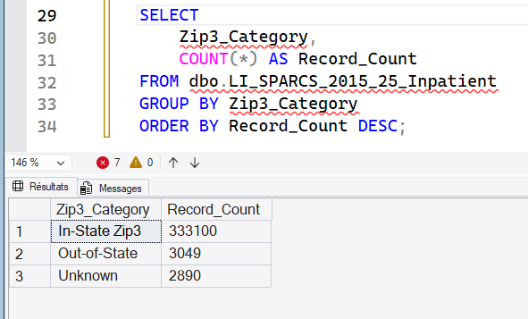
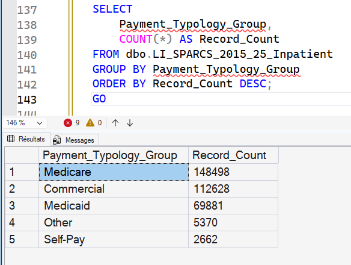
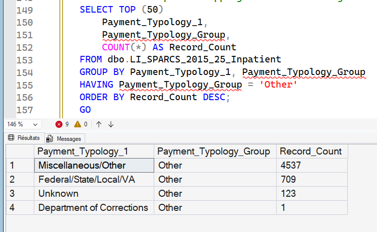
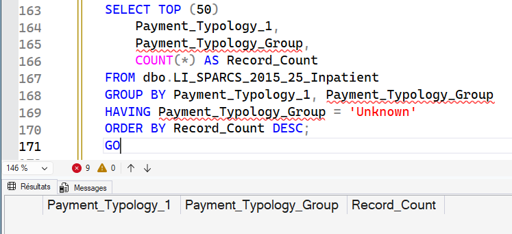
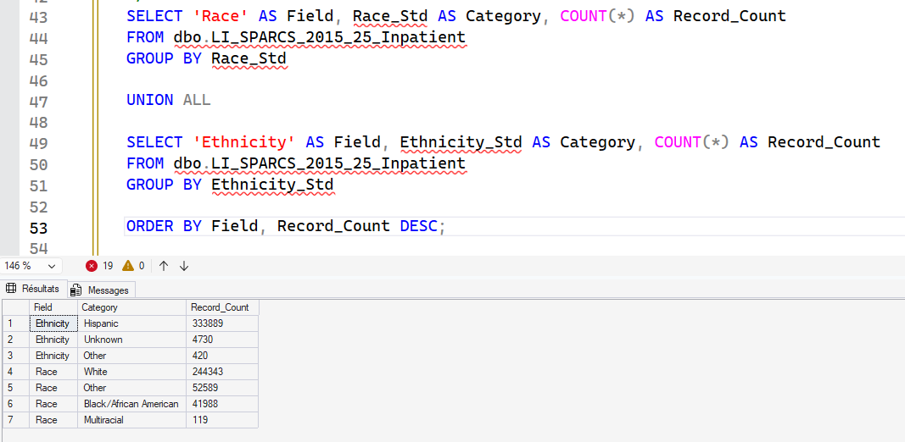
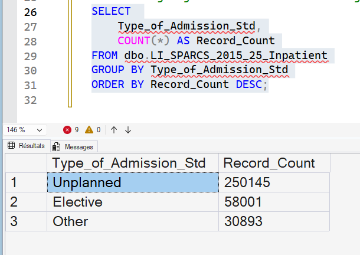
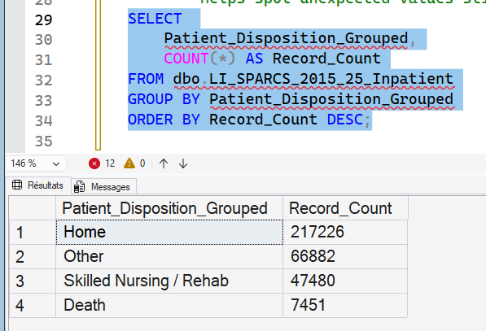
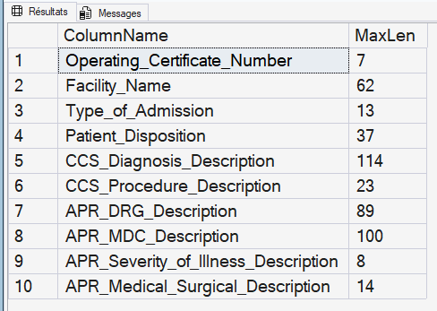
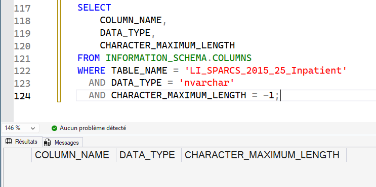
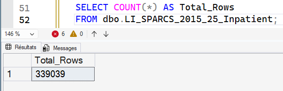
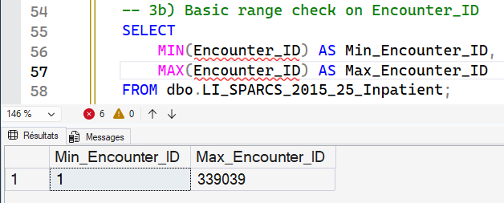
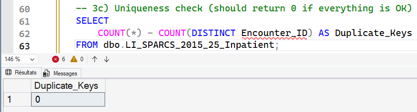

</details>

---

## Folder Contents

```text
02_Data_Cleaning/
|-- README.md
|-- screenshots/
|   `-- image.png ... image-12.png
`-- 02_SQL/
    |-- 2_1_Currency_Formatting.sql
    |-- 2_2_Standardize_ZIP_data.sql
    |-- 2_3_Standardize_Unknown_cat.sql
    |-- 2_4_Admission_Category_Normalization.sql
    |-- 2_5_PatientDisposition_Cat_Standardiz.sql
    |-- 2_6_nvarcharMax_trimming.sql
    |-- 2_7_add_surrogate_PrimaryKey.sql
    `-- 2_8_payment_typology_grouping.sql
```


