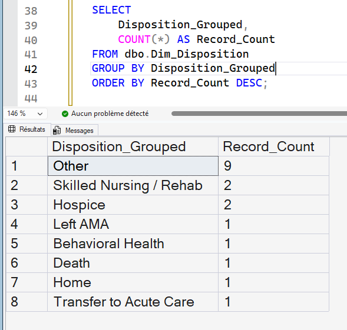
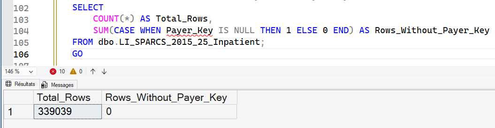
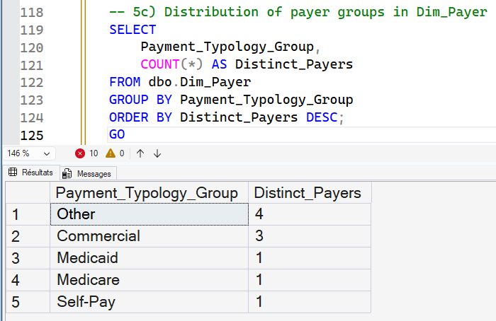
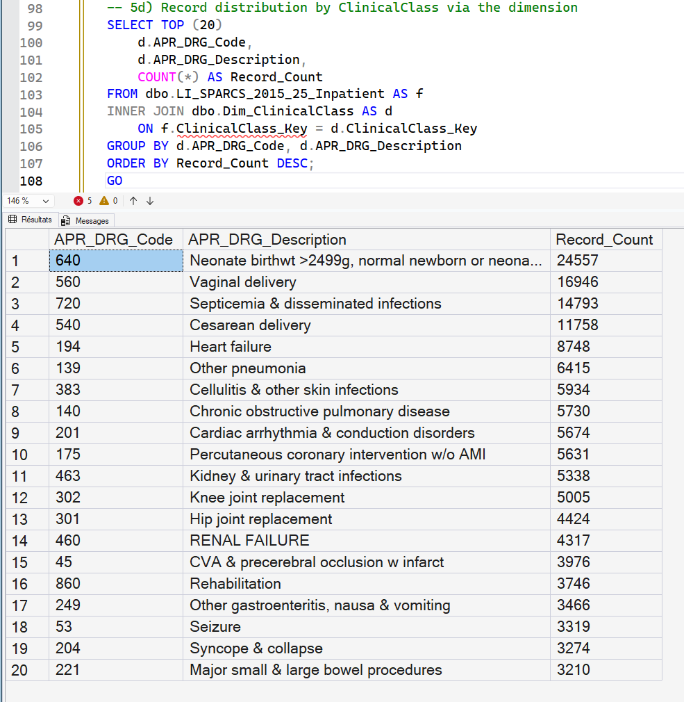
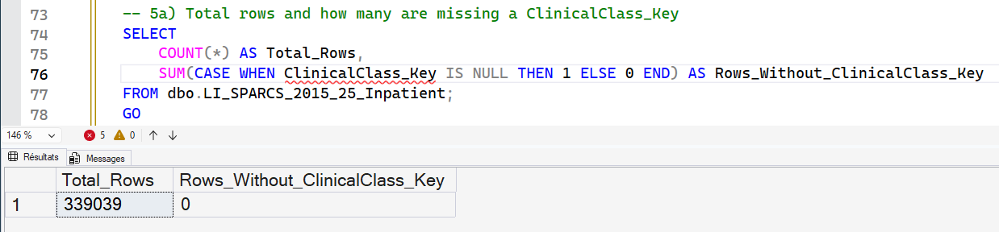
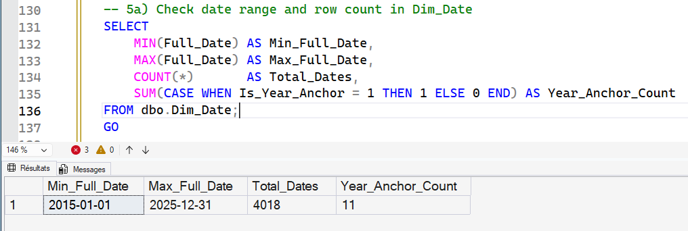
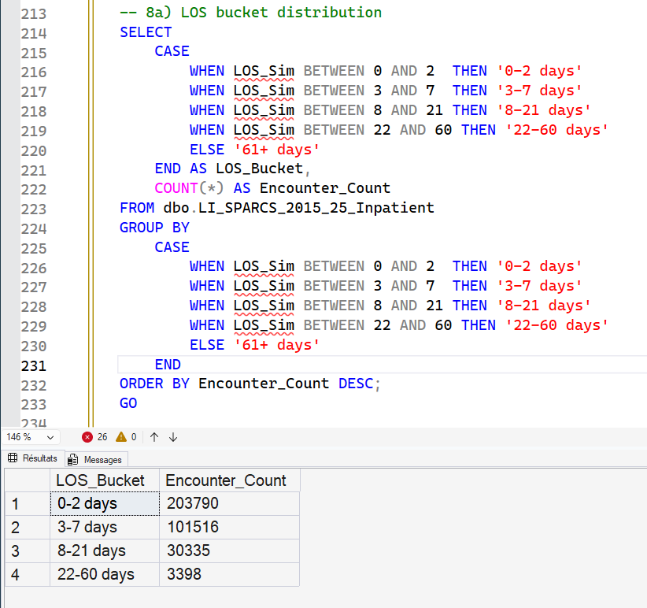
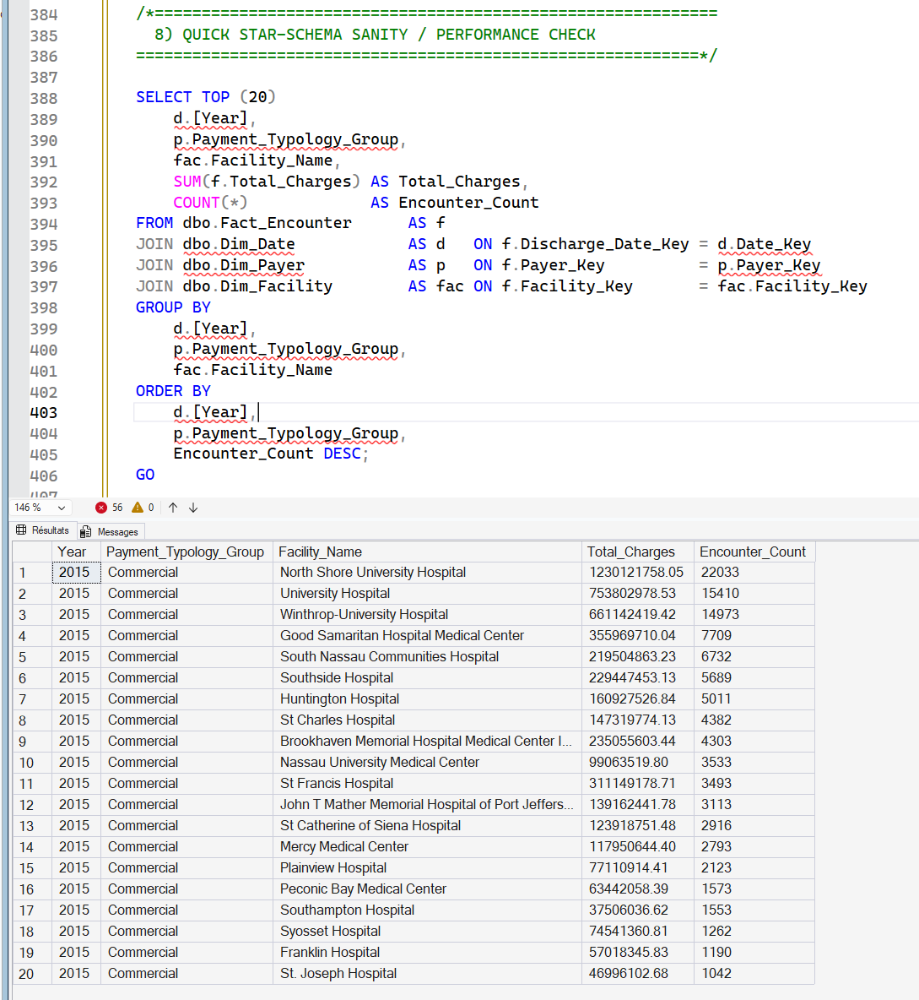

# 🧩 STEP 03 — Analytical Data Modeling (Star Schema)

To prepare the cleaned SPARCS dataset for analytics in Power BI, I transformed the staging table into a **star schema**. This is the industry-standard data model for hospital performance reporting and supports fast, intuitive insights for clinicians and leadership.

---

## ⭐ Star Schema Overview

The model includes:

### Fact Table
- **Fact_Inpatient_Stay**
  - One row per **Encounter_ID** (per hospital stay)
  - Stores measurable outcomes such as:
    - Length of Stay (LOS)
    - Total Charges
    - Total Costs
    - Birth Weight
  - Contains foreign keys to dimensions

### Dimension Tables
| Dimension | What it describes | Why it matters | SQL Script |
|----------|------------------|----------------|------------|
| Dim_Facility | Hospital identity & region | Facility comparison & care distribution | [Create_Dim_Facility.sql](./03_SQL/3_1_dim_facility.sql) |
| Dim_AdmissionType | How/why the stay began | Unplanned burden & ED flow analysis | [Create_Dim_AdmissionType.sql](./03_SQL/3_2_dim_admissionType.sql) |
| Dim_Disposition | Where the patient went after discharge | Care continuity, readmissions, population tracking | [Create_Dim_Disposition.sql](./03_SQL/3_3_dim_disposition.sql) |
| Dim_Payer | Insurance category | Cost burden & reimbursement analysis | [Create_Dim_Payer.sql](./03_SQL/3_4_dim_payers.sql) |
| Dim_ClinicalClass | APR-DRG clinical grouping | Risk stratification & case-mix comparison | [Create_Dim_ClinicalClass.sql](./03_SQL/3_5_dim_clinical_class.sql) |
| Dim_Date | Synthetically enhanced Date table 2015 (ranging down to 2025) | Time series & time based analysis | [Create_Dim_Date.sql]() |

---

## 🧠 Why a Star Schema is Critical in Healthcare

Hospital analytics must support life-impacting decisions, such as identifying:

- High-risk admissions driving bed occupancy
- Financial strain by payer type
- Mortality or transfer spikes at specific facilities

A star schema enables:

✔ Fast dashboard performance  
✔ Easy clinical interpretation  
✔ Clear drill-downs (facility → service line → patient cohort)  
✔ Scalable architecture for multiple years of SPARCS data

➡ This structure is **now ready for Power BI ingestion**.

## Dim_Date (2015 only) and Synthetic Admission/Discharge Dates  
**Fields impacted:** `Discharge Year`, `Admission_Date_Sim`, `Discharge_Date_Sim`, `LOS_Sim`, `Admission_Date_Key`, `Discharge_Date_Key`  
**SQL files:** [Dim_Date](./03_SQL/3_6_dim_date.sql) + [code](./03_SQL/3_6b_2015_synthetic_dates.sql) for the synthetic data

The original SPARCS extract used in this project includes only a `Discharge Year`
field (and the sample contains 2015 encounters only). This limits time analysis
to a single annual data point and does not allow for realistic month, weekday or
length-of-stay analytics. 

To demonstrate full calendar modelling and time-intelligence in a transparent
way, I generated clearly-labelled synthetic dates:

- `Discharge_Date_Sim`: random discharge date within the recorded discharge year  
- `LOS_Sim`: synthetic length of stay with a skew toward short stays  
  (0–2 days most common, 3–7 days less frequent, long stays rare)  
- `Admission_Date_Sim = Discharge_Date_Sim – LOS_Sim`, clamped to 2015-01-01 for very early cases  

On top of this, I created a `Dim_Date` table at daily grain for the 2015
calendar only (2015-01-01 to 2015-12-31), with:

- Year, quarter, month number and name  
- Day of month  
- Monday-first weekday number (1–7) and weekday name  
- Weekend flag  

Each encounter is then linked to `Dim_Date` via:

- `Admission_Date_Key`  
- `Discharge_Date_Key`  

Several validation checks confirm realistic and usable time-based analytics:
- **All encounters occur within 2015** (consistent with the source dataset scope)
- **Monthly discharge counts** are evenly distributed (~27–29K)  
  with February lower (fewer days) — indicating uniform random distribution worked correctly
- **Admission counts vary slightly vs. discharges**  
  due to synthetic Length of Stay shifting some discharges into later months
- **Weekday vs weekend distribution** is balanced and continuous  
  confirming correct Date Key linkage and no missing weekday rows

This ensures the dataset is ready for:
- Calendar-based analytics (month, quarter, weekday/weekend)
- Seasonal trend exploration (e.g., winter admission pressure)
- LOS insights and operational patterns
- Proper star-schema modeling and Power BI time intelligence

Overall, the synthetic time fields behave **credibly and consistently**, supporting richer
visual storytelling without altering the original dataset’s truth.

#### Screenshots:  

Dim_Facility:  

Dim_AdmissionType:  

Dim_Disposition:  

Dim_Payer:  

Distribution of Dim_Payer:  

Dim_ClinicalClass:  

Dim_ClinicalClass Rows Check:  

Date Range Check of Dim_Date: 

Synthetic Data: LOS Bucket Distribution:

---

## 🔁 Fact ↔ Dimension Linking
**SQL file:** [here](./03_SQL/3_7_Fact_Table_inpatient_stay.sql)

Each inpatient stay (Fact) gets its context from surrounding dimensions:

> Measures live in the Fact table  
> Meaning lives in Dimension tables

This ensures:
- No duplicated text fields
- The model remains efficient as data grows
- Insights reflect real healthcare pathways

After completing the cleaning and dimensional enrichment of the inpatient dataset,
I connected each encounter to the surrounding business context by attaching foreign
keys into the core dimension tables:

- `Dim_Facility` → hospital identity, location & ownership
- `Dim_AdmissionType` → clinical entry point (unplanned vs planned, ED, maternity…)
- `Dim_Disposition` → continuity of care after discharge (home, rehab, SNF…)
- `Dim_Payer` → reimbursement group (Medicare/Medicaid/Commercial/Self-Pay)
- `Dim_ClinicalClass` → APR-DRG severity & clinical grouping
- `Dim_Date` → synthetic Admission & Discharge calendar keys (daily granularity)

This transformation elevates the staging table (`LI_SPARCS_2015_25_Inpatient`)
into a clean **star-schema fact**, ready for high-performance analytics.

### Fact Grain
> One record = One inpatient encounter

### Measures included
- `LOS_Sim` (synthetic Length of Stay, days)
- `Total_Charges` and `Total_Costs`
- `ED_Flag` (1 if entered via Emergency Department)

### Performance Features (SQL Server Analytics Best Practice)
- **Clustered Columnstore Index (CCI)**  
  Enables highly compressed storage and fast aggregation performance:
  > ✔ Optimized for large scans, GROUP BY, Power BI reporting workloads  
- **Supporting nonclustered indexes**  
  Improve selective filtering by common dimension keys (facility, payer, dates…)

These optimizations ensure fast slice-and-dice exploration of hospital-level
KPIs such as:
- Operational burden by admission source (ED)
- Payer mix & reimbursement variation
- Facility benchmarking and case-mix complexity
- Seasonal / weekday patterns using synthetic calendar intelligence

This is a production-style analytical model, demonstrating:
- **Dimensional Data Modeling** proficiency
- **ETL + SQL Engineering** skills
- **Performance tuning** for BI workloads

### ✔ Dim_Facility — Data Warehouse Design Choice

Rather than relying on inconsistent external sources, the Facility dimension is
constructed directly from distinct facility attributes in the SPARCS inpatient
dataset. This guarantees:

- Every facility in the fact table has a matching dimension row
- Surrogate keys (`Facility_Key`) align cleanly with the Fact_Encounter table
- A reliable master record for hospital identity, service area, and county

### ⭐ Analytical Model Validation – First Query Success

A grouped summary of encounters by Discharge Year, Payer Group, and Facility
executed successfully against the Fact_Encounter table using all relevant
dimension joins. The model now supports real analytical use cases such as:

- Facility-level encounter volume benchmarking
- Payer mix distribution analysis (e.g., Medicare vs Medicaid vs Commercial)
- Revenue/charge comparisons across hospitals and counties
- Time-based trends powered by Dim_Date calendar intelligence

Query performance is excellent, thanks to the clustered columnstore index (CCI)
and supporting key indexes on the fact table.

---

## ✔ Status After Step 03 — Star Schema Completed

- All core **Dimension** tables built and populated  
- **Dim_Facility** constructed directly from the inpatient dataset  
  ensuring full facility coverage and reliable surrogate keys  
- **Fact_Encounter** created at the correct grain  
  (1 row = 1 inpatient encounter)
- Surrogate keys successfully linked across the model
- **Clustered Columnstore Index (CCI)** applied for analytics performance
- Model follows healthcare data-warehouse best practices
- Fully optimized for **Power BI time-series analytics**

---

## 🏁 Deliverable Result — BI-Ready Analytical Model

> A performance-optimized **star schema** capable of supporting real-world
> hospital analytics at scale — including cost, payer-mix, facility benchmarking,
> and seasonal or operational trends.

Stakeholders now benefit from:

- Sub-second slicing of 339K+ encounters  
- Accurate facility-level and payer-level KPIs  
- Instant exploratory analysis with high data-quality confidence  

---

📌 **Next Step:**  
➡ Step 04 — Healthcare KPI Development & Power BI Modeling

This will include:

- **Length of Stay (LOS)** metrics (mean, median, high-severity outliers)  
- **Emergency Department** burden analysis  
- **Transfer and Readmission** signals  
- **Cost per Encounter** by payer and facility  
- **Severity & case-mix** analysis (APR-DRG)

Deliverables:

- Portfolio-grade documentation in Markdown
- Interactive, professional dashboards in Power BI using DAX measures

---
