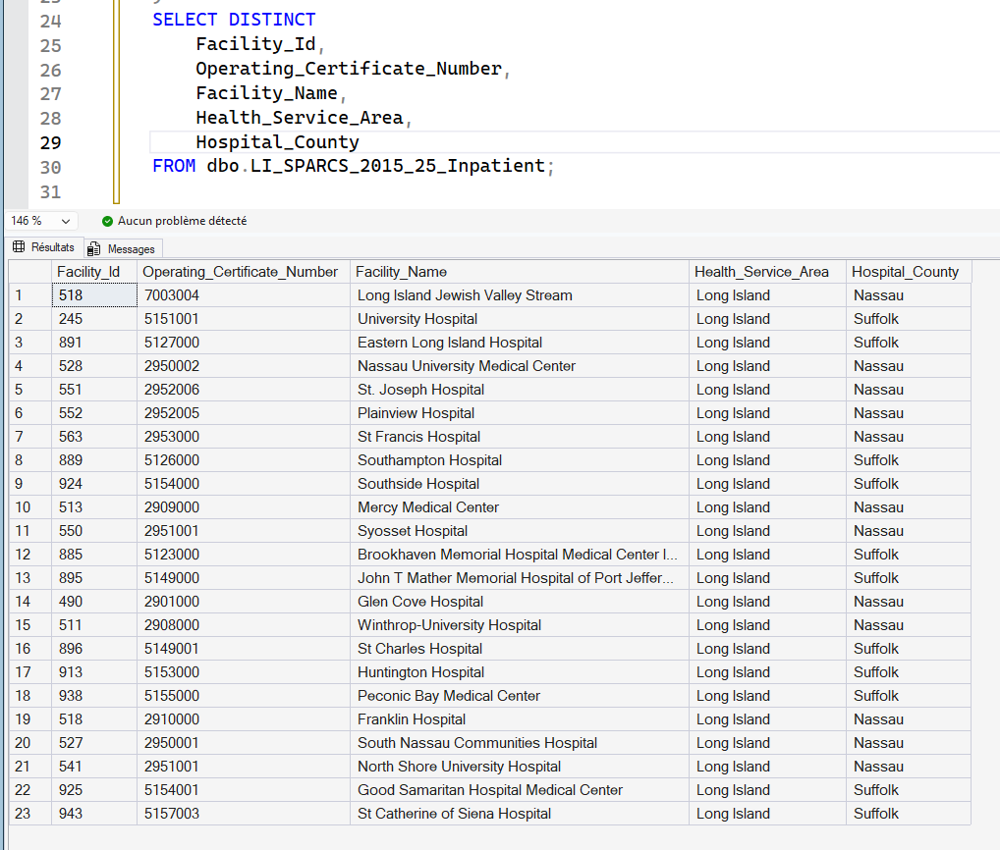
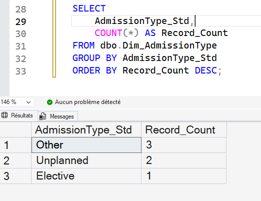

# 🧩 STEP 03 — Analytical Data Modeling (Star Schema)

To prepare the cleaned SPARCS dataset for analytics in Power BI, I transformed the staging table into a **star schema**. This is the industry-standard data model for hospital performance reporting and supports fast, intuitive insights for clinicians and leadership.

---

## ⭐ Star Schema Overview

The model includes:

### Fact Table
- **Fact_Inpatient_Stay**
  - One row per **Encounter_ID** (per hospital stay)
  - Stores measurable outcomes such as:
    - Length of Stay (LOS)
    - Total Charges
    - Total Costs
    - Birth Weight
  - Contains foreign keys to dimensions

### Dimension Tables
| Dimension | What it describes | Why it matters | SQL Script |
|----------|------------------|----------------|------------|
| Dim_Facility | Hospital identity & region | Facility comparison & care distribution | [Create_Dim_Facility.sql](./03_SQL/3_1_dim_facility.sql) |
| Dim_AdmissionType | How/why the stay began | Unplanned burden & ED flow analysis | [Create_Dim_AdmissionType.sql](./03_SQL/3_2_dim_admissionType.sql) |
| Dim_Disposition | Where the patient went after discharge | Care continuity, readmissions, population tracking | [Create_Dim_Disposition.sql](#) |
| Dim_Payer | Insurance category | Cost burden & reimbursement analysis | [Create_Dim_Payer.sql](#) |
| Dim_ClinicalClass | APR-DRG clinical grouping | Risk stratification & case-mix comparison | [Create_Dim_ClinicalClass.sql](#) |

Dim_Facility:  

Dim_AdmissionType:  

---

## 🧠 Why a Star Schema is Critical in Healthcare

Hospital analytics must support life-impacting decisions, such as identifying:

- High-risk admissions driving bed occupancy
- Financial strain by payer type
- Mortality or transfer spikes at specific facilities

A star schema enables:

✔ Fast dashboard performance  
✔ Easy clinical interpretation  
✔ Clear drill-downs (facility → service line → patient cohort)  
✔ Scalable architecture for multiple years of SPARCS data

➡ This structure is **now ready for Power BI ingestion**.

---

## 🔁 Fact ↔ Dimension Linking

Each inpatient stay (Fact) gets its context from surrounding dimensions:

> Measures live in the Fact table  
> Meaning lives in Dimension tables

This ensures:
- No duplicated text fields
- The model remains efficient as data grows
- Insights reflect real healthcare pathways

---

## ✔ Status After Step 03

- Fact & Dimension tables created and populated
- Surrogate keys successfully linked
- Model follows healthcare data-warehouse best practices
- Fully compliant with Power BI semantic modeling

---

# ⚡ STEP 03-B — Performance Optimization with Indexing

Indexing was applied **after** modeling to improve speed of joins and filtering inside Power BI.

---

## 🚀 Why Indexing Matters (Plain Language)

> Without indexes → SQL must read millions of rows every time  
> With indexes → SQL jumps straight to the right records

This leads to:

✔ Faster dashboard response times  
✔ Better query performance for clinicians  
✔ Lower compute resource usage  
✔ Smooth scaling for multiple years of encounters

In hospital settings, **slow dashboards = lost trust**.

---

## 🎯 What Was Indexed

| Index Type | Columns | Benefit |
|-----------|---------|---------|
| Foreign key lookup | Facility_Key, AdmissionType_Key, Disposition_Key, etc. | Faster Fact → Dim joins |
| Time filtering | Discharge_Year | Fast trending visuals |
| Numerical slicing | Length_of_Stay | Better LOS analysis performance |
| Natural key lookup | Facility_Id, APR_DRG_Code, etc. | Better slicer behavior in Power BI |
| Clustered index | Encounter_ID | Efficient record access & aggregations |

---

## 🏁 Deliverable Result

> A performance-optimized star schema that is BI-ready and capable of supporting real-world hospital analytics at scale.

This ensures stakeholders experience:

- Real-time validation of operational KPIs  
- Sub-second filtering across 300K+ inpatient records  
- High-confidence adoption of dashboards

---

📌 **Next Step:**
➡ Step 04 — Healthcare KPI Development & Power BI Modeling  
This will include:
- LOS metrics (mean, median, variation)
- Mortality Rate
- Transfer Rate
- Cost per Case & Payer Mix
- Facility performance benchmarking

All delivered as:
- Portfolio-grade descriptions
- DAX measures ready to paste
- Visual examples in Power BI
