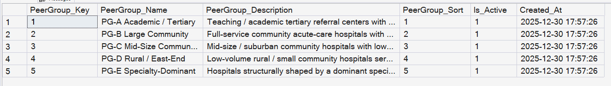
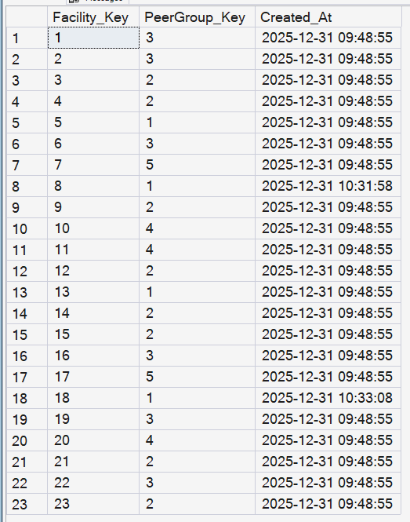

# Facility Peer Grouping Framework

## What This Is

This document defines the **facility peer grouping framework** used across the project to ensure that hospital benchmarking, KPI interpretation, and executive reporting are **clinically fair, statistically meaningful, and industry-aligned**.

Peer groups are a core part of the analytical data model and directly influence how KPIs such as Length of Stay, Mortality, Cost, and Payer Mix are interpreted. Peer grouping is model configuration, not KPI logic.

---
## Table of Contents
<details>
<summary>TOC</summary>

- [Facility Peer Grouping Framework](#facility-peer-grouping-framework)
  - [What This Is](#what-this-is)
  - [Table of Contents](#table-of-contents)
  - [Scope](#scope)
  - [Why Peer Grouping Is Required](#why-peer-grouping-is-required)
  - [Design Principles](#design-principles)
  - [🔧 Revision: Data Model Objects (Updated)](#-revision-data-model-objects-updated)
    - [Why This Change Was Introdued](#why-this-change-was-introdued)
    - [1. `dbo.Dim_PeerGroup`](#1-dbodim_peergroup)
    - [Peer Group Definitions](#peer-group-definitions)
    - [2. `dbo.Bridge_Facility_PeerGroup`](#2-dbobridge_facility_peergroup)
    - [3. Dim\_Facility (Extended for Semantic Stability)](#3-dim_facility-extended-for-semantic-stability)
      - [Change introduced](#change-introduced)
      - [How it is populated](#how-it-is-populated)
      - [Why Power Query (not DAX)](#why-power-query-not-dax)
    - [🧠 Design Rationale](#-design-rationale)
      - [Why the bridge still exists](#why-the-bridge-still-exists)
  - [Seeding Logic](#seeding-logic)
    - [1. Populate `Dim_PeerGroup`](#1-populate-dim_peergroup)
    - [2. Populate `Bridge_Facility_PeerGroup`](#2-populate-bridge_facility_peergroup)
  - [Canonical Facility Name Requirement (Important)](#canonical-facility-name-requirement-important)
      - [Why strict matching is enforced](#why-strict-matching-is-enforced)
    - [QA Expectations](#qa-expectations)
      - [Recommended QA check](#recommended-qa-check)
    - [PG-A — Academic / Tertiary Referral Centers](#pg-a--academic--tertiary-referral-centers)
    - [PG-B — Large Community Acute-Care Hospitals](#pg-b--large-community-acute-care-hospitals)
    - [PG-C — Mid-Size / Suburban Community Hospitals](#pg-c--mid-size--suburban-community-hospitals)
    - [PG-D — Rural / Small Community / East-End Hospitals](#pg-d--rural--small-community--east-end-hospitals)
    - [PG-E — Specialty-Dominant Hospitals](#pg-e--specialty-dominant-hospitals)
  - [KPI-to-Peer-Group Applicability](#kpi-to-peer-group-applicability)
  - [Downstream Usage (Power BI)](#downstream-usage-power-bi)
  - [Known Limitations](#known-limitations)
  - [Summary (Updated)](#summary-updated)


</details>

---

## Scope

This framework:
* Defines the official peer group taxonomy (PG-A through PG-E)
* Populates the Dim_PeerGroup dimension
* Assigns facilities to peer groups via a factless bridge table
* Enforces strict, deterministic matching to canonical facility names

It does not:
* Perform KPI calculations
* Modify fact tables
* Apply fuzzy matching or heuristic joins

---

## Why Peer Grouping Is Required

In healthcare analytics, comparing hospitals without adjusting for **role, acuity, and service mix** leads to false conclusions.

Industry best practices (CMS, AHRQ, Vizient, HFMA) consistently show that performance metrics are structurally driven by:

* Teaching vs non-teaching mission
* Tertiary referral responsibilities
* Case mix severity
* Specialty concentration (cardiac, rehab, neuro)
* Rural vs urban operating constraints
* Safety-net obligations

This framework ensures that:

* High-acuity hospitals are not penalized
* Small hospitals are not distorted by volatility
* Specialty hospitals are not diluted into general peers
* Executives can trust KPI signals

Peer-group semantics in visuals are documented in the [Power BI Semantic Model](../../06_PBI_Semantic_Model/03_PowerBI_Model/README.md).

---

## Design Principles

The peer groups defined here follow five strict principles:

1. **Role over ownership**
   Health system branding is irrelevant for benchmarking. Hospital function is what matters.

2. **KPI-specific applicability**
   Not every peer group is valid for every KPI.

3. **Clinical plausibility**
   Groupings reflect real referral patterns and care pathways.

4. **Statistical stability**
   Groups avoid low-denominator volatility where possible.

5. **Executive defensibility**
   Every grouping decision can be explained in one sentence to leadership.

---

## 🔧 Revision: Data Model Objects (Updated)
- SQL file: [here](./seed_dim_peergroup_and_bridge.sql)  

### Why This Change Was Introdued

While the peer grouping framework is correctly implemented in SQL using a factless bridge table, Power BI has practical limitations when:
* Applying **conditional formatting**
* Comparing **row-level values to group-level statistics**
* Rendering **per-facility color logic** against peer-group medians

In particular, Power BI visuals do **not reliably evaluate group-aware DAX** when peer membership is resolved through a many-to-many bridge.

To ensure correct **visual behavior and deterministic formatting, a denormalized peer-group attribute** was added directly to `Dim_Facility` in the semantic layer.

This does not replace the SQL framework.
It complements it for **Power BI-specific execution needs**.

### 1. `dbo.Dim_PeerGroup`

**Grain**  
One row per peer group.

**Role**  
Analytical comparison lens.

**Populated by**  
`seed_dim_peergroup_and_bridge.sql`



### Peer Group Definitions

<details>
<summary> See Hospital / Peer-Group Table</summary>

| Hospital | Peer Group | Rationale (Summary) |
|--------|------------|---------------------|
| **North Shore University Hospital** | PG-A Academic / Tertiary | Teaching hospital, regional tertiary referral center, high-acuity case mix |
| **University Hospital (Stony Brook University Hospital)** | PG-A Academic / Tertiary | Academic medical center with advanced subspecialty services |
| **Winthrop-University Hospital (NYU Langone Hospital – Long Island)** | PG-A Academic / Tertiary | Academic affiliate, tertiary referrals, complex inpatient mix |
| **Nassau University Medical Center** | PG-A Academic / Tertiary (Safety-Net) | Public teaching hospital with safety-net mission and high acuity |
| **Good Samaritan Hospital Medical Center** | PG-B Large Community | High-volume community hospital with broad acute-care services |
| **Huntington Hospital** | PG-B Large Community | Full-service community hospital with ICU and surgical depth |
| **Southside Hospital** | PG-B Large Community | Large community hospital serving dense catchment area |
| **South Nassau Communities Hospital** | PG-B Large Community | High-volume acute-care community hospital |
| **St Catherine of Siena Hospital** | PG-B Large Community | Broad inpatient services, moderate–high acuity |
| **Mercy Medical Center** | PG-B Large Community | Large community hospital with diverse service mix |
| **St. Joseph Hospital** | PG-B Large Community | Full-service community acute-care hospital |
| **Brookhaven Memorial Hospital Medical Center Inc** | PG-B Large Community | High-volume community hospital, non-tertiary role |
| **Glen Cove Hospital** | PG-C Mid-Size Community | Lower acuity, limited specialty depth |
| **Plainview Hospital** | PG-C Mid-Size Community | Suburban community hospital with narrower service mix |
| **Syosset Hospital** | PG-C Mid-Size Community | Mid-size hospital with limited tertiary exposure |
| **Franklin Hospital** | PG-C Mid-Size Community | Community-focused hospital with moderate inpatient volume |
| **John T Mather Memorial Hospital of Port Jefferson NY Inc** | PG-C Mid-Size Community | Community hospital with regional, non-tertiary role |
| **Long Island Jewish Valley Stream** | PG-C Mid-Size Community | Community hospital, limited subspecialty concentration |
| **Eastern Long Island Hospital** | PG-D Rural / East-End | Small hospital serving geographically isolated population |
| **Peconic Bay Medical Center** | PG-D Rural / East-End | Low-volume East-End hospital with high transfer-out rate |
| **Southampton Hospital** | PG-D Rural / East-End | Rural/East-End hospital with seasonal variability |
| **St Francis Hospital** | PG-E Specialty-Dominant | Cardiac specialty focus drives LOS, cost, and outcomes |
| **St Charles Hospital** | PG-E Specialty-Dominant | Rehabilitation / neuro specialty concentration |


</details>

Peer groups are **mutually exclusive as definitions**, but facilities may belong to **multiple peer groups** if required by future analysis.

---

### 2. `dbo.Bridge_Facility_PeerGroup`

**Grain**  
One row per Facility–PeerGroup assignment.

**Role**  
Resolves the many-to-many relationship between facilities and peer groups.

**Columns**
- `Facility_Key`
- `PeerGroup_Key`



This table contains **no measures**.  
It exists solely to propagate peer-group filter context through `Dim_Facility` to all KPI fact tables.

### 3. Dim_Facility (Extended for Semantic Stability)

#### Change introduced
A `PeerGroup_Name` column is added to `Dim_Facility` via Power Query.

#### How it is populated
Two controlled merges are applied:

1. **Merge** `Dim_Facility` → `Bridge_Facility_PeerGroup`  
   Using `Facility_Key`

2. **Merge result** → `Dim_PeerGroup`  
   Using `PeerGroup_Key`

This produces a single, deterministic peer group per facility at the dimension level.

#### Why Power Query (not DAX)

* Ensures **materialized, row-level correctness**
* Avoids ambiguous filter propagation
* Prevents visual-level DAX inconsistencies
* Keeps KPI measures free of peer-resolution logic

**Resulting grain**
> One facility → one peer group (authoritative)

This reflects the **current business rule** that peer groups are mutually exclusive for reporting purposes.


### 🧠 Design Rationale
#### Why the bridge still exists

The SQL-based bridge remains the **source of truth** for:
* Peer group governance
* Auditable assignments
* Future extensibility (multi-group membership if ever required)
* Non-Power-BI consumers

The denormalized column exists **only to stabilize the semantic model**.

This is a deliberate **layered architecture**.

---


## Seeding Logic  
`seed_dim_peergroup_and_bridge.sql`

The seed script performs two controlled operations:

### 1. Populate `Dim_PeerGroup`

- Uses `PeerGroup_Name` as the natural key
- Uses `MERGE` for idempotent re-runs
- Maintains sort order and active flags

### 2. Populate `Bridge_Facility_PeerGroup`

- Resolves `Facility_Key` exclusively via `dbo.Dim_Facility`
- Resolves `PeerGroup_Key` exclusively via `dbo.Dim_PeerGroup`
- Inserts only validated Facility–PeerGroup pairs

---

## Canonical Facility Name Requirement (Important)

Facility-to-peer mappings are resolved using **exact equality** on:

```sql
Dim_Facility.Facility_Name
```

This is intentional.

#### Why strict matching is enforced
* Prevents silent misclassification
* Forces a single source of truth for facility naming
* Surfaces data-quality issues early
* Avoids fragile LIKE, fuzzy, or normalized joins

If a facility name in the peer-mapping list does not exist in Dim_Facility,
no bridge row is created.

This behavior is by design.

---

### QA Expectations

After running the seed script, the following must be true:
* All peer groups exist in Dim_PeerGroup
* All mapped facilities exist in Dim_Facility
* The bridge contains only valid foreign keys

#### Recommended QA check

```sql
SELECT m.Facility_Name
FROM (VALUES (...)) AS m(Facility_Name, PeerGroup_Name)
LEFT JOIN dbo.Dim_Facility f
    ON f.Facility_Name = m.Facility_Name
WHERE f.Facility_Key IS NULL;

```

---

### PG-A — Academic / Tertiary Referral Centers

**Definition**
Hospitals with teaching missions, high acuity, complex case mix, and regional referral responsibilities.

**Structural characteristics**

* Teaching programs / academic affiliation
* Advanced subspecialty services
* Higher severity and mortality by design
* Higher cost structure

**Hospitals included**

* North Shore University Hospital
* University Hospital (Stony Brook University Hospital)
* Winthrop-University Hospital (NYU Langone Hospital – Long Island)
* Nassau University Medical Center

---

### PG-B — Large Community Acute-Care Hospitals

**Definition**
Full-service community hospitals with ED, ICU, surgery, and broad inpatient services, but without primary tertiary referral responsibility.

**Structural characteristics**

* High volume
* Moderate to high acuity
* Broad service mix
* Community-driven referral patterns

**Hospitals included**

* Good Samaritan Hospital Medical Center
* Huntington Hospital
* Southside Hospital
* South Nassau Communities Hospital
* St Catherine of Siena Hospital
* Mercy Medical Center
* St. Joseph Hospital
* Brookhaven Memorial Hospital Medical Center Inc

---

### PG-C — Mid-Size / Suburban Community Hospitals

**Definition**
Community hospitals with lower acuity, narrower specialty depth, and limited tertiary exposure.

**Structural characteristics**

* Lower severity mix
* Fewer transfers-in
* Cost and LOS profiles distinct from large centers

**Hospitals included**

* Glen Cove Hospital
* Plainview Hospital
* Syosset Hospital
* Franklin Hospital
* John T Mather Memorial Hospital of Port Jefferson New York Inc
* Long Island Jewish Valley Stream

---

### PG-D — Rural / Small Community / East-End Hospitals

**Definition**
Low-volume hospitals serving geographically isolated populations with limited specialty services.

**Structural characteristics**

* Small denominators
* Seasonal variability
* Higher transfer-out rates
* Limited ICU and subspecialty depth

**Hospitals included**

* Eastern Long Island Hospital
* Peconic Bay Medical Center
* Southampton Hospital

---

### PG-E — Specialty-Dominant Hospitals

**Definition**
Hospitals whose performance metrics are structurally shaped by a dominant specialty focus.

**Structural characteristics**

* Non-representative LOS and cost profiles
* Skewed disposition patterns
* Inappropriate comparison to general acute hospitals

**Hospitals included**

* St Francis Hospital (cardiac-dominant)
* St Charles Hospital (rehabilitation / neuro-dominant)

---

## KPI-to-Peer-Group Applicability

Not all peer groups are valid for all KPIs. The table below defines which peer groups are used for each KPI.

| KPI | PG-A Academic / Tertiary | PG-B Large Community | PG-C Mid-Size Community | PG-D Rural / East-End | PG-E Specialty-Dominant |
|-----|--------------------------|----------------------|-------------------------|-----------------------|------------------------|
| **KPI 01 – Length of Stay** | ✓ | ✓ | ✓ | ✓ | ✓ |
| **KPI 02 – Unplanned Admission Proxy** | ✓ | ✓ | ✓ | ✓ | — |
| **KPI 03 – Severity Mix Index** | ✓ | ✓* | ✓* | ✓ | — |
| **KPI 04 – Payer Mix** | ✓ | ✓ | ✓ | ✓ | — |
| **KPI 05 – Disposition Outcomes** | ✓ | ✓ | ✓ | ✓ | ✓ |
| **KPI 06 – Mortality** | ✓ | ✓ | — | ✓ | ✓ |
| **KPI 07 – Cost per Encounter** | ✓ | ✓ | ✓ | ✓ | ✓ |

**Notes:**  
- ✓* = PG-B and PG-C are interpreted as a combined *Community Hospital* comparator set for Severity Mix.  
- “—” indicates the peer group is intentionally excluded to avoid distortion or statistical instability.


---

## Downstream Usage (Power BI)

* Dim_PeerGroup is exposed as a slicer
* Filters propagate via  
  `Dim_PeerGroup → Bridge_Facility_PeerGroup → Dim_Facility`
* All KPI measures automatically evaluate Facility vs Peer Group context

No peer logic exists in DAX.
Peer group logic is **never embedded ad hoc** in KPI SQL. It is treated as a **semantic modeling layer**.

---

## Known Limitations

* Peer groups do not eliminate the need for clinical judgment
* Small hospitals may still exhibit volatility on rare events
* Specialty overlap may evolve over time

These limitations are acknowledged explicitly to prevent misuse of metrics.

---

## Summary (Updated)

The facility peer grouping framework now operates on **two coordinated layers**:
* **Normalized SQL** model for governance and correctness
* **Denormalized semantic** attribute for Power BI reliability

This ensures that peer-adjusted insights are:
* Correct
* Stable
* Explainable
* Executive-safe

This framework ensures that all hospital performance metrics in this project are:

* Fair
* Comparable
* Clinically grounded
* Executive-ready

It is a foundational component of the analytical data model, not a visualization convenience.


---