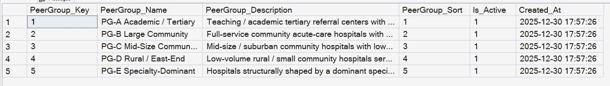

# 03 - Facility Peer Grouping Framework

## Purpose

Defines governed facility peer-group assignments used for fair cross-facility KPI comparison.

Peer grouping is structural context, not KPI math.

---

## Scope

This framework:

- Defines canonical peer groups (`PG-A` to `PG-E`)
- Seeds `Dim_PeerGroup`
- Populates `Bridge_Facility_PeerGroup`
- Uses deterministic exact-name matching for auditable assignments

This framework does not calculate KPI values.

---

## SQL Artifacts

- `seed_dim_peergroup_and_bridge.sql`
- `../03_SQL/3_6c_dim_peergroup.sql`
- `../03_SQL/3_6d_bridge_facility_peergroup.sql`

---

## Data Model Objects

- `dbo.Dim_PeerGroup`: one row per peer group
- `dbo.Bridge_Facility_PeerGroup`: facility-to-group assignment bridge

The bridge is retained for extensibility and filter-governance consistency.

---

## Canonical Peer Groups

- `PG-A Academic / Tertiary`
- `PG-B Large Community`
- `PG-C Mid-Size Community`
- `PG-D Rural / East-End`
- `PG-E Specialty-Dominant`

---

## QA Requirements

Post-seed checks must confirm:

- expected groups exist,
- assignments resolve to valid facility keys,
- unresolved names are flagged and reviewed.

---

## Downstream Usage

Used by semantic and reporting layers for interpretation-safe benchmarking.

See:

- `../README.md`
- `../../06_PBI_Semantic_Model/README.md`

---

## Visual Snapshot



---

## Folder Contents

```text
03_Facility_Peer_Grouping_Framework/
|-- README.md
|-- seed_dim_peergroup_and_bridge.sql
|-- screenshots/image.png
`-- screenshots/image-1.png
```


