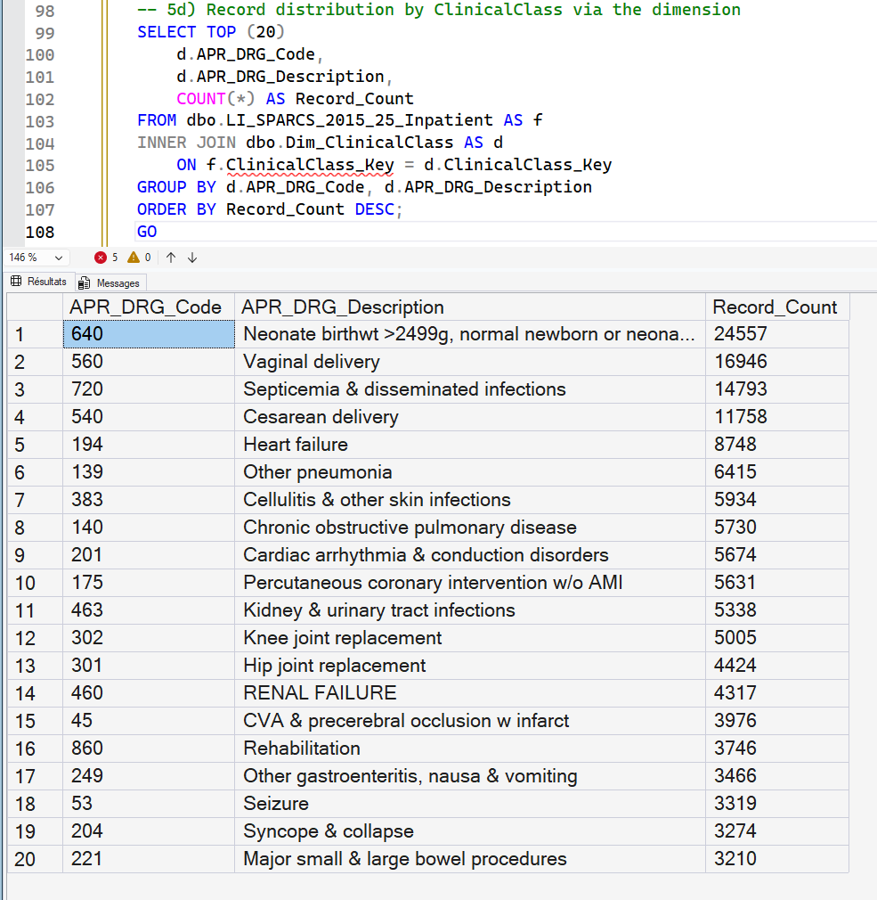

# 03 - Analytical Data Modeling

## Purpose

Builds the analytical structure consumed by validation, KPI development, and semantic modeling.

This step defines reusable dimensions, encounter-grain fact structure, and peer-group comparison context.

---

## Explainability-First Role

Modeling separates context from outcomes:

- Dimensions carry business context
- Fact layer carries encounter events and additive values
- Peer-group logic is modeled once in SQL for reuse across KPI domains

---

## Inputs and Artifacts

Input table:

- `dbo.LI_SPARCS_2015_25_Inpatient` (cleaned output from Step 02)

SQL artifacts:

- `03_SQL/3_1_dim_facility.sql`
- `03_SQL/3_2_dim_admissionType.sql`
- `03_SQL/3_3_dim_disposition.sql`
- `03_SQL/3_4_dim_payers.sql`
- `03_SQL/3_5_dim_clinical_class.sql`
- `03_SQL/3_6_dim_date.sql`
- `03_SQL/3_6b_2015_synthetic_dates.sql`
- `03_SQL/3_6c_dim_peergroup.sql`
- `03_SQL/3_6d_bridge_facility_peergroup.sql`
- `03_SQL/3_7_Fact_Table_inpatient_stay.sql`

Peer grouping submodule:

- `03_Facility_Peer_Grouping_Framework/README.md`
- `03_Facility_Peer_Grouping_Framework/seed_dim_peergroup_and_bridge.sql`

---

## Core Model Outputs

Dimensions:

- `Dim_Facility`, `Dim_AdmissionType`, `Dim_Disposition`, `Dim_Payer`
- `Dim_ClinicalClass`, `Dim_Date`, `Dim_PeerGroup`
- `Bridge_Facility_PeerGroup`

Fact layer:

- `Fact_Encounter` at encounter grain

---

## Date Modeling Note

Both standard date-dimension and synthetic-date scripts exist for 2015 portfolio usage.

Synthetic dates support modeling behavior where full real timestamp granularity is limited.

---

## Output Contract

Provides the governed structural foundation consumed by:

- `04_Analytical_Validation`
- `05_KPI_Dev`

---

## Visual Snapshot



---

## Folder Contents

```text
03_Analytical_Data_Modeling/
|-- README.md
|-- screenshots/image.png ... screenshots/image-9.png
|-- 03_SQL/
`-- 03_Facility_Peer_Grouping_Framework/
```


