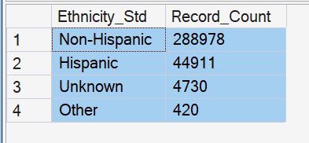
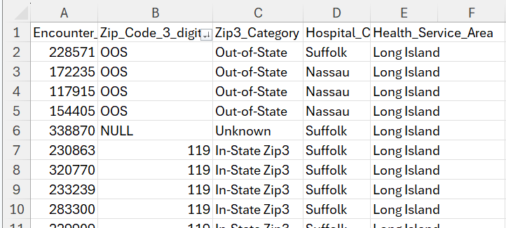
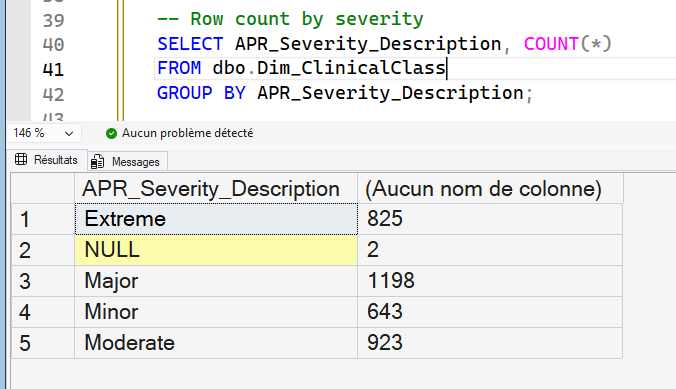
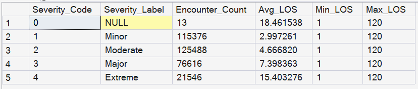
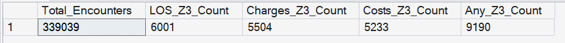
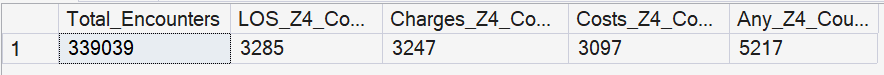
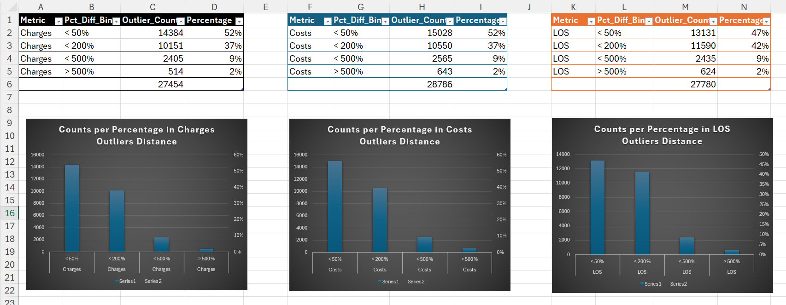

## 🧪 Step 04 — Analytical Validation & Insight Foundations

With a fully cleaned and modeled dataset in SQL Server (Steps 00–03), this phase focuses on **verifying data correctness from a business perspective** and **establishing the first hospital performance insights**.

This step introduces **Excel** as a quality-assurance tool, alongside SQL-based KPI calculations.  
This reflects real workflows in healthcare analytics where clinical and operational teams often validate data in Excel before reporting in BI tools.

---

### 🎯 Key Objectives

| Goal | What It Means | Tools |
|------|---------------|------|
| Human validation of critical fields | Spot-check transformed columns for realistic values | Excel |
| Verify analytical logic | Ensure KPIs produce expected clinical patterns | SQL |
| Build core hospital insights | First operational & financial metrics | SQL + Excel |
| Prepare for stakeholder reporting | Create interpretations clinicians & executives can trust | Excel → Power BI |

---

### 🩺 Business-Critical KPIs Developed in This Step

| KPI | Analytical Question | Stakeholder |
|-----|------------------|-------------|
| **Unplanned Admission Rate** | How many encounters strain emergency resources? | ED Leadership |
| **Cost per Encounter** | Which facilities deliver high-value vs high-cost care? | Finance |
| **Severity Mix Index (APR)** | Are we treating more complex cases? | Quality & Risk |
| **Payer Mix & Reimbursement Risk** | Where is revenue exposure concentrated? | CFO / Payer Relations |
| **Disposition Outcomes** | Do patients return safely to the community? | Care Coordination |

These serve as the **foundation for Power BI dashboards** in Step 05.

---

### 📄 Step 04.1 — Excel Quality Checks & Data Trust Validation

Before developing KPIs and dashboards, it is essential to verify that our cleaned data not only runs correctly in SQL — but also **looks clinically and financially correct** when reviewed by a human.

This reflects real workflows in healthcare analytics where Excel is used as a quick validation tool by financial analysts, clinicians, and operational leads.

---

#### 🔍 Validation Focus Areas

| Field Group | What We’re Checking | Why |
|------------|-------------------|-----|
| Monetary fields (`Total_Charges`, `Total_Costs`) | No `$`, no commas, values show correct decimal scale | Prevent incorrect sum/average calculations |
| Standardized categories | Admission Type, Disposition, Payer Group appear correctly mapped | Avoid misleading KPI groupings |
| Clinical indexes | APR Severity aligns with realistic Length of Stay ranges | Ensures clinical logic holds |
| Outliers / anomalies | Identify data points harming model accuracy | Protects decision-makers from bad insight |

---

#### 🧪 Excel Sample Exports

From SQL Server, generate small, curated extracts:

1. **Monetary Check**  
   - Top 100 encounters by Total_Charges  
   - Ensure $ signs were removed, decimals preserved, no null inflation.  
  
     - Excel file: [here](./04_Excel/04_1_Monetary_Top100.xlsx)

1. **Category Mapping Check**  
   - Random 200 rows showing:  
     `Type_of_Admission_Std`, `Patient_Disposition_Grouped`, `Race_Std`, `Ethnicity_Std`, `Payment_Typology_Group`

     **Revealed:** Excel validation surfaced a logic bug where ‘Not Span/Hispanic’ was incorrectly standardized as ‘Hispanic’. I corrected the CASE logic so that ‘Not Span/Hispanic’ is mapped to ‘Non-Hispanic’ before generic Hispanic rules. This is a good example of why human-readable validation is critical in healthcare analytics.  
     - SQL Code: [here](./04_SQL/ethnicity_std_mapping_fixing.sql)  
     - Excel file after bug fix: [here](./04_Excel/04_2_Category_Mapping_Sample.xlsx)

     

2. **Birth Weight Fix Check**  
   - Random NICU cases to confirm Birth_Weight correctly cast to integer.  
  
    **Revealed:** Birth Weight Validation  
✔ The cast to INT preserved realistic newborn weights (typically 2500–4000g).  
✔ No evidence of unit conversion errors (no values 3–4 digits smaller or larger than expected).  
✔ A high volume of 0g entries were confirmed as “not recorded / not applicable” values, typical for datasets containing both maternity and non-maternity patients.

    **Conclusion:**  
    Birth weight can be safely used for newborn cohort analysis but should be excluded from adult encounters and filtered for >0g when analyzing neonatal groups.  
    Excel file: [here](./04_Excel/04_3_BirthWeight_Sample.xlsx)

1. **ZIP Categorization Check**  
   - Sample showing `Zip_Code_3_digits` vs `Zip3_Category`.
    
        ✅ OOS only appears as `Out-of-State`  
        ✅ Null / blank become `Unknown`  
        ✅ Normal 3-digit codes → `In-State Zip3`  
        Excel file: [here](./04_Excel/04_4_Zip3_Category_Sample.xlsx)

        

2. **Fact Table Integrity Check**  
   - 100 random rows from the `Fact_Encounter` table joined with all dimensions.  
         SQL file: [here](./04_Excel/04_5_FactDim_Integrity_Sample.xlsx)  

        ✅ All rows have valid Facility_Name, Date, Payer_Group, AdmissionType_Std, Disposition_Grouped

3. **Clinical Index Validation** (APR Severity vs Length of Stay)

    We want to confirm that the **APR Severity of Illness** index behaves in a clinically logical way:
    higher severity should generally be associated with **longer Length of Stay (LOS)**.

    This protects us from building KPIs on a severity score that doesn’t reflect actual resource use.

    **Findings**:  
    The dataset already includes official clinical severity metrics, commonly used in hospital analytics:
    - APR Severity of Illness Code (1–4)
    - APR Risk of Mortality (1–4)
    - APR DRG + APR MDC codes & descriptions
    - CCS Diagnosis + CCS Procedure groupings  
  
    These fields reflect real clinical complexity, not just raw length-of-stay or death counts and:
    - Enables risk-adjusted KPIs (fair hospital comparisons)
    - Improves accuracy of LOS and mortality analysis
    - Supports clinical benchmarking and reimbursement logic
  
    We updated the Dim_ClinicalClass table to include these fields so I can:
    - Segment outcomes by severity level
    - Identify high-risk patient profiles
    - Support value-based care reporting  
    SQL file of the update [here](./04_SQL/04_Dim_ClinicClass_Update.sql)

    

    For clinical validation, we used the original SPARCS Length_of_Stay field to confirm that LOS increases with APR severity.
    For portfolio visuals, synthetic LOS_Sim is used to preserve anonymity while keeping realistic ranges.  
    SQL file [here](./04_SQL/APR_Sev_Vs_LOS_original.sql)

    

3. **Outlier & Anomaly Scan**  
SQL File: [here](./04_SQL/04_7_Outlier_Anomaly_Scan.sql)   

This step identifies statistical and operational anomalies across three high-risk fields commonly used in hospital performance analysis:

- **LOS** or length of stay  
- **Total_Charges**  
- **Total_Costs**

Outliers in these fields can distort KPIs such as LOS averages, cost-of-care metrics, and facility benchmarking. Healthcare data is also naturally right-skewed, making a dual-strategy approach essential.

### **1️⃣ Z-Score Outlier Scan (±3 & ±4 SD)**  
**Excel Files:** [here]()  

Applied statistical profiling to detect encounters with extreme values in LOS, charges, and costs.  
This method flags unusually high or low values based on standard deviation, which is widely used in healthcare audit workflows.

Using a ±3 SD Z-score rule across LOS, Charges and Costs surfaced 9,190 statistical outliers (2.7% of all encounters)—nearly 9× the rate expected under a normal distribution.

This confirms the presence of the heavy right-tail typical of real inpatient utilization data, where a small proportion of encounters drive a disproportionately high share of total inpatient days and costs.

LOS outliers (≈1.8%) mostly correspond to clinically complex or extended-stay cases. Charges (≈1.6%) and costs (≈1.5%) outliers track tightly together, validating the costing logic.

These patterns are consistent with SPARCS data and support downstream analyses such as case-mix adjustments, high-utilization cohorts, and financial risk detection.

For practical monitoring, we separated:
- Mild outliers: |Z| > 3 (used for aggregate profiling)
- Severe outliers: |Z| > 4 (used for targeted review and dashboards)

Outliers count with ±4 SD:  

### **2️⃣ IQR Outlier Scan (1.5 × IQR Rule)**  
Excel file: [here](./04_Excel/4_8_Distribution_Severity_Bins.xlsx)  

To understand how extreme our outliers are—not just how many exist—we quantified each encounter’s distance beyond the expected range defined by Tukey’s 1.5 × IQR rule.

For each metric (Length of Stay, Total Charges, Total Costs), we calculated:
- The IQR Upper Bound (Q3 + 1.5 × IQR)
- The encounter’s absolute distance beyond that bound
- The percentage difference relative to the bound (Pct_Diff)
- A severity bin indicating how extreme the deviation is (Pct_Diff_Bin)

Although thousands of encounters qualify as IQR outliers, fewer than 2% exceed 500% of the expected boundary. These extreme cases represent the most impactful utilization and financial anomalies in the dataset and are the primary focus for operational review and cost-containment strategies.

📈 Visual Insight

The Excel charts above summarize the distribution of severity bins for each metric. All three follow the same pattern:
- A steep decline from mild → moderate → strong outliers
- A long, low-probability tail of extreme (> 500%) outliers
- A smooth, monotonic slope consistent with heavy-tailed clinical and financial distributions

This validates that our anomaly detection captures:
- Routine variability
- Moderate deviations
- Operationally meaningful cases
- Small but critical extreme outliers

Such a pattern is what we expect in real hospital datasets: a small number of encounters drive a disproportionate share of LOS, resource use, and cost.

### **3️⃣ Impossible or Suspicious Value Detection**  
A final scan identified hard-rule violations, including:  
- LOS_Sim ≤ 0  
- Negative or zero Total_Charges / Total_Costs  
- **Total_Costs > Total_Charges** (not possible in real hospital finance)

These anomalies usually indicate data-entry issues, ETL defects, or source inconsistencies and must be resolved before building downstream LOS, mortality, and cost KPIs.

---

**Outcome:**  
A validated, anomaly-aware dataset ready for clinical and financial KPI modeling, ensuring that dashboards and statistical analyses are reliable and trustworthy.

The excel files with the extracts are placed in:

📂 [`/04_Excel`](./04_Excel/)

---

#### 🧠 Deliverable From Step 04

> A set of Excel files demonstrating that the cleaned data is **globally accurate**, **clinically reasonable**, and **safe** to use for operational insights.

These validation artifacts also:
- Show data governance mindset  
- Demonstrate accountability in public-health reporting  
- Show process maturity  

These files complete the data-trust layer and prepare the foundation for KPI development in Step 04.B — where numbers are **clinically sensible**, **financially accurate**, and **ready for BI visualization**.

---

### 📊 Work Outputs

✔ KPI SQL queries stored in [`04_Analytical_Validation/04_SQL`](./04_SQL/)  
✔ Extracts to Excel showing data validation samples - [excel folder](./04_Excel/)  
✔ Quick-interpretation notes for insights communication  
✔ This present updated documentation of data trustworthiness

---

