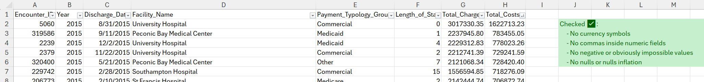

## 🧪 Step 04 — Analytical Validation & Insight Foundations

With a fully cleaned and modeled dataset in SQL Server (Steps 00–03), this phase focuses on **verifying data correctness from a business perspective** and **establishing the first hospital performance insights**.

This step introduces **Excel** as a quality-assurance tool, alongside SQL-based KPI calculations.  
This reflects real workflows in healthcare analytics where clinical and operational teams often validate data in Excel before reporting in BI tools.

---

### 🎯 Key Objectives

| Goal | What It Means | Tools |
|------|---------------|------|
| Human validation of critical fields | Spot-check transformed columns for realistic values | Excel |
| Verify analytical logic | Ensure KPIs produce expected clinical patterns | SQL |
| Build core hospital insights | First operational & financial metrics | SQL + Excel |
| Prepare for stakeholder reporting | Create interpretations clinicians & executives can trust | Excel → Power BI |

---

### 🩺 Business-Critical KPIs Developed in This Step

| KPI | Analytical Question | Stakeholder |
|-----|------------------|-------------|
| **Unplanned Admission Rate** | How many encounters strain emergency resources? | ED Leadership |
| **Cost per Encounter** | Which facilities deliver high-value vs high-cost care? | Finance |
| **Severity Mix Index (APR)** | Are we treating more complex cases? | Quality & Risk |
| **Payer Mix & Reimbursement Risk** | Where is revenue exposure concentrated? | CFO / Payer Relations |
| **Disposition Outcomes** | Do patients return safely to the community? | Care Coordination |

These serve as the **foundation for Power BI dashboards** in Step 05.

---

### 📄 Step 04.1 — Excel Quality Checks & Data Trust Validation

Before developing KPIs and dashboards, it is essential to verify that our cleaned data not only runs correctly in SQL — but also **looks clinically and financially correct** when reviewed by a human.

This reflects real workflows in healthcare analytics where Excel is used as a quick validation tool by financial analysts, clinicians, and operational leads.

---

#### 🔍 Validation Focus Areas

| Field Group | What We’re Checking | Why |
|------------|-------------------|-----|
| Monetary fields (`Total_Charges`, `Total_Costs`) | No `$`, no commas, values show correct decimal scale | Prevent incorrect sum/average calculations |
| Standardized categories | Admission Type, Disposition, Payer Group appear correctly mapped | Avoid misleading KPI groupings |
| Clinical indexes | APR Severity aligns with realistic Length of Stay ranges | Ensures clinical logic holds |
| Outliers / anomalies | Identify data points harming model accuracy | Protects decision-makers from bad insight |

---

#### 🧪 Excel Sample Exports

From SQL Server, generate small, curated extracts:

1. **Monetary Check**  
   - Top 100 encounters by Total_Charges  
   - Ensure $ signs were removed, decimals preserved, no null inflation.  
  
  Excel file: [here](./04_Excel/04_1_Monetary_Top100.xlsx)

1. **Category Mapping Check**  
   - Random 200 rows showing:  
     `Type_of_Admission_Std`, `Patient_Disposition_Grouped`, `Race_Std`, `Ethnicity_Std`, `Payment_Typology_Group`

2. **Birth Weight Fix Check**  
   - Random NICU cases to confirm Birth_Weight correctly cast to integer.

3. **ZIP Categorization Check**  
   - Sample showing `Zip_Code_3_digits` vs `Zip3_Category`.

4. **Fact Table Integrity Check**  
   - 100 random rows from the `Fact_Encounter` table joined with all dimensions.

The extracts will be placed in:

📂 `/04_Excel_Quality_Checks/`

Each sheet includes a short **interpretation note** explaining:
- What was checked  
- Why it matters  
- Result summary (Pass/Fail)  

---

#### 🧠 Deliverable From Step 04.1

> A set of Excel files demonstrating that the cleaned data is **globally accurate**, **clinically reasonable**, and **safe** to use for operational insights.

These validation artifacts also:
- Show data governance mindset  
- Demonstrate accountability in public-health reporting  
- Show process maturity  

These files complete the data-trust layer and prepare the foundation for KPI development in Step 04.2.

---

### 📊 Work Outputs

✔ KPI SQL queries stored in [`04_Analytical_Validation/04_SQL`](./04_SQL/)  
✔ Extracts to Excel showing data validation samples - [excel folder](./04_Excel/)  
✔ Quick-interpretation notes for insights communication  
✔ This present updated documentation of data trustworthiness

---

### 🚀 Deliverable From Step 04

> A validated insight foundation — where numbers are **clinically sensible**, **financially accurate**, and **ready for BI visualization**.

---

