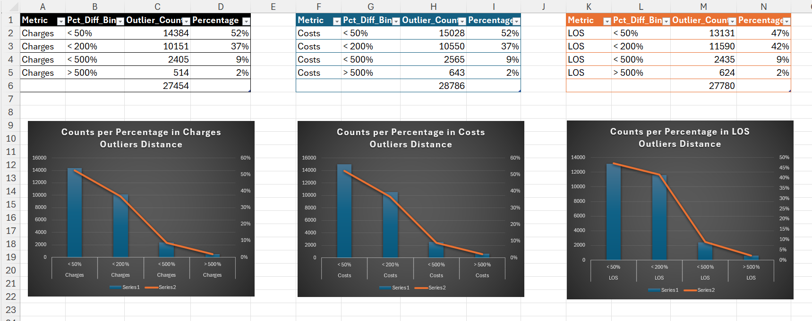
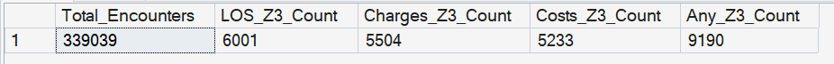
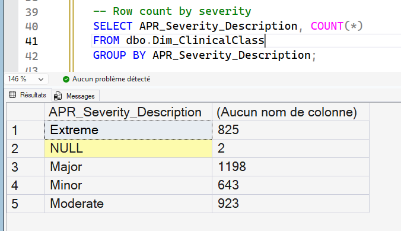

# 04 - Analytical Validation

## Purpose

Validates that cleaned and modeled data from Steps 02 and 03 is reliable for KPI development and semantic modeling.

This step certifies data trust. It does not finalize KPI definitions.

---

## Explainability-First Role

Validation is the governance gate between structural modeling and KPI logic.

It verifies that transformed data remains clinically plausible, financially coherent, and structurally consistent.

---

## Inputs and Artifacts

Inputs:

- `dbo.LI_SPARCS_2015_25_Inpatient`
- `dbo.Fact_Encounter`
- Core dimensions from Step 03

SQL artifacts:

- [`04_SQL/04_curated_extracts.sql`](/04_Analytical_Validation/04_SQL/04_curated_extracts.sql)
- [`04_SQL/ethnicity_std_mapping_fixing.sql`](/04_Analytical_Validation/04_SQL/ethnicity_std_mapping_fixing.sql)
- [`04_SQL/04_Dim_ClinicClass_Update.sql`](/04_Analytical_Validation/04_SQL/04_Dim_ClinicClass_Update.sql)
- [`04_SQL/APR_Sev_Vs_LOS_original.sql`](/04_Analytical_Validation/04_SQL/APR_Sev_Vs_LOS_original.sql)
- [`04_SQL/04_7_Outlier_Anomaly_Scan.sql`](/04_Analytical_Validation/04_SQL/04_7_Outlier_Anomaly_Scan.sql)
- [`04_SQL/04_7_Costs_greater_Charges_Actions.sql`](/04_Analytical_Validation/04_SQL/04_7_Costs_greater_Charges_Actions.sql)

Excel validation packs:

- [`04_Excel/04_1_Monetary_Top100.xlsx`](/04_Analytical_Validation/04_Excel/04_1_Monetary_Top100.xlsx)
- [`04_Excel/04_2_Category_Mapping_Sample.xlsx`](/04_Analytical_Validation/04_Excel/04_2_Category_Mapping_Sample.xlsx)
- [`04_Excel/04_3_BirthWeight_Sample.xlsx`](/04_Analytical_Validation/04_Excel/04_3_BirthWeight_Sample.xlsx)
- [`04_Excel/04_4_Zip3_Category_Sample.xlsx`](/04_Analytical_Validation/04_Excel/04_4_Zip3_Category_Sample.xlsx)
- [`04_Excel/04_5_FactDim_Integrity_Sample.xlsx`](/04_Analytical_Validation/04_Excel/04_5_FactDim_Integrity_Sample.xlsx)
- [`04_Excel/4_6_Clinical_Index_Validation.xlsx`](/04_Analytical_Validation/04_Excel/4_6_Clinical_Index_Validation.xlsx)
- [`04_Excel/4_7_ZScore_Outlier_Scan_Validation.xlsx`](/04_Analytical_Validation/04_Excel/4_7_ZScore_Outlier_Scan_Validation.xlsx)
- [`04_Excel/4_8_Distribution_Severity_Bins.xlsx`](/04_Analytical_Validation/04_Excel/4_8_Distribution_Severity_Bins.xlsx)
- [`04_Excel/04_7_Costs_Greater_Charges_Actions.xlsx`](/04_Analytical_Validation/04_Excel/04_7_Costs_Greater_Charges_Actions.xlsx)

Evidence artifacts:

- [`screenshots/charges_costs_los_outliers_distance_perc_counts_with_pct_line.png`](/04_Analytical_Validation/screenshots/charges_costs_los_outliers_distance_perc_counts_with_pct_line.png) through [`screenshots/row_count_bySeverity.png`](/04_Analytical_Validation/screenshots/row_count_bySeverity.png)

---

## Validation Workstreams

- Curated SQL extracts for manual QA in Excel
- Ethnicity mapping correction
- Clinical class enrichment checks
- APR severity vs LOS plausibility checks
- Outlier/anomaly scans (Z-score, IQR, hard-rule)
- Cost greater than charge drilldown by payer/clinical context

---

## Output Contract to Step 05

Delivers a validation-certified base for KPI development:

- documented QA evidence,
- corrected transformation logic,
- anomaly boundaries and known-review areas,
- readiness for governed KPI definition.

---

## Visual Snapshot

<details>
<summary>Show Screenshots</summary>






</details>

---

## Folder Structure

```text
04_Analytical_Validation/
|-- README.md
|-- 04_Excel/
|   |-- 04_1_Monetary_Top100.xlsx
|   |-- 04_2_Category_Mapping_Sample.xlsx
|   |-- 04_3_BirthWeight_Sample.xlsx
|   |-- 04_4_Zip3_Category_Sample.xlsx
|   |-- 04_5_FactDim_Integrity_Sample.xlsx
|   |-- 04_7_Costs_Greater_Charges_Actions.xlsx
|   |-- 4_6_Clinical_Index_Validation.xlsx
|   |-- 4_7_ZScore_Outlier_Scan_Validation.xlsx
|   `-- 4_8_Distribution_Severity_Bins.xlsx
|-- 04_SQL/
|   |-- 04_7_Costs_greater_Charges_Actions.sql
|   |-- 04_7_Outlier_Anomaly_Scan.sql
|   |-- 04_curated_extracts.sql
|   |-- 04_Dim_ClinicClass_Update.sql
|   |-- APR_Sev_Vs_LOS_original.sql
|   `-- ethnicity_std_mapping_fixing.sql
`-- screenshots/   (13 validation images)
```


