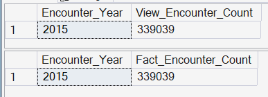
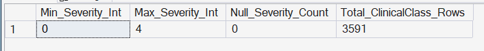
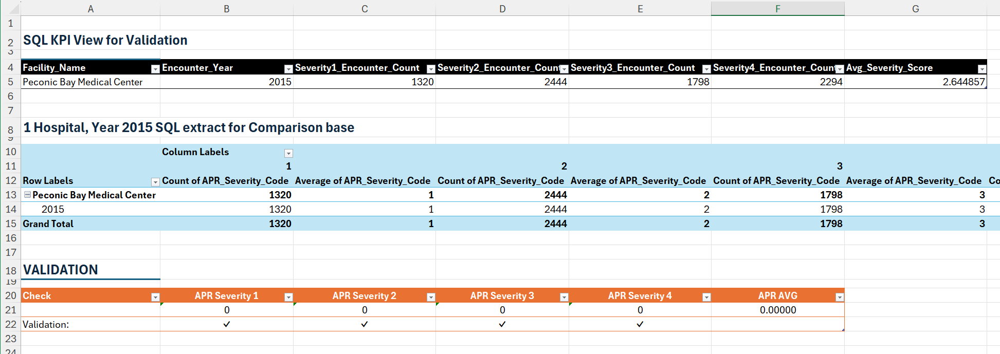
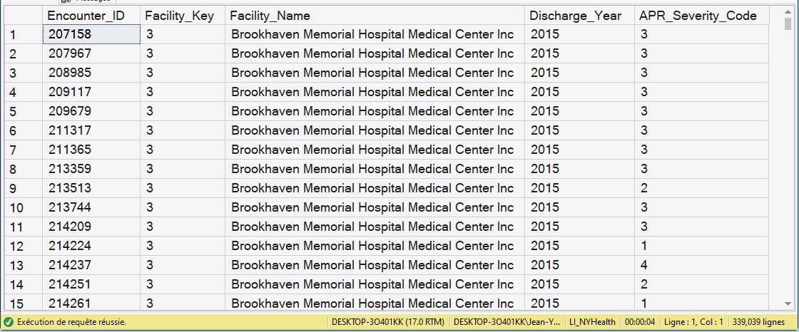
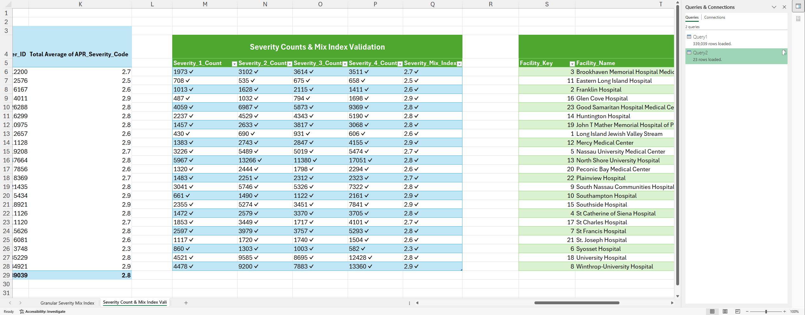

# KPI 05.01 - Severity Mix Index (APR)

## Purpose

Measures encounter acuity distribution using APR Severity of Illness (1-4) and aggregates to Facility-Year.

Severity Mix is a context KPI. It describes case complexity, not care quality.

## SQL Artifacts

- [`05_SQL/05_01_Severity_Mix_Index_APR.sql`](/05_KPI_Dev/05_01_Severity_Mix_Index_APR/05_SQL/05_01_Severity_Mix_Index_APR.sql)
- [`05_SQL/05_01B_Fact_KPI_SeverityMix_BySeverity.sql`](/05_KPI_Dev/05_01_Severity_Mix_Index_APR/05_SQL/05_01B_Fact_KPI_SeverityMix_BySeverity.sql)

## Governed Views

- `dbo.vw_KPI_05_01_SeverityMix_Encounter` (validation / encounter grain)
- `dbo.vw_KPI_05_01_SeverityMix_FacilityYear` (KPI output)
- `dbo.vw_Fact_KPI_SeverityMix_BySeverity` (distribution support)

## Validation Artifact

- [`05_Excel/05_01_Severity_Mix_Index.xlsx`](/05_KPI_Dev/05_01_Severity_Mix_Index_APR/05_Excel/05_01_Severity_Mix_Index.xlsx)

## Step-07 Consumption Note

Step 07 consumes:

- `dbo.vw_KPI_05_01_SeverityMix_FacilityYear`

Encounter-level outputs remain validation artifacts and are not the executive integration contract.

## Visual Snapshot

Show Screenshots

---

