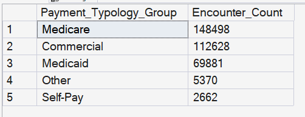

# KPI 05.02 - Payer Mix and Reimbursement Risk

## Purpose

Profiles payer composition, volume share, and financial pressure at Facility-Year-Payer grain, with Facility-Year rollups for executive interpretation.

## SQL Artifact

- `05_02_SQL/05_02_Payment_Mix_Reimbursement_Risk.sql`

## Governed Views

- `dbo.vw_KPI_05_02_PayerMix_Encounter` (validation / encounter grain)
- `dbo.vw_KPI_PayerMix_FacilityYear` (KPI output)

## Validation Artifact

- `05_02_Excel/05_02_Payment_Mix_Reimbursement_Risk_Validation.xlsx`

## Step-07 Consumption Note

Step 07 consumes:

- `dbo.vw_KPI_PayerMix_FacilityYear`

Excel-focused pivot safety logic in this SQL file supports validation and executive compatibility, but Step-07 should still use the governed KPI view as source.

## Visual Snapshot

Additional screenshots: `image-1.png`, `image-2.png`, `image-3.png`, `image-4.png`

---

