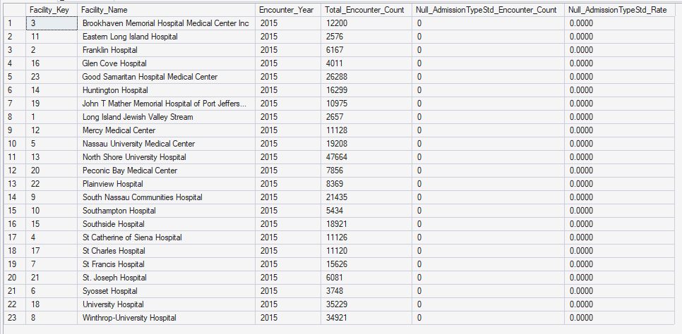
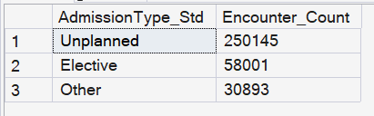
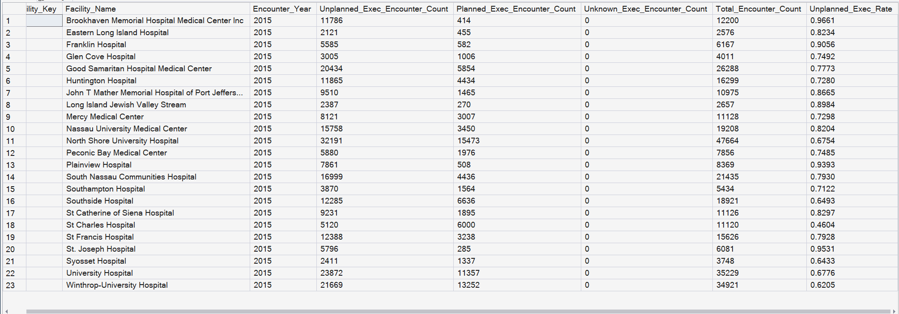
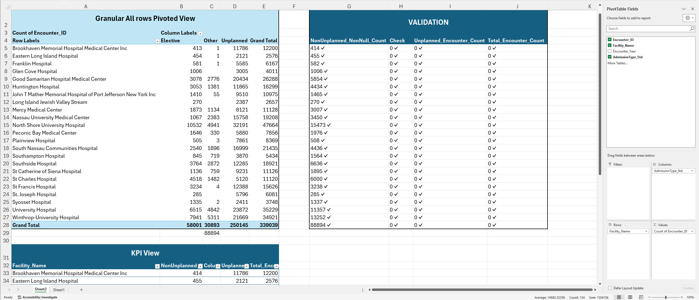
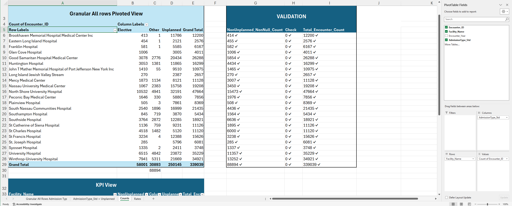
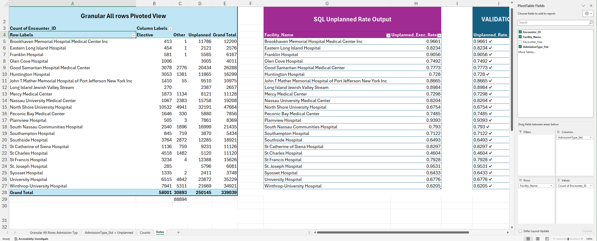
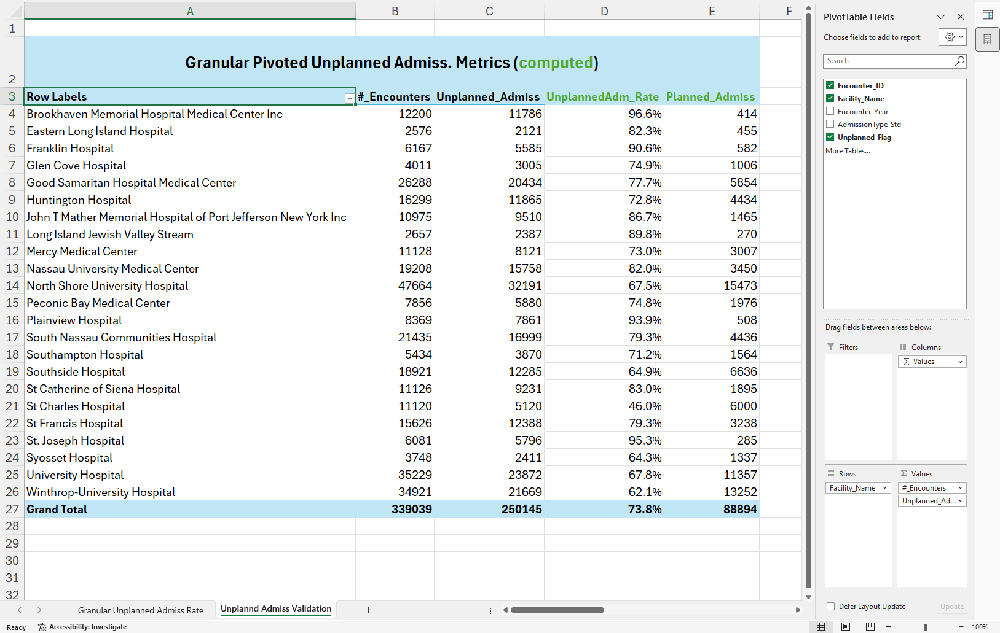
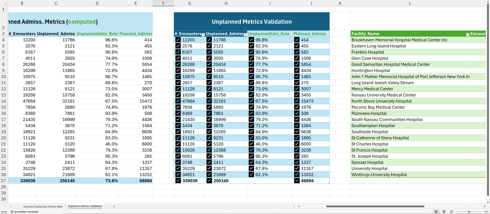

# KPI 05.03 - Unplanned Admission Rate

## Purpose

Measures unplanned intake burden (Emergency/Urgent standardized to `Unplanned`) at Facility-Year grain.

## SQL Artifact

- [`05_03_SQL/05_03_Unplanned_Admission_Rate.sql`](/05_KPI_Dev/05_03_Unplanned_Admission_Rate/05_03_SQL/05_03_Unplanned_Admission_Rate.sql)

## Governed View

- `dbo.vw_KPI_UnplannedAdmissions_FacilityYear`

## Validation Artifact

- [`05_03_Excel/05_03_Unplanned_Admission_Rate.xlsx`](/05_KPI_Dev/05_03_Unplanned_Admission_Rate/05_03_Excel/05_03_Unplanned_Admission_Rate.xlsx)

## Peer Group Reference

- [`03_Analytical_Data_Modeling/03_Facility_Peer_Grouping_Framework/README.md`](/03_Analytical_Data_Modeling/03_Facility_Peer_Grouping_Framework/README.md)

## Step-07 Consumption Note

Step 07 consumes:

- `dbo.vw_KPI_UnplannedAdmissions_FacilityYear`

This is the executive-facing KPI contract; any encounter-level checks remain validation-only.

## Visual Snapshot

Show Screenshots

---

