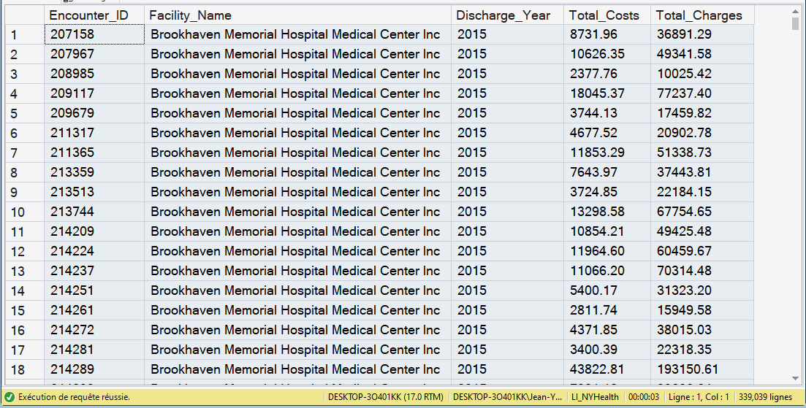

# KPI 05.07 - Medical Cost per Encounter and Margin Pressure

## Purpose

Measures financial intensity and margin pressure at Facility-Year grain using encounter-level costs and charges.

## SQL Artifact

- `05_07_SQL/05_07_MCost_and_Margin_Pressure.sql`

## Governed View

- `dbo.vw_KPI_CostPerCase_FacilityYear`

## Validation Artifact

- `05_07_Excel/05_07_MCost_Margin_Pressure.xlsx`

## Step-07 Consumption Note

Step 07 consumes:

- `dbo.vw_KPI_CostPerCase_FacilityYear`

Validation extracts and quality transparency outputs in this SQL script are auxiliary and not the executive source contract.

## Visual Snapshot

Additional screenshots: `image-1.png`, `image-2.png`, `image-3.png`

---

