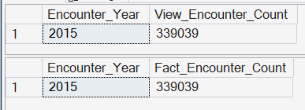
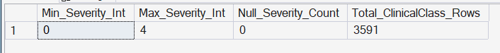

# ✅ 1. Severity Mix Index (APR)

### **What:** 
This KPI measures how many encounters fall into each APR Severity of Illness level (1–4) per facility and year, and computes an average severity score.  

### **Why:** 
It provides the core case-mix context needed to interpret all other KPIs (LOS, mortality, cost, etc.) fairly across facilities and time.

---

### Peer Group Context

Severity Mix is interpreted strictly relative to **hospital referral role**.
Direct comparisons across fundamentally different hospital types
would be misleading.

Peer groups applied for this KPI:
- Academic / Tertiary Referral Centers
- Community Hospitals (Large + Mid-Size)
- Rural / East-End Hospitals

Higher severity is expected and appropriate for tertiary centers
due to regional referral patterns and specialized services.

➡ Peer group definitions are documented in
[`03_03_Facility_Peer_Grouping_Framework`]().

---

### Design Summary

- Primary View: dbo.vw_KPI_SeverityMix_FacilityYear
- Why it comes first:
  - Pure grouping logic using APR_Severity_Code (1–4).
  - No dependency on LOS, disposition, mortality, or costs.
  - Establishes the baseline risk/acuity profile of each facility and year.
  - Critical context for interpreting every clinical KPI that follows.

- SQL Checks:   
**SQL file:** [here](./05_SQL/05_01_Severity_Mix_Index_APR.sql) 
  - Ensure that the view did not accidentally drop/duplicate encounters
  
    - 
  - Ensure the APR severity field is populated and within expected bounds
  
    - 

- Outputs: 
  - Encounter counts per severity level
  - Average severity score per facility-year
  - Foundational case-mix index for downstream comparisons

---

### Excel Validation ✅
**Excel validation file**: [here](./05_Excel/05_01_Severity_Mix_Index.xlsx)

What to validate: APR severity counts per severity and its total AVG
- The count per severity level (1–4) matches between the PivotTable and the view.
- The average severity score matches (allowing for very minor rounding differences).  

If everything matches for a couple of facilities and years, you can trust the view logic. ONLY one facility data validation was done here (Peconic Bay Medical Center). 

---