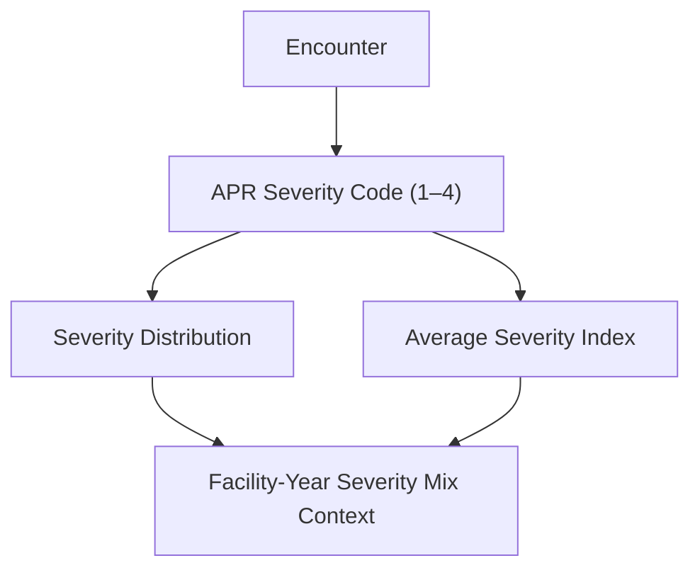

# KPI 05.01 — Severity Mix Index (APR)

This KPI evaluates the **clinical acuity profile of inpatient encounters** by measuring how encounters distribute across **APR Severity of Illness levels (1–4)** and aggregating results to the **facility–year level**.

Severity mix is a **contextual KPI**, not a performance score.  
It explains **who hospitals are treating**, not **how well they are treating them**.

> **Executive question:**  
> *Are observed differences in outcomes, LOS, or cost driven by hospital performance — or by how sick the patients are?*

---

## Table of Contents
<details>
<summary>Open TOC</summary>

- [KPI 05.01 — Severity Mix Index (APR)](#kpi-0501--severity-mix-index-apr)
  - [Table of Contents](#table-of-contents)
  - [Purpose](#purpose)
  - [Business Meaning](#business-meaning)
    - [APR Severity of Illness](#apr-severity-of-illness)
    - [Severity Mix Index](#severity-mix-index)
  - [Executive Questions This KPI Answers](#executive-questions-this-kpi-answers)
  - [Peer Group Context](#peer-group-context)
  - [Metric Definitions](#metric-definitions)
    - [Encounter Count by Severity Level](#encounter-count-by-severity-level)
    - [Reporting Grain](#reporting-grain)
    - [Conceptual Flow](#conceptual-flow)
    - [Interpretation Guidelines](#interpretation-guidelines)
    - [What It Should Look Like](#what-it-should-look-like)
    - [Known Limitations](#known-limitations)
    - [Excel Validation](#excel-validation)
      - [Objective](#objective)
      - [Required Fields (Encounter Level)](#required-fields-encounter-level)
    - [Validation Steps](#validation-steps)
    - [KPI Contract Summary](#kpi-contract-summary)
    - [Why This KPI Matters](#why-this-kpi-matters)

</details>

---

## Purpose

<details>
<summary>Why this KPI exists</summary>

Severity Mix Index establishes the **baseline clinical risk context** required to interpret every downstream KPI fairly. In other words, the Severity Mix Index tells you how sick the patients are, on average, at each hospital.

It enables leadership and analysts to:

* Separate **case-mix driven effects** from operational performance:
  * Tell the difference between “patients are sicker” and “operations are worse.”
Higher LOS or costs might simply mean the hospital treats more complex cases.
* Avoid penalizing referral hospitals for treating sicker patients:
  * Referral and tertiary hospitals should look different — that’s their job.
* Interpret LOS, mortality, cost, and margin KPIs responsibly:
  * They only make sense once you know how sick the patients were to begin with.
* Detect meaningful acuity shifts over time within a facility:
  * If severity increases within the same hospital, then rising costs or LOS may be expected — or may signal capacity stress.

Without severity context, cross-facility comparisons are **structurally misleading**, meaning if you don’t account for how sick the patients are, comparing hospitals is unfair and misleading.

</details>

---

## Business Meaning

### APR Severity of Illness

<details>
<summary>What APR severity represents</summary>

APR Severity of Illness classifies each inpatient encounter into **four standardized clinical levels** reflecting physiological burden and complication risk:

| Level | Clinical Meaning |
|------|------------------|
| 1 | Minor |
| 2 | Moderate |
| 3 | Major |
| 4 | Extreme |

Higher severity implies:

* Increased resource utilization
* Longer expected LOS
* Higher complication and mortality risk

APR severity is **clinically assigned**, independent of cost or charges.

</details>

### Severity Mix Index

<details>
<summary>How the Severity Mix Index should be read</summary>

The Severity Mix Index summarizes a hospital’s overall acuity by:

* Counting encounters per APR severity level (1–4)
* Computing a **facility–year average severity score**

In practical terms:

* **Higher index** → sicker inpatient population, higher expected resource use
* **Lower index** → less complex, lower-risk inpatient mix

This KPI provides **risk context**, not judgment.

</details>

---

## Executive Questions This KPI Answers

<details>
<summary>Decision-support use cases</summary>

* Do extreme LOS or cost values (acuity-driven outliers) reflect higher patient severity rather than operational issues?
* Which facilities consistently treat the sickest patients?
* Has the type and severity of patients (case mix) treated changed over time?
* Are outcome differences driven by care quality or by patient acuity?

</details>

---

## Peer Group Context

Severity Mix Index must be interpreted **relative to hospital referral role**.

Direct comparisons across fundamentally different hospital types  
(e.g., tertiary centers vs rural hospitals)  
introduce structural bias.

Peer groups applied for this KPI:
- Academic / Tertiary Referral Centers  
- Community Acute-Care Hospitals (Large & Mid-Size)  
- Rural / East-End Hospitals  

Higher severity is **expected and appropriate** for tertiary centers due to:
- Regional referral patterns  
- Specialized service lines  
- Higher transfer-in volumes  

➡ Peer group definitions are documented in  
[`03_03_Facility_Peer_Grouping_Framework`]()

---

## Metric Definitions
- SQL Code: [here](./05_SQL/05_01_Severity_Mix_Index_APR.sql)

<details>
<summary>Primary calculations</summary>

### Encounter Count by Severity Level

```text
Count of encounters grouped by APR_Severity_Code (1–4)
```

Average Severity Mix Index
```text
Severity Mix Index = Average(APR_Severity_Code)
```

This is a case-mix indicator, not a quality or efficiency metric.

</details>

### Reporting Grain
<details> <summary>Aggregation level</summary>

* Facility
* Discharge Year (2015)

All metrics are derived from encounter-level APR severity data, ensuring traceability and auditability.

</details>

### Conceptual Flow


### Interpretation Guidelines
Peer-Group Comparison (Required Context)
<details> <summary>Why peer grouping is mandatory</summary>

Severity mix is structurally determined by hospital role and referral patterns.  
Best practice dictates that this KPI should be interpreted:

* Within peer groups → meaningful signal
* Across peer groups → expected structural difference

Peer-based interpretation helps:
* Avoid penalizing hospitals that treat sicker patients
* Prevent misattribution of risk-driven outcomes
* Anchor executive decisions in clinical reality

**Rule**:  
Severity differences within a peer group are meaningful.  
Differences across peer groups are often expected.

</details>

### What It Should Look Like
<details> <summary>Expected patterns</summary>

* Tertiary centers skew toward Severity 3–4
* Community hospitals cluster around Severity 2–3
* Rural hospitals show lower average severity
* Severity mix is relatively stable year over year unless service scope changes

</details>

Signals Worth Investigating
<details> <summary>Potential warning signs</summary>

* Sudden shifts in severity mix without service-line changes
* Divergence from peer-group severity patterns
* Severity drops coinciding with LOS or cost improvements (possible selection effects)

</details>

### Known Limitations
<details> <summary>Important caveats</summary>

* Not risk-adjusted beyond APR severity
* Does not account for DRG-level granularity
* Dependent on accurate clinical coding
* Severity reflects admission status, not care quality

These limitations must be acknowledged in executive interpretation.

</details>

### Excel Validation
* Excel File: [here](./05_Excel/05_01_Severity_Mix_Index.xlsx)

<details> <summary>Validation approach</summary>

#### Objective

Confirm that **APR severity counts and average severity index** calculated in Excel match the SQL view outputs.

#### Required Fields (Encounter Level)
* Encounter_ID
* Facility_Name
* Discharge_Year - 2015
* APR_Severity_Code

  <details> <summary>See the SQL Output Screenshot</summary>

  

  </details>

### Validation Steps

1) Severity Counts  
    ```text
    Count encounters per APR_Severity_Code (1–4)
    ```

2) Average Severity Index  
    ```text
    Average(APR_Severity_Code)
    ```
  
3) Reconciliation
* Severity-level counts
* Facility-year average severity index

  Minor rounding differences may occur, but totals must reconcile.

  <details> 
  <summary>See the Validation Screenshot</summary>

  

  </details> 

</details>

### KPI Contract Summary
<details> 
<summary>Contract at a glance</summary>

* Input: Encounter-level APR severity classifications
* Transformation: Grouping and averaging
* Output: Facility-year severity mix profile
* Primary Use: Contextual risk adjustment for all downstream KPIs

</details>

### Why This KPI Matters
<details> 
<summary>Strategic context</summary>

Severity Mix Index is the foundation KPI for the entire performance framework.

When reviewed alongside LOS, Mortality, Cost, Margin, and Discharge KPIs, it allows leaders to understand:
* Whether performance differences are real or risk-driven
* How patient acuity shapes operational and financial outcomes
* Where true improvement opportunities actually exist

Without this KPI, every other comparison is incomplete.

</details>

---