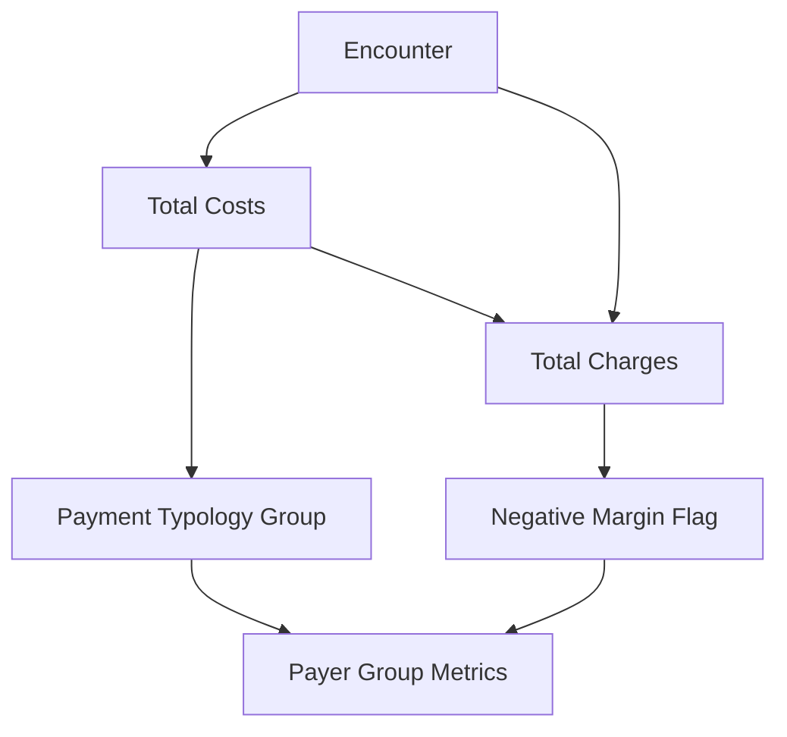
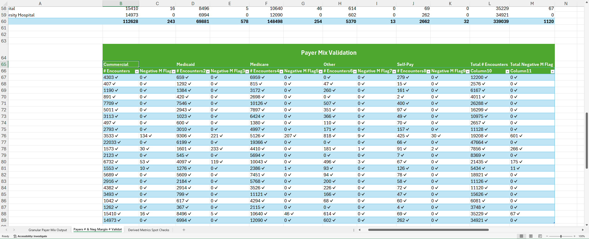
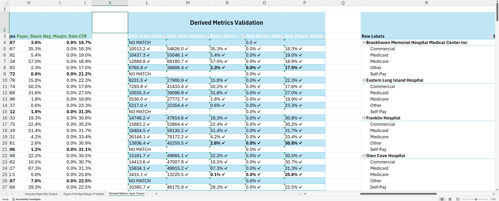

# KPI 05.02 — Payer Mix & Reimbursement Risk

This KPI evaluates **how inpatient encounter volume, costs, and financial risk are distributed across payer groups**, aggregating results to the **facility–year level** using standardized payment typologies.  
In other words, it helps explain who is paying for care, how much that care costs, and where financial pressure comes from, broken down by payer type and hospital.  

Payer mix is a **financial exposure KPI**.
It does not measure operational efficiency directly — it explains **who is paying for care and under what reimbursement risk**.

> **Executive question:**
> *Is our financial performance shaped more by how we operate — or by who is paying us?*

---

## Purpose

<details>
<summary>Why this KPI exists</summary>

Payer Mix & Reimbursement Risk establishes the **baseline revenue and reimbursement context** needed to interpret all downstream financial KPIs.

It helps leadership and analysts:

* Understand **how stable** hospital revenue is and where **financial risk comes from**, by payer type
* Identify identify which payer groups bring **in many patients (volume)** versus which ones drive **financial losses**
* Tell whether financial pressure comes from low insurance payments (**structural reimbursement risk**) or inefficient care (operational inefficiency)
* Inform which contracts to renegotiate (**payer contract strategy**) and which services to adjust or invest in (**service-line planning**)

Without payer mix context, cost, margin and pressure, KPIs are **financially incomplete and potentially misleading**.

</details>

---

## Business Meaning

### Payment Typology Groups

<details>
<summary>What payment typology represents</summary>

Each encounter is assigned to a **standardized payer group** (`Payment_Typology_Group`), such as:

* Medicare
* Medicaid
* Commercial
* Self-Pay / Uninsured
* Other Government

These groupings normalize payer analysis across facilities and contracts, enabling **system-wide comparison**.

Payment typology reflects **reimbursement behavior**, not patient severity or care quality.

</details>

### Reimbursement Risk & Negative Margin

<details>
<summary>How reimbursement risk should be read</summary>

Reimbursement risk reflects the **likelihood that costs exceed charges** for a given payer group.

Key concepts:

* **Negative-margin encounter** → costs exceed charges
* **Higher-risk payer groups** tend to:

  * Pay less per unit of care
  * Have higher denial or underpayment exposure
  * Concentrate in safety-net facilities

This KPI does **not** calculate net profit.
It surfaces **where financial stress originates** in the payer mix.

</details>

---

## Executive Questions This KPI Answers

<details>
<summary>Decision-support use cases</summary>

* Which payer groups drive the most inpatient volume?
* Which payer groups contribute disproportionately to financial losses?
* Are negative margins driven by operations or reimbursement structure?
* How exposed is each facility to high-risk payer mix?
* Do payer risks differ meaningfully across peer hospitals?

</details>

---

## Peer Group Context

Payer Mix must be interpreted **within role-based peer groups**, with an added **safety-net lens**.

Peer groups applied for this KPI:

* Academic / Tertiary Referral Centers
* Large Community Acute-Care Hospitals
* Mid-Size Community Hospitals
* Rural / East-End Hospitals

Public and safety-net hospitals are expected to show:

* Higher Medicaid and Self-Pay share
* Higher negative-margin rates

This reflects **mission and reimbursement structure**, not inefficiency.

  <details>

  <summary>Safety-net hospitals</summary>

  **Safety-net hospitals** are hospitals whose mission is to care for everyone, including patients who **cannot pay or have very limited insurance**.

  In practice, that means they:
  * Treat a **large share of uninsured, Medicaid, or under-insured patients**
  * Provide care **regardless of ability to pay**
  * Often serve as the **main hospital for vulnerable populations**

  Because of this role:
  * They receive **lower average reimbursement**
  * They often show **higher financial strain (margin pressure)**
  * That strain reflects their **mission and payer mix**, not necessarily inefficiency

  Safety-net hospitals look financially weaker on paper because they serve harder-to-pay populations — not because they provide worse care.

  </details>

➡ Peer group definitions are documented in
[`03_03_Facility_Peer_Grouping_Framework`]()

---

## Metric Definitions

* SQL Code: [here](./05_02_SQL/05_02_Payment_Mix_Reimbursement_Risk.sql)

<details>
<summary>Primary calculations</summary>

### Encounter Counts by Payer Group

```text
Count of encounters grouped by Payment_Typology_Group
```

### Share of Encounters

```text
Payer Share = Encounters per Payer Group / Total Encounters
```

### Average Financials per Payer Group

```text
Avg Costs   = Average(Total_Costs)
Avg Charges = Average(Total_Charges)
```

### Cost-to-Charge Ratio (CTR)

```text
CTR = Total_Costs / Total_Charges
```

### Negative-Margin Encounter

```text
Negative Margin = Total_Costs > Total_Charges
```

### Negative-Margin Rate

```text
Negative Margin Rate =
Count(Negative-Margin Encounters) / Total Encounters
```

</details>

---

## Reporting Grain

<details>
<summary>Aggregation level</summary>

* Facility
* Discharge Year (2015)
* Payment Typology Group

All measures are aggregated from **encounter-level financial data**, ensuring traceability and auditability.

</details>

---

## Conceptual Flow



---

## Interpretation Guidelines

### Peer-Group Comparison (Required Context)

<details>
<summary>Why peer grouping is mandatory</summary>

Payer mix and reimbursement risk are **structurally determined** by hospital role, geography, and mission.

Peer-based interpretation helps:

* Avoid penalizing safety-net hospitals
* Distinguish **payer-driven losses** from operational problems
* Make payer risk signals actionable and fair


**Rule:**
* Differences within peer groups are meaningful.
* Differences across peer groups are often expected.


</details>

### What It Should Look Like

<details>
<summary>Expected patterns</summary>

* Academic centers show higher Medicaid and complex payer mix
* Community hospitals skew more commercial
* Rural hospitals show payer concentration and volatility
* Negative-margin rates vary primarily by payer group, not facility

</details>

### Signals Worth Investigating

<details>
<summary>Potential warning signs</summary>

* Rising negative-margin rates within the same payer group
* Commercial payers showing unexpectedly high loss rates
* Sudden payer mix shifts without service-line changes
* Facilities deviating strongly from peer-group payer patterns

</details>

---

## Known Limitations

<details>
<summary>Important caveats</summary>

* Charges are a **revenue proxy**, not actual payments
* Does not account for payer contracts or negotiated rates
* No adjustment for severity or service mix
* Sensitive to coding and charge capture accuracy

These limitations must be acknowledged in executive use.

</details>

---

## Excel Validation

* Excel File: [here](./05_02_Excel/05_02_Payment_Mix_Reimbursement_Risk)

<details>
<summary>Validation approach</summary>

### Objective

* Confirm that payer **group counts and negative-margin logic** calculated in Excel **exactly match** SQL outputs.


### Required Fields (Encounter Level)

* Encounter_ID
* Facility_Name
* Discharge_Year
* Payment_Typology_Group
* Total_Costs
* Total_Charges


<details>
<summary>See the SQL Output Screenshot</summary>


</details>

### Validation Steps

Mandatory validation was performed for:
* Encounter counts by Facility–Year–Payer Group
* Negative-margin encounter classification (Total_Costs > Total_Charges)

Derived metrics (payer share, negative-margin rate, CTR, and average financials) were validated via targeted spot checks, as they are deterministic functions of the validated encounter-level measures.


  <details>
  <summary>See the Mandatory Validation Screenshot</summary>

  

  </details>

  <details>
  <summary>See Derived Metrics Validation Screenshot</summary>

  

  </details>

</details>

---

## KPI Contract Summary

<details>
<summary>Contract at a glance</summary>


Input: Encounter-level costs, charges, and payer classification
Transformation: Grouping, aggregation, and risk flagging
Output: Facility-year payer mix and reimbursement risk profile
Primary Use: Financial exposure analysis and contract strategy


</details>

---

## Why This KPI Matters

<details>
<summary>Strategic context</summary>

Payer Mix & Reimbursement Risk explains **where financial pressure originates** before operations are even considered.

When reviewed alongside Severity Mix, Cost, and Margin KPIs, it allows leaders to:

* Understand whether losses are structural or operational
* Anticipate reimbursement stress
* Make informed decisions about payer strategy, service mix, and access

Without this KPI, margin analysis lacks context.

</details>

---

