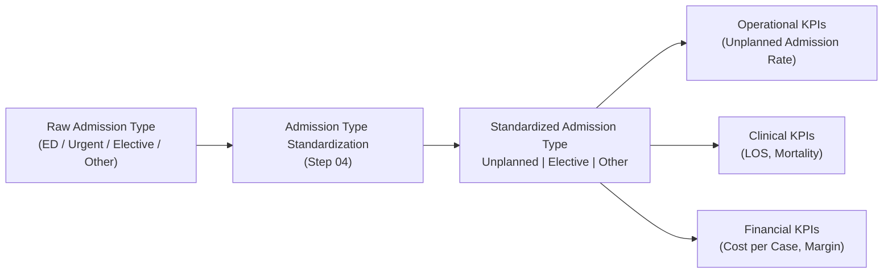
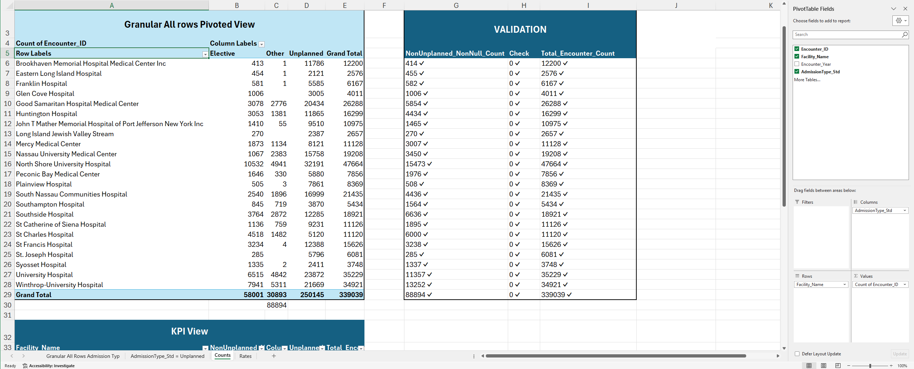

# 05.03 — Unplanned Admission Rate (ED & Urgent Intake Pressure)

## ❓ What

What is Unplanned Admission Rate

This KPI measures the **rate and volume of unplanned inpatient admissions**
(Emergency and Urgent) by facility and year, highlighting operational pressure
on emergency services and inpatient capacity.

Planned admissions are inferred by exclusion, with remaining encounters categorized as Unknown (or Other) where standardization is missing.

**NOTE:**  
Admission type standardization was performed upstream, collapsing raw ED/Urgent intake into a normalized ‘Unplanned’ category. Downstream KPIs consume this standardized semantic layer to ensure consistency across operational, LOS, and financial metrics.

## 🎯 Why

<strong>Why use it?</strong>

Unplanned admissions are a major driver of:

- Emergency Department congestion  
- Bed shortages and staffing strain  
- Higher costs and longer length of stay  

Hospital leadership closely monitors unplanned admission rates to:

- Evaluate access and throughput performance  
- Anticipate capacity constraints  
- Support ED staffing, diversion, and patient flow optimization decisions  

This KPI provides essential **operational context** before analyzing LOS,
mortality, and cost outcomes.

## 🧩 Design Summary

<strong>Details about this KPI</strong>

**Primary View:**  
`dbo.vw_KPI_UnplannedAdmissions_FacilityYear`

**Definition Logic (Project Assumption):**

- `AdmissionType_Std IN ('Emergency', 'Urgent')` → **Unplanned**
- All other standardized admission types → **Planned**

This logic aligns with common hospital reporting standards and relies on
admission-type standardization validated in **Step 04**.

## 🖥️ Primary View

<strong>Details about the Primary View</strong>

**View Name:**  
`dbo.vw_KPI_UnplannedAdmissions_FacilityYear`

**Grain:**  
Facility × Year

Each row represents one facility-year combination with:

- Total encounter volume  
- Unplanned encounter count  
- Planned encounter count  
- Unplanned admission rate  

## 🥉 Why it comes third

<strong>Why is this KPI the third one?</strong>

- Depends only on **standardized Admission Type**, already validated in Step 04  
- Does **not** depend on LOS, disposition, mortality, or financial logic  
- Establishes **operational intake pressure** before:
  - Length of stay analysis  
  - Mortality analysis  
  - Cost-per-case and margin pressure KPIs  
- Provides critical context for interpreting downstream KPIs  
  (e.g., higher LOS or costs may be driven by emergency-heavy intake)

## 🧱 Key Columns

<strong>The Key Columns that were Used</strong>

**From `Fact_Encounter`:**

- `Facility_Key`  
- `AdmissionType_Key`  
- `Admission_Date_Key`  

**From `Dim_AdmissionType`:**

- `AdmissionType_Std`  

**From `Dim_Date`:**

- `Year`  

**From `Dim_Facility`:**

- `Facility_Name`  

## 🗄️ SQL Checks

<strong>Checks made with SQL in the Server</strong>

SQL file: [here](./05_03_SQL/05_03_Unplanned_Admission_Rate.sql)  

### 1️⃣ Admission Type Coverage Check

**Purpose:**  
Ensure that all encounters map to a valid standardized admission type and that
Emergency / Urgent categories do not exist as they are grouped in the unplanned category.

**What to verify:**

- No unexpected `NULL` values in `AdmissionType_Std`  
  
  
<strong>Screenshot</strong>

  

  

- The Unplanned category (Emergency and Urgent categories) has realistic encounter volumes 
  
   

---

### 2️⃣ Unplanned Classification Validation

**Purpose:**  
Confirm that the **unplanned logic** used in the KPI view matches raw encounter data.

**What to verify:**

- Encounter-level classification:
  - Emergency / Urgent → Unplanned  
  - All others → Planned  
    
  
<strong>Screenshot</strong>

    

    

- Unplanned encounter counts match the aggregated KPI view  

---

### 3️⃣ Encounter Count Reconciliation

**Purpose:**  
Ensure the KPI view does not drop or duplicate encounters.

**Validation approach:**

Results must reconcile exactly per facility-year.

## 📤 Outputs

<strong>The List of Outputs</strong>

- Total encounters per facility-year  
- Unplanned encounter count  
- Planned encounter count  
- Unplanned admission rate (%)  

These outputs support:

- Executive operational dashboards  
- ED utilization and throughput analysis  
- Capacity planning and staffing discussions  

## 📊 Excel Validation

<strong>Logic Validation in Excel</strong>

Excel validation file: [here](./05_03_Excel/05_03_Unplanned_Admission_Rate.xlsx)  

### What to validate

- **Encounter classification**
  - Excel logic (`AdmissionType_Std = Unplanned`) matches SQL logic 
    
  
<strong>Screenshot</strong>

    

    
 
- **Counts**
  - Unplanned + Planned encounters equal Total encounters  
    
  
<strong>Screenshot</strong>

    

    
 
- **Rates**
  - Unplanned Rate = Unplanned / Total (manually recomputed in Excel)  
    
  
<strong>Screenshot</strong>

    

    
 

## 🔗 Downstream Usage

<strong>What to Do with this KPI later on</strong>

This KPI directly informs:

- Length of Stay analysis (Step 05.04)  
- Cost-per-case and margin pressure interpretation  
- ED throughput and access reporting  
- Executive operational dashboards in Power BI  

