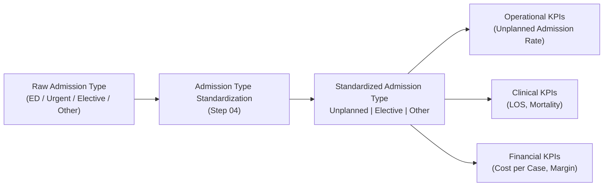

# 05.03 — Unplanned Admission Rate (ED & Urgent Intake Pressure)

## ❓ What

What is Unplanned Admission Rate

This KPI measures the **rate and volume of unplanned inpatient admissions**
(Emergency and Urgent) by facility and year - only 2015, **highlighting operational pressure
on emergency services and inpatient capacity**.

In simple terms, it helps answer...

Which hospitals are under the most pressure from emergency admissions, and how heavy that pressure is.
Unplanned admissions typically require immediate beds, staff, and resources, so higher values point to strain on emergency departments and inpatient capacity.

Admissions that are not emergency or urgent are treated as planned by elimination.
Any records that cannot be clearly classified due to missing or inconsistent data are grouped as Unknown (Other).

Important context:

The admission type logic is standardized before this KPI is calculated. All raw Emergency and Urgent intake values are first consolidated into a single Unplanned category. This ensures that all downstream analyses—operational, length-of-stay, and financial—are based on one consistent definition, avoiding conflicting counts or interpretations across reports.

## 🎯 Why

<strong>Why use it?</strong>

Unplanned admissions are a major driver of:

- Emergency Department congestion  
- Bed shortages and staffing strain  
- Higher costs and longer length of stay  

Hospital leadership closely monitors unplanned admission rates to:

- Help hospitals understand how easily patients can get care and how quickly they move through the system (**access and throughput performance**).
- Help hospitals spot upcoming bed, staff, or resource shortages before they happen (**anticipate capacity constraints**).
- Help hospitals staff emergency rooms properly (**support ED staffing**), avoid overcrowding (**patients diversion**), and move patients to beds faster (**patient flow optimization**).  

This KPI helps to set the day-to-day operational picture of the hospital before examining length of stay, mortality, and cost results (**operational context**).

---

### Peer Group Context

Unplanned admissions are evaluated using **community role–based peer groups**
that reflect emergency department volume, trauma coverage,
and safety-net responsibilities.

Peer groups applied for this KPI:
- Academic / Tertiary Referral Centers
- Large Community Acute-Care Hospitals
- Mid-Size Community Hospitals
- Rural / East-End Hospitals

Specialty-dominant hospitals are excluded, as their admission patterns
are not ED-driven and would distort comparisons.

➡ Peer group definitions are documented in
[`03_03_Facility_Peer_Grouping_Framework`]().

---

## 🧩 Design Summary

<strong>Details about this KPI</strong>

**Primary View:**  
`dbo.vw_KPI_UnplannedAdmissions_FacilityYear`

**Definition Logic (Project Assumption):**

- `AdmissionType_Std IN ('Emergency', 'Urgent')` → **Unplanned**
- All other standardized admission types → **Planned**

This logic aligns with common hospital reporting standards and relies on
admission-type standardization validated in **Step 04**.

## 🖥️ Primary View

<strong>Details about the Primary View</strong>

**View Name:**  
`dbo.vw_KPI_UnplannedAdmissions_FacilityYear`

**Grain:**  
Facility × Year

Each row represents one facility-year combination with:

- Total encounter volume  
- Unplanned encounter count  
- Planned encounter count  
- Unplanned admission rate  

## 🥉 Why it comes third

<strong>Why is this KPI the third one?</strong>

- Depends only on **standardized Admission Type**, already validated in Step 04  
- Does **not** depend on LOS, disposition, mortality, or financial logic  
- Clarifies how much pressure hospitals face at the point of admission before deeper analysis (**operational intake pressure**).:
  - Length of stay analysis  
  - Mortality analysis  
  - Cost-per-case and margin pressure KPIs  
- Provides critical context for interpreting downstream KPIs  
  (e.g., higher LOS or costs may be driven by emergency-heavy intake)

## 🧱 Key Columns

<strong>The Key Columns that were Used</strong>

**From `Fact_Encounter`:**

- `Facility_Key`  
- `AdmissionType_Key`  
- `Admission_Date_Key`  

**From `Dim_AdmissionType`:**

- `AdmissionType_Std`  

**From `Dim_Date`:**

- `Year`  

**From `Dim_Facility`:**

- `Facility_Name`  

## 📤 Outputs

<strong>The List of Outputs</strong>

SQL file: [here](./05_03_SQL/05_03_Unplanned_Admission_Rate.sql)    

- Total encounters per facility-year  
- Unplanned encounter count  
- Planned encounter count  
- Unplanned admission rate (%)  

These outputs support:

- Executive operational dashboards  
- ED utilization and throughput analysis  
- Capacity planning and staffing discussions  

## 📊 Excel Validation

<strong>Logic Validation in Excel</strong>

Excel validation file: [here](./05_03_Excel/05_03_Unplanned_Admission_Rate.xlsx)  

### What to validate

- **Encounter classification**
  - Excel logic (`AdmissionType_Std = Unplanned`) matches SQL logic 
    
  
<strong>Screenshot</strong>

    

    
 
- **Counts**
  - Unplanned + Planned encounters equal Total encounters  
    
  
<strong>Screenshot</strong>

    

    
 
- **Rates**
  - Unplanned Rate = Unplanned / Total (manually recomputed in Excel)  
    
  
<strong>Screenshot</strong>

    

    
 

## 🔗 Downstream Usage

<strong>What to Do with this KPI later on</strong>

This KPI directly informs:

- How long patients stay in the hospital (Length of Stay analysis – Step 05.04). 
- How much each case costs and where financial pressure comes from (cost-per-case and margin pressure).  
- How efficiently patients move through the emergency department and how easy it is to access care (ED throughput and access).  
- Executive operational dashboards in Power BI  

