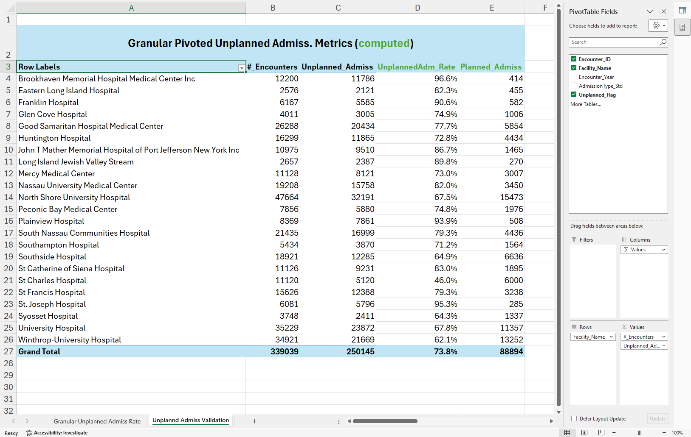
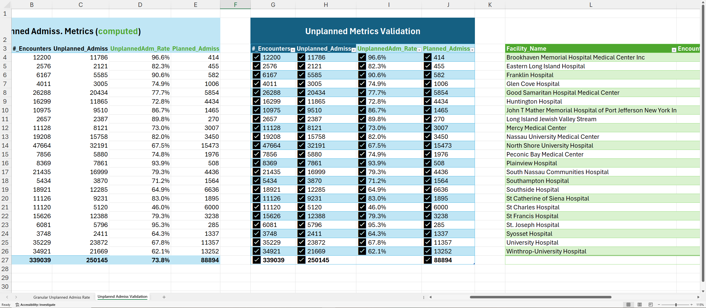

# KPI 05.03 — Unplanned Admission Rate (ED & Urgent Intake Pressure)

This KPI measures the rate and volume of unplanned inpatient admissions (Emergency and Urgent) by facility and year (2015). It quantifies operational intake pressure on EDs and inpatient capacity.

> Executive question:  
> Are observed operational strains (bed shortages, ED crowding, rising LOS) driven by higher unplanned admission volume?

---

## Table of Contents

Open TOC

- [KPI 05.03 — Unplanned Admission Rate (ED \& Urgent Intake Pressure)](#kpi-0503--unplanned-admission-rate-ed--urgent-intake-pressure)
  - [Table of Contents](#table-of-contents)
  - [Purpose](#purpose)
  - [Business Meaning](#business-meaning)
  - [Peer Group Context](#peer-group-context)
  - [Design Summary](#design-summary)
  - [Primary View](#primary-view)
  - [Metric Definitions](#metric-definitions)
  - [Reporting Grain](#reporting-grain)
  - [Conceptual Flow](#conceptual-flow)
  - [Excel Validation](#excel-validation)
  - [Downstream Usage](#downstream-usage)

---

## Purpose

This KPI identifies which facilities experience the most unplanned admission pressure and quantifies that pressure. It supports capacity planning, ED staffing decisions, and interpretation of downstream operational and clinical KPIs (LOS, mortality, cost).

---

## Business Meaning

Unplanned Admission Rate captures the proportion of inpatient encounters that originate from Emergency or Urgent intake (standardized to "Unplanned"). Higher rates indicate greater acute intake pressure and potential downstream effects on throughput, LOS, and costs.

Operationally, this KPI helps leadership to:
- Monitor ED and inpatient capacity strain.
- Trigger staffing, bed management, and diversion decisions.
- Contextualize LOS and cost patterns that may be intake-driven rather than performance-driven.

Important: Admission type values are standardized before KPI calculation (see Step 04).

---

## Peer Group Context

Interpret Unplanned Admission Rate within appropriate peer groups to avoid structural bias. Peer groups used:
- Academic / Tertiary Referral Centers
- Large Community Acute-Care Hospitals
- Mid-Size Community Hospitals
- Rural / East-End Hospitals

Specialty-dominant hospitals are excluded from comparisons because their admission patterns are atypical.

➡ Peer group definitions are documented in [`03_03_Facility_Peer_Grouping_Framework`]()

---

## Design Summary

Primary view: dbo.vw_KPI_UnplannedAdmissions_FacilityYear

Definition logic (project assumption):
- AdmissionType_Std = 'Unplanned' → Unplanned
- All other standardized admission types → Planned

Grain: Facility × Discharge Year (2015)

Outputs: Total encounters, Unplanned count, Planned count, Unplanned admission rate (%).

---

## Primary View

View name: dbo.vw_KPI_UnplannedAdmissions_FacilityYear

Each row represents a facility-year with:
- Total encounters
- Unplanned encounters
- Planned encounters
- Unplanned admission rate (Unplanned / Total)

---

## Metric Definitions
- SQL file: [here](./05_03_SQL/05_03_Unplanned_Admission_Rate.sql)  
  
Primary calculation:
- Unplanned Count: AdmissionType_Std = 'Unplanned'
- Planned Count: = AdmissionType_Std <> 'Unplanned'
- Unplanned Admission Rate = Unplanned Count / Total Encounters

This KPI depends only on standardized AdmissionType and date dimensions.

---

## Reporting Grain

- Facility
- Discharge Year (2015)

All metrics are computed from encounter-level data for traceability.

---

## Conceptual Flow

---

## Excel Validation

Excel file: [here](./05_03_Excel/05_03_Unplanned_Admission_Rate.xlsx)

Validation checklist:
1. Encounter classification: ensure AdmissionType_Std = 'Unplanned' logic in Excel matches SQL.
2. Counts: Unplanned + Planned = Total encounters.
3. Rates: Unplanned Rate = Unplanned / Total (validate manual recomputation in Excel).

   

   
Screenshot: Logic Validation

      Logic for above metrics confirmed by pivoting the granular Unplanned view:  

      

   

Screenshot: Unplanned Metrics Validation

   

Minor rounding differences may occur but totals and rates must reconcile.

---

## Downstream Usage

This KPI informs:
- Length of Stay analysis (Step 05.04)
- Cost-per-case and margin pressure analyses
- ED throughput and capacity planning dashboards in Power BI
- Operational decision-making around staffing and diversion

---
