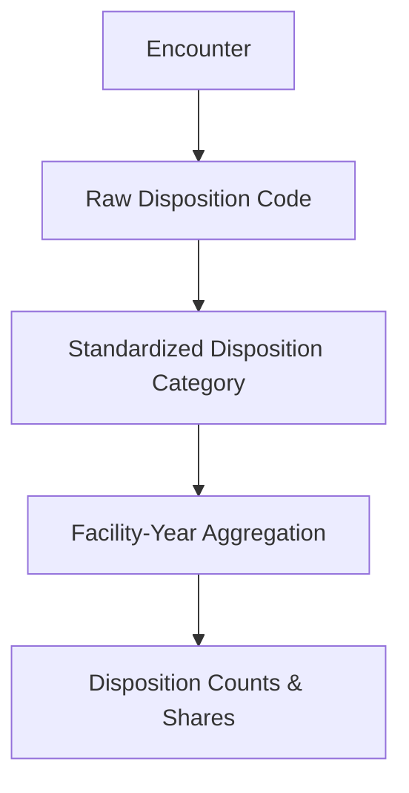

# KPI 05.04 — Disposition Outcomes

## Purpose

This KPI evaluates **how inpatient encounters conclude** by analyzing patient discharge disposition. It provides insight into care effectiveness, post-acute demand, and system pressure beyond length of stay or admission volume.

At an executive level, disposition outcomes answer a simple question:

> *When patients leave the hospital, where do they go?*

---

<strong>📑 Table of Contents</strong>

- [KPI 05.04 — Disposition Outcomes](#kpi-0504--disposition-outcomes)
  - [Purpose](#purpose)
  - [Business Meaning](#business-meaning)
  - [Executive Questions This KPI Answers](#executive-questions-this-kpi-answers)
  - [Peer Group Context](#peer-group-context)
  - [Metric Definition](#metric-definition)
    - [Primary Measures](#primary-measures)
    - [Reporting Grain](#reporting-grain)
  - [Disposition Categories (Standardized)](#disposition-categories-standardized)
  - [Conceptual Flow (High-Level)](#conceptual-flow-high-level)
  - [Interpretation Guidelines](#interpretation-guidelines)
    - [What It "Should" Look Like](#what-it-should-look-like)
    - [Signals Worth Investigating](#signals-worth-investigating)
  - [Known Limitations](#known-limitations)
  - [Excel Validation](#excel-validation)
    - [Objective](#objective)
    - [Source for Validation](#source-for-validation)
  - [KPI Contract Summary](#kpi-contract-summary)
  - [Why This KPI Matters](#why-this-kpi-matters)

---

## Business Meaning

Disposition outcomes describe the **end state of a hospital encounter**.

Examples include:

* Discharged home
* Transferred to another acute facility
* Sent to skilled nursing or rehab
* Expired (in-hospital mortality)

Tracking these outcomes helps stakeholders understand:

* How sick patients are when they arrive and how that changes over time (**severity and acuity trends**).
* How well inpatient care is working once patients are admitted (**effectiveness of inpatient care**).
* How today’s clinical decisions affect future costs and bed availability (**downstream cost and capacity impact**).
* Whether more patients are being discharged to rehabilitation, nursing facilities, or long-term care (**shifts toward post-acute or long-term care**).

Post-acute care includes places patients go after discharge to continue recovery, such as:
- Rehabilitation facilities (physical, occupational, or speech therapy)
- Skilled Nursing Facilities (SNFs) for ongoing medical or nursing support
- Long-term care or assisted living settings
- Sometimes home health services

---

## Executive Questions This KPI Answers

* Are more patients requiring **post-acute care** after discharge?
* Is **in-hospital mortality** stable, improving, or worsening?
* Do certain facilities send a much higher share of patients to rehab or skilled nursing instead of home (**discharge to rehab or SNF**)?
* Are discharge destinations shifting across the system over time (year-over-year disposition patterns not relevant as only 2015 is available)?

---

## Peer Group Context

Disposition outcomes are benchmarked using **care-complexity–aligned peer groups**
to reflect differences in post-acute needs, transfer patterns,
and specialty-driven discharge behavior.

Peer groups applied for this KPI:
- Academic / Tertiary Referral Centers
- Large Community Acute-Care Hospitals
- Mid-Size Community Hospitals
- Rural / East-End Hospitals
- Specialty-Dominant Hospitals

This ensures that higher transfer or rehab rates are interpreted
in clinical context rather than as performance deficiencies.

➡ Peer group definitions are documented in
[`03_03_Facility_Peer_Grouping_Framework`]().

---

## Metric Definition

### Primary Measures

* **Disposition Encounter Count** — number of encounters per disposition category
* **Disposition Share (%)** — proportion of total encounters by disposition

### Reporting Grain

* Facility
* Year 2015

---

## Disposition Categories (Standardized)

At the KPI layer, raw discharge codes are grouped (normalized) into clear, leadership-ready categories.

Typical standardized groups include:

* **Home** — routine discharge to home or self-care
* **Post-Acute Care** — skilled nursing, rehab, long-term care
* **Acute Transfer** — transfer to another acute hospital
* **Expired** — in-hospital mortality
* **Other / Unknown** — hospice, AMA, unmapped, or missing values

What another acute hospital means
  
The patient is transferred **from one hospital to a different hospital** for continued acute treatment.

This usually happens when:
- A higher level of care is needed (specialists, ICU, trauma center)
- Capacity issues require a transfer
- Certain procedures are only available elsewhere  
In short: the patient is still sick and still in hospital-level care.

What Hospice means
  
Hospice care is focused on comfort rather than cure, typically for patients with terminal or end-of-life conditions.

Key characteristics:
- Symptom and pain management
- No curative treatment
- Can be delivered in a hospice facility, nursing home, or at home

In analytics terms, hospice discharges indicate a transition to end-of-life care, not recovery.

Technical note — why normalization is required

Raw discharge disposition codes:

* Vary by source system
* Change over time
* Are often too granular for executive reporting

Normalization ensures:

* Stable year-over-year comparison
* Facility-to-facility comparability
* Reduced noise from coding practice differences

---

## Conceptual Flow (High-Level)

---

## Interpretation Guidelines

### What It "Should" Look Like

* **Home discharges** dominate for general acute hospitals
* **Post-acute share** aligns with patient mix and service lines
* **Expired share** is low and stable year over year

### Signals Worth Investigating

* Rising post-acute discharges **without LOS increase**
* Facility-level mortality outliers
* Large shifts between Home and Post-Acute year over year

Technical interpretation notes

* Disposition outcomes are **not quality metrics by themselves**
* Case mix, service lines, and transfer behavior strongly influence results
* Comparisons should be contextualized with LOS, age, and diagnosis mix

---

## Known Limitations

* Does not account for how sick or complex patients are (**case severity or DRG mix**).
* Measures deaths occurring during the hospital stay only, not outcomes after discharge (**in-hospital mortality**).
* Relies on correct and consistent discharge coding, so data quality directly affects results (**discharge disposition accuracy**).

---

## Excel Validation
- Excel File: [here](./05_04_Excel/05_04_Disposition_Outcomes_Counts_Rates_Validation.xlsx)  
  
### Objective

Verify that discharge **counts and percentages calculated in Excel** match the KPI results exactly.

### Source for Validation

Export **one row per patient stay**, including the following fields (**encounter-level data**):

* Encounter_ID
* Facility_Name
* Discharge_Year
* Standardized_Disposition_Category

    

    
Counts Validation Screenshot
  

    

    

    

    
Rates Validation Screenshot
  

    

    

Common Excel validation pitfalls

* Forgetting to include NULL / Unknown categories
* Filtering out transfers or expired encounters
* Mixing discharge year vs admission year

---

## KPI Contract Summary

* **Input**: Detailed discharge information for each patient stay (encounter-level data).
* **Transformation**: Raw discharge codes are grouped into clear, executive-friendly categories (Standardized executive categories).
* **Output**: For each hospital in year 2015, counts and percentages of discharge outcomes.
* **Primary Use**: Help leadership understand patient outcomes after hospitalization and future demand on post-acute and inpatient services.

---

## Why This KPI Matters

Disposition outcomes connect **inpatient care** to the broader healthcare system.

They reveal:

* Whether hospitals are stabilizing patients effectively
* How much care is shifted downstream
* Where capacity pressure is being absorbed

Used together with LOS, admissions, and unplanned intake, this KPI completes the **patient flow story** from entry to exit.

```mermaid
flowchart TD
  A["📊 Disposition Outcomes KPI"]:::title

  A --> B["Connects inpatient care to the broader healthcare system"]

   B --> C["System insights revealed"]
  C --> D["Patient stabilization effectiveness"]
  C --> E["Care shifted downstream"]
  C --> F["Capacity pressure absorption"]

  A --> H["Completes the patient flow story"]
  H --> I["From entry to exit"]

  classDef title font-size:22px,font-weight:bold,stroke-width:2px
```

Flowchart

---