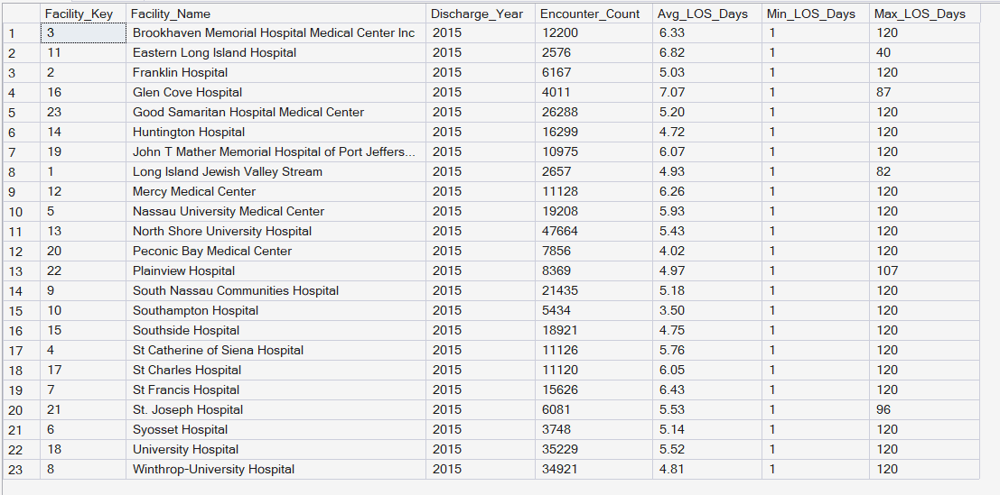
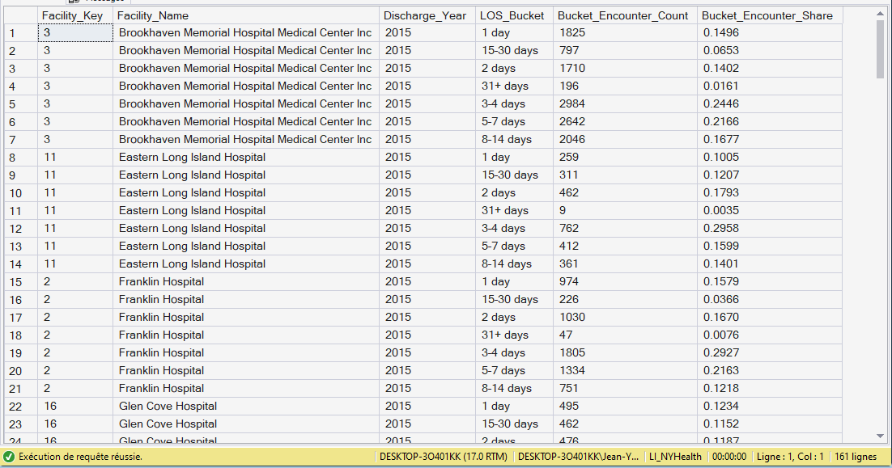
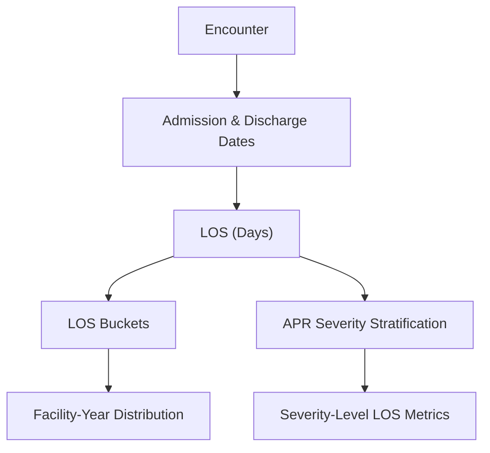
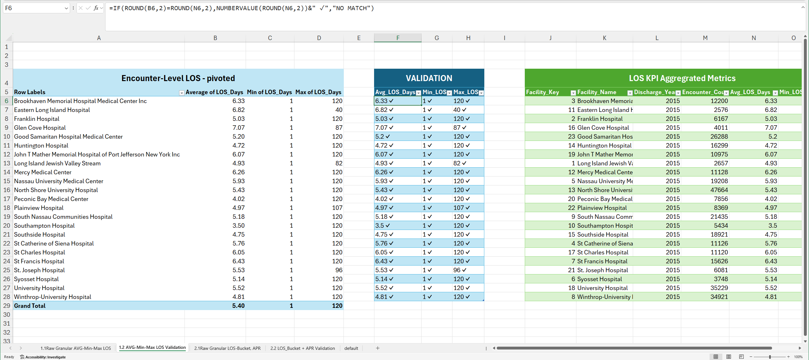
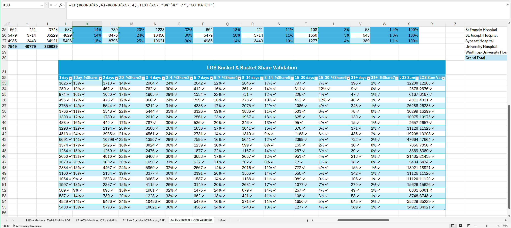
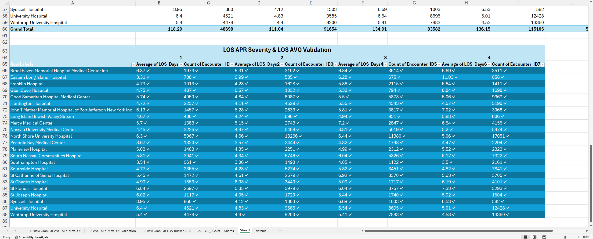

# KPI 05.05 — Length of Stay (LOS)

## Purpose

This KPI measures **how long patients remain hospitalized**, providing a core indicator of care efficiency, resource utilization, and patient complexity.

Length of Stay (LOS) is one of the most widely used operational and executive metrics because it sits at the intersection of:

* clinical severity - how sick patients are,
* care processes - how care is delivered,
* and system capacity - how much capacity the hospital has available.

---

## Business Meaning

LOS answers a straightforward question:

> *How long do patients stay in the hospital before discharge?*

Shorter stays typically indicate:

* efficient care pathways
* effective discharge planning
* reduced cost burden per admission (lower per-encounter cost pressure)

Longer stays often reflect:

* higher clinical severity
* complications or delays
* Future pressure on beds, staff, and resources (downstream capacity constraints)

---

## Executive Questions This KPI Answers

* Are patients staying longer than expected?
* Is LOS changing over time for the same facility?
* Do some hospitals have systematically longer stays?
* How strongly does LOS increase with patient severity? Meaning:
  * How much longer patients stay as their condition becomes more severe (LOS vs. patient severity)

---

## Peer Group Context

Length of Stay is benchmarked using **role-based facility peer groups**
to account for differences in acuity, teaching status, and service mix.

Peer groups applied for this KPI:
- Academic / Tertiary Referral Centers
- Large Community Acute-Care Hospitals
- Mid-Size Community Hospitals
- Rural / East-End Hospitals
- Specialty-Dominant Hospitals

This prevents penalizing tertiary and specialty centers for
structurally longer stays driven by case complexity.

➡ Peer group definitions are documented in
[`03_03_Facility_Peer_Grouping_Framework`]().


---

## Metric Definitions
  - SQL File: [Here](./05_05_SQL/05_05_Length_of_Saty.sql)  
  
### Primary LOS Metrics

* **Average LOS** — Average duration of each inpatient admission (mean inpatient days per encounter)
* **Minimum LOS** — shortest observed stay
* **Maximum LOS** — longest observed stay

  <details>
  <summary>SQL Output Screenshot</summary>

  

  </details>

### Supporting Views

* **LOS Distribution** — How hospital stays are distributed between shorter and longer durations (spread of LOS)
* **LOS by APR Severity of Illness** — How length of stay changes as patient severity increases, from level 1 to level 4 (LOS stratified by clinical severity).

  <details>
  <summary>SQL Output Screenshot</summary>

  

  </details>

---

## Reporting Grain

* Facility
* Discharge Year - 2015

LOS is first calculated for **each individual patient stay** (the whole dataset: 339.039 rows), then summarized at higher levels (encounter-level aggregation).

  <details>
  <summary>SQL Output Screenshot (whole dataset: 339.039 rows)</summary>

  

  </details>

---

## LOS Calculation Logic

LOS is defined as:

```
LOS (days) = Discharge Date − Admission Date
```

<details>
<summary>Technical note — LOS calculation details</summary>

* LOS is measured in **calendar days**
* Same-day discharges result in LOS = 0
* Negative LOS values (data errors) are excluded from KPI aggregations
* Discharge date (not admission date) anchors reporting year

</details>

---

## LOS Bucketing (Distribution View)

To make LOS easier to interpret at an executive level, stays are grouped into standardized buckets:

* 0 days
* 1 day
* 2 days
* 3–4 days
* 5–7 days
* 8–14 days
* 15–30 days
* 31+ days

These buckets highlight:

* short-stay dominance
* Extended stays by a few patients that drive disproportionate bed and cost usage (long-tail utilization).
* changes in discharge efficiency

---

## Conceptual Flow



---

## LOS by APR Severity of Illness

APR Severity of Illness (SOI) classifies encounters on a **1–4 scale**:

* **1** — Minor
* **2** — Moderate
* **3** — Major
* **4** — Extreme

LOS by severity allows stakeholders to distinguish:

* operational inefficiency **against**
* legitimately complex patient populations

<details>
<summary>Technical note — severity stratification</summary>

* Severity is derived from APR-DRG grouping logic
* Hospital stays should generally get longer as patients become more severely ill (expected LOS–severity pattern).
* Breaks from this pattern may indicate data issues or operational inefficiencies and should be reviewed more closely (investigation trigger).

</details>

---

## Interpretation Guidelines

### What it "Should" Look Like

* Average LOS is stable or improving year over year
* LOS increases progressively from severity 1 → 4
* Long-stay (15+ days) tail is limited and stable

### Signals Worth Investigating

* Longer hospital stays over time without patients being sicker, which may point to process or capacity issues (rising LOS without severity mix change).
* Very high maximum LOS caused by only a few patient stays, suggesting outliers or long-tail utilization (high max LOS from few encounters).
* Similar LOS across all severity levels, which may signal problems with severity coding or grouping logic (flat LOS by severity).

---

## Known Limitations

* LOS does **not adjust for differences in patient complexity or case mix** (no case-mix adjustment).
* LOS measures only **what happens during the hospital stay**, not outcomes after discharge (post-discharge outcomes excluded).
* Can be affected by **delays in discharge caused by logistics or capacity issues**, not necessarily care quality (discharge-related sensitivity).

---

## Excel Validation
  - Excel file: [here](./05_05_Excel/05_05_LOS_Bucket_APR_Sev_Validation.xlsx)  

### Objective

Verify that **LOS metrics calculated in Excel** exactly match KPI results.

### Data Fidelity
The granular per-encounter data and the KPI view were **imported into Excel using the Excel SQL server import** feature. I used SQL commands that were also used to compute the original KPI views in SQL Server (code made available in the SQL file). This ensures data fidelity of the data as it is imported directly from the source. 

### Source for Validation

Export **one row per patient stay** with the following fields:

* Encounter_ID
* Facility_Name
* Discharge_Year
* LOS_Days
* LOS_Bucket
* APR_Severity_Code

### Excel Validation

#### 1) Average / Min / Max LOS

* Average of LOS_Days
* Min of LOS_Days
* Max of LOS_Days

  <details>
  <summary>Validation Screenshot</summary>

  

  </details>

#### 2) LOS Distribution

* LOS_Bucket count
* LOS Bucket share

  <details>
  <summary>Validation Screenshot</summary>

  

  </details>

#### 3) LOS by APR Severity

* Average of LOS_Days
* Count per APR Severity level

  <details>
  <summary>Validation Screenshot</summary>

  

  </details>

<details>
<summary>Common Excel validation pitfalls</summary>

* Including negative or invalid LOS values
* Mixing admission year with discharge year
* Excluding zero-day stays
* Filtering out severity = NULL encounters

</details>

---

## KPI Contract Summary

* **Input**: Admission and discharge dates per encounter
* **Transformation**: LOS calculation, bucketing, severity stratification
* **Output**: Facility-Year LOS averages, ranges, distributions, and severity views
* **Primary Use**: Executive monitoring of efficiency and patient complexity

---

## Why This KPI Matters

Length of Stay is a **foundational efficiency metric**.

When combined with:

* Unplanned admissions
* Disposition outcomes
* Severity mix

LOS provides a clear view of **how effectively hospitals convert admissions into timely, appropriate discharges**.

---