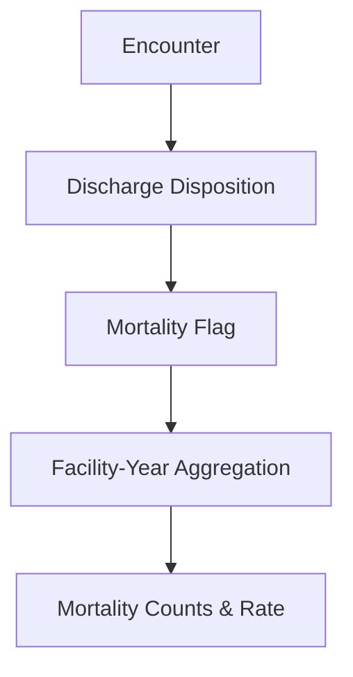

# KPI 05.06 — Mortality Rate

## Purpose

This KPI measures **in-hospital mortality**, defined as the proportion of inpatient encounters that end in death prior to discharge.

Mortality rate is a **high‑signal outcome metric**. While it must be viewed in the context of how sick patients are and the types of cases treated, it offers critical insight into patient risk levels, how effective care is, and overall system exposure to adverse outcomes.

---

## Business Meaning

Mortality rate answers a sensitive but critical question:

> *How many patients die during their hospital stay?*

At an executive level, this KPI helps distinguish:

* Which hospitals care for sicker patients (severity mix differences).
* How patient outcomes are changing over time (trend analysis).
* Where possible safety or quality concerns may exist, signaling the need for deeper investigation.

Mortality is **not** a standalone quality score — it is an outcome that must be interpreted together with how sick patients are (**severity**), how many are treated (**volume**), and what services are provided (**service mix**).

---

## Questions This KPI Answers

* Is in-hospital mortality stable, improving, or worsening?
* Are there large differences in mortality rates across facilities?
* Do mortality patterns align with patient severity and complexity?
  * Help assess **whether death rates make sense given how sick and complex the patients are** (mortality vs. severity alignment).
* Are month-over-month (year 2015) changes driven by encounter volume or by rate?
  * Help determine whether changes over time are due to treating more patients or to changes in the mortality rate itself (volume vs. rate effects).

---

### Peer Group Context

Mortality is benchmarked using **strictly role-adjusted peer groups**
to avoid false signals driven by acuity, referral patterns,
and denominator size.

Peer groups applied for this KPI:
- Academic / Tertiary Referral Centers
- Large Community Acute-Care Hospitals
- Rural / East-End Hospitals
- Specialty-Dominant Hospitals

Mid-size community hospitals are excluded due to low event counts,
which can introduce volatility and misinterpretation.

➡ Peer group definitions are documented in
[`03_03_Facility_Peer_Grouping_Framework`]().


---

## Metric Definition
- SQL file: [here](./05_06_SQL/05_06_Mortality_Rate.sql)
  
### Primary Measure

* **Mortality Rate**

```
Mortality Rate = In-Hospital Deaths / Total Inpatient Encounters
```

### Supporting Measures

* **Mortality Encounter Count** — number of encounters ending in death
* **Total Encounter Count** — denominator for rate calculation

    <details>
    <summary>Mortality Rate Encounter_Level Screenshot</summary>

    

    </details>

---

## Reporting Grain

* Facility
* Discharge Year - 2015

Mortality is anchored to **discharge year**, ensuring alignment with LOS and disposition KPIs.  
The dataset covers a single calendar year (2015). Temporal analysis therefore focuses on **month-over-month variation** using discharge month rather than year-over-year trends.

---

## How Mortality Is Identified

An encounter is classified as a mortality case if its **standardized discharge disposition** indicates patient death.

The standardized label is:

* `Death`

<details>
<summary>Technical note — mortality identification logic</summary>

* Mortality is derived from **discharge disposition**, not diagnosis codes
* Only **in-hospital deaths** are included
* Post-discharge mortality (e.g., 30‑day mortality) is out of scope
* Month-over-month analysis is based on the standardized discharge month derived from the date dimension
* Standardization ensures consistent interpretation across facilities

</details>

---

## Conceptual Flow



---

## Interpretation Guidelines

### What it "Should" Look Like

* Mortality rate is low in absolute terms:
  * In-hospital mortality rates are typically low in absolute terms (often in the 1–3% range for general acute hospitals), but small changes can still represent meaningful shifts in outcomes or patient mix.
* Rates are relatively stable year over year
* Higher mortality aligns with:

  * higher APR severity: more severely ill patients (higher APR severity)
  * tertiary or referral centers

### Signals Worth Investigating

* Sudden year-over-year rate increases
* Facilities with persistently high mortality without severity justification
* Mortality rate changes without volume change

<details>
<summary>Technical interpretation notes</summary>

* Mortality should be analyzed alongside:

  * APR Severity of Illness
  * LOS distribution
  * Disposition mix
* Small facilities may show volatile rates due to low denominators
* Rate changes should always be reviewed with counts

</details>

---

## Known Limitations

* Results are not adjusted for how sick or complex patients are (no risk adjustment).
* Does not include deaths after discharge
* Sensitive to coding accuracy of discharge disposition

---

## Excel Validation
- Excel file: [here](./05_06_Excel/05_06_Mortality_Rate.xlsx)

### Objective

Verify that **mortality counts and rates calculated in Excel** match KPI outputs exactly.

### Source for Validation

Export at the granularity of Encounter-Level, **one row per patient stay** with the following fields:

* Encounter_ID
* Facility_Name
* Discharge_Year
* Standardized_Disposition_Category
* Mortality_Flag (1 = expired, 0 = not expired)

### Excel Validation

* Count of Encounter_ID (Total Encounters)
* Sum of Mortality_Flag (Deaths)
* Add a calculated field:
    ```
    Mortality Rate = Deaths / Total Encounters
    ```

1. Compare:

   * Mortality encounter counts
   * Mortality rates

    <details>
    <summary>Mortality Rate Validation Screenshot</summary>

    

    </details>

All values must reconcile exactly with the KPI output tables.

<details>
<summary>Common Excel validation pitfalls</summary>

* Filtering out expired encounters unintentionally
* Using admission year instead of discharge year
* Comparing rates without checking underlying counts
* Excluding Unknown or NULL disposition categories

</details>

---

## KPI Contract Summary

* **Input**: Encounter-level discharge disposition
* **Transformation**: Disposition → mortality flag → aggregation
* **Output**: Facility-Year mortality counts and rate
* **Primary Use**: Executive monitoring of outcomes and system risk

---

## Why This KPI Matters

Mortality rate is one of the most **visible outcome measures** in healthcare.

When interpreted responsibly and in context, it provides:

* early warning signals
* outcome benchmarking direction
* a critical complement to utilization and flow metrics

Together with LOS, Unplanned Admissions, and Disposition Outcomes, this KPI completes the **end-of-care outcome picture**.

---