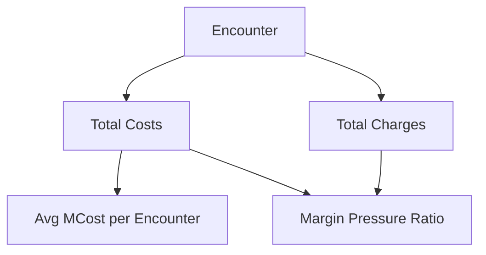

# KPI 05.07 — MCost per Encounter & Margin Pressure

This KPI evaluates **financial strain per inpatient encounter** and aggregates results to the **facility–year level** to surface cost intensity, margin erosion, and structural financial pressure across the system.

Margin pressure describes **how hard it is for a hospital to stay financially healthy while still delivering care**. It is a **system stress indicator**, not a standalone performance score.

> **Executive question:** *Are we delivering care at a cost that is financially sustainable — and if not, why?*

---

## Purpose

<details>
<summary>Why this KPI exists</summary>

This KPI connects **clinical utilization** to **financial performance** by measuring medical cost and margin outcomes at the encounter level and rolling them up consistently.

It helps distinguish:

* Structural cost drivers (severity, service mix, hospital role)
* Operational drivers (LOS, throughput, discharge delays)
* Financial exposure driven by volume

</details>

---

## Business Meaning

### Medical Cost per Encounter (MCost)

<details>
<summary>What MCost represents</summary>

MCost is the **average cost incurred by the hospital for a single inpatient stay**.

Higher MCost may result from:

* Longer length of stay (LOS)
* Higher clinical severity or complexity
* Resource‑intensive services

Lower MCost may indicate:

* Efficient care pathways
* Shorter stays
* Less complex case mix

</details>

### Margin Pressure

<details>
<summary>How margin pressure should be read</summary>

Margin pressure reflects the **gap between costs and charges**. It does **not** calculate true profitability, but signals **relative financial stress**.

In plain terms:

* **High margin pressure** → costs consume a large share of charges
* **Low margin pressure** → more financial headroom per encounter

Margin pressure must always be interpreted alongside **severity, volume, and service mix**.

</details>

---

## Executive Questions This KPI Answers

<details>
<summary>Decision‑support use cases</summary>

* Are costs per encounter rising or falling over time?
* Which facilities experience the greatest financial strain?
* Is margin pressure driven by **cost growth** or **revenue limitation**?
* Do higher‑cost facilities also show longer LOS or higher severity?

</details>

---

### Peer Group Context

Cost and margin metrics are benchmarked using **structural cost–aligned peer groups**
that reflect differences in teaching overhead, specialty services,
and rural operating constraints.

Peer groups applied for this KPI:
- Academic / Tertiary Referral Centers
- Large Community Acute-Care Hospitals
- Mid-Size Community Hospitals
- Rural / East-End Hospitals
- Specialty-Dominant Hospitals

System-wide averages are intentionally avoided to prevent masking
legitimate structural cost drivers.

➡ Peer group definitions are documented in
[`03_03_Facility_Peer_Grouping_Framework`]().


---

## Metric Definitions
- SQL Code: [here](./05_07_SQL/05_07_MCost_and_Margin_Pressure.sql)

<details>
<summary>Primary calculations</summary>

### Average MCost per Encounter

```text
Avg MCost = Total Medical Costs / Total Encounters
```

### Margin Pressure (Rate)

```text
Margin Pressure = Total Medical Costs / Total Charges
```

> A higher ratio indicates **greater financial pressure**.

### Supporting Measures

* Total Medical Costs
* Total Charges (revenue proxy)
* Encounter Count

</details>

---

## Reporting Grain

<details>
<summary>Aggregation level</summary>

* Facility
* Discharge Year (2015)

All measures are aggregated from **encounter‑level financial data**, ensuring auditability.

</details>

---

## Conceptual Flow



---

## Interpretation Guidelines

## Peer-Group Comparison (Required Context)

<details>
<summary>Why peer grouping matters for this KPI</summary>

Margin pressure is **structurally influenced** by hospital role and case mix. Best practice dictates that this KPI should be interpreted **within peer groups**, not across the entire system indiscriminately.

Peer-based comparison helps:

* Avoid penalizing hospitals that treat **sicker or more complex patients**
* Separate **structural cost differences** from true operational inefficiency
* Make margin signals **actionable and fair**, rather than misleading

Typical peer group dimensions include:

* Facility type (community, teaching, tertiary / referral)
* Service scope (general acute vs specialty-heavy)
* Typical severity and case complexity

> **Rule:** Large margin differences *within* a peer group are meaningful. Differences *across* peer groups are often expected.

</details>

### What It *Should* Look Like

<details>
<summary>Expected patterns</summary>

* MCost varies by facility size and case mix
* Margin pressure is **relatively stable within a peer group**
* Higher costs are explainable by severity, LOS, or service scope

Peer‑based comparison is essential to avoid misleading conclusions.

</details>

### Signals Worth Investigating

<details>
<summary>Potential warning signs</summary>

* Rising MCost without changes in severity or LOS
* Persistently high margin pressure within a peer group
* Large cost or margin gaps between similar facilities

</details>

---

## Known Limitations

<details>
<summary>Important caveats</summary>

* Not risk‑adjusted for clinical complexity or DRG mix
* Does not account for payer mix or contractual reimbursement
* Charges reflect pricing strategy and are a **revenue proxy**, not payments
* Sensitive to coding accuracy and discharge timing

These limitations must be acknowledged in executive use.

</details>

---

## Excel Validation
- Excel File: [here](./05_07_Excel/05_07_MCost_Margin_Pressure.xlsx)  
  
<details>
<summary>Validation approach</summary>

### Objective

Confirm that **MCost and margin pressure values calculated in Excel** exactly match KPI outputs.

### Required Fields (Encounter Level)

* Encounter_ID
* Facility_Name
* Discharge_Year
* Total_Costs
* Total_Charges

    <details>
    <summary>See the SQL Output Screenshot</summary>

    

    </details>

### Validation Steps

**1) Average MCost**

```text
Avg MCost = Sum(Total_Costs) / Count(Encounter_ID)
```

**2) Margin Pressure**

```text
Margin Pressure = Sum(Total_Costs) / Sum(Total_Charges)
```

**3) Reconciliation**

* Avg MCost per Encounter
* Margin Pressure Ratio

All results must reconcile exactly.

<details>

<summary>See the Validation Screenshot</summary>


</details>

</details>

---

## KPI Contract Summary

<details>
<summary>Contract at a glance</summary>

* **Input**: Encounter‑level costs and charges
* **Transformation**: Aggregation and ratio calculation
* **Output**: Facility‑Year cost efficiency and margin pressure indicators
* **Primary Use**: Executive financial monitoring and system stress detection

</details>

---

## Why This KPI Matters

<details>
<summary>Strategic context</summary>

MCost and margin pressure translate clinical activity into **financial reality**.

When reviewed alongside LOS, Unplanned Admissions, Discharge Disposition, and Mortality, this KPI helps leaders understand:

* Where resources are being consumed
* Where financial stress is emerging
* How clinical and financial performance intersect

</details>
