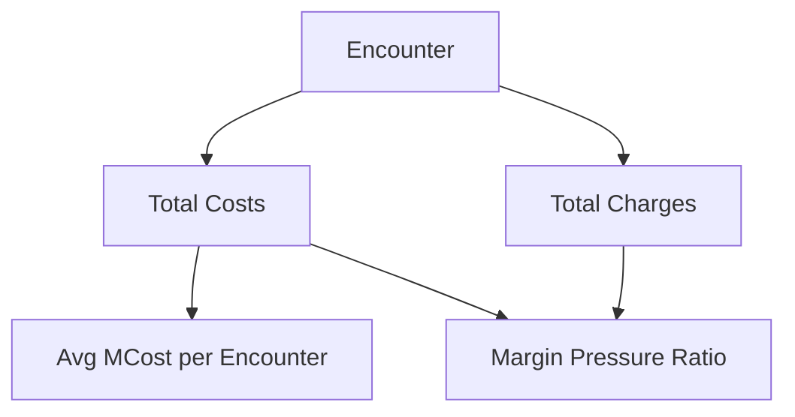

# KPI 05.07 — MCost per Encounter & Margin Pressure

## Purpose

This KPI evaluates the **financial efficiency of inpatient care** by measuring average medical cost per encounter (MCost) and the resulting **margin pressure**.

Margin Pressure describes **how hard it is for a hospital to stay financially healthy while still delivering care**.

It connects clinical utilization to financial performance and answers a fundamental executive question:

> *Are we delivering care at a cost that is financially sustainable?*

---

## Business Meaning

### Medical Cost per Encounter (MCost)

MCost represents the **average cost incurred by the hospital for a single inpatient stay**.

Higher MCost can result from:

* longer length of stay - LOS
* higher clinical severity
* resource-intensive services

Lower MCost may indicate:

* efficient care pathways
* shorter stays
* less complex case mix

### Margin Pressure

Margin pressure reflects the **gap between costs and charges**. It does not attempt to calculate true profitability, but instead signals **relative financial stress**.

In plain terms:

* High margin pressure = costs are consuming a large share of charges
* Low margin pressure = more financial headroom per encounter

---

## Executive Questions This KPI Answers

* Are costs per encounter rising or falling?
* Which facilities experience the greatest cost pressure?
* Is margin pressure driven by cost growth or revenue limitations?
* Do high-cost facilities also show longer LOS or higher severity?

---

## Metric Definitions
- SQL File: [here]()

### Primary Measures

* **Average MCost per Encounter**

```
Avg MCost = Total Medical Costs / Total Encounters
```

* **Margin Pressure Ratio**

```
Margin Pressure = Total Medical Costs / Total Charges
```

> A higher ratio indicates greater financial pressure.

### Supporting Measures

* Total Medical Costs
* Total Charges
* Encounter Count

---

## Reporting Grain

* Facility
* Discharge Year - 2015

All measures are aggregated from **encounter-level financial data**.

---

## Conceptual Flow



---

## Interpretation Guidelines

### What It "Should" Look Like

* MCost varies by facility size and case mix
* Margin pressure is relatively stable within a peer group:
  * Margin pressure does not vary widely **between hospitals of similar type and role**.
* Higher costs are explainable by severity or LOS

### Signals Worth Investigating

* Rising MCost without severity or LOS change
* Facilities with persistently high margin pressure
* Large gaps between similar facilities

<details>
<summary>Technical interpretation notes</summary>

* Charges are not a proxy for revenue but provide a consistent reference point
* Margin pressure is a *relative* indicator, not a profitability metric
* Comparisons should be peer-based where possible

Peer-based comparisons:
* Comparing hospitals with similar size, service mix, and clinical role
* Separating structural cost differences from true performance issues
* Making margin signals actionable and fair, rather than misleading

</details>

---

## Known Limitations

* Does not account for payer mix or contractual reimbursement
* Charges may vary due to pricing strategy, not utilization
* Not risk-adjusted for clinical complexity

---

## Excel Validation

### Objective

Verify that **MCost and margin pressure calculations in Excel** match KPI outputs exactly.

### Source for Validation

Export **one row per patient stay** with the following fields:

* Encounter_ID
* Facility_Name
* Discharge_Year
* Total_Costs
* Total_Charges

### Excel Validation

#### 1) Average MCost per Encounter

* Pivot rows: Facility_Name
* Pivot values:

  * Sum of Total_Costs
  * Count of Encounter_ID
* Calculate:

```
Avg MCost = Sum(Total_Costs) / Count(Encounter_ID)
```

#### 2) Margin Pressure

* Using the same pivot:

```
Margin Pressure = Sum(Total_Costs) / Sum(Total_Charges)
```

#### 3) Reconciliation

* Compare Excel results to KPI outputs:

  * Avg MCost per Encounter
  * Margin Pressure Ratio

All values must reconcile exactly.

<details>
<summary>Common Excel validation pitfalls</summary>

* Excluding encounters with zero charges or costs
* Mixing admission year and discharge year
* Filtering out extreme-cost encounters
* Comparing ratios without reconciling underlying totals

</details>

---

## KPI Contract Summary

* **Input**: Encounter-level costs and charges
* **Transformation**: Aggregation and ratio calculation
* **Output**: Facility-Year cost efficiency and margin pressure indicators
* **Primary Use**: Executive financial monitoring and cost control insight

---

## Why This KPI Matters

MCost and margin pressure translate clinical activity into **financial reality**.

Together with LOS, Unplanned Admissions, and Mortality, this KPI helps leaders understand:

* where resources are being consumed
* where financial stress is emerging
* and how clinical and financial performance intersect

---