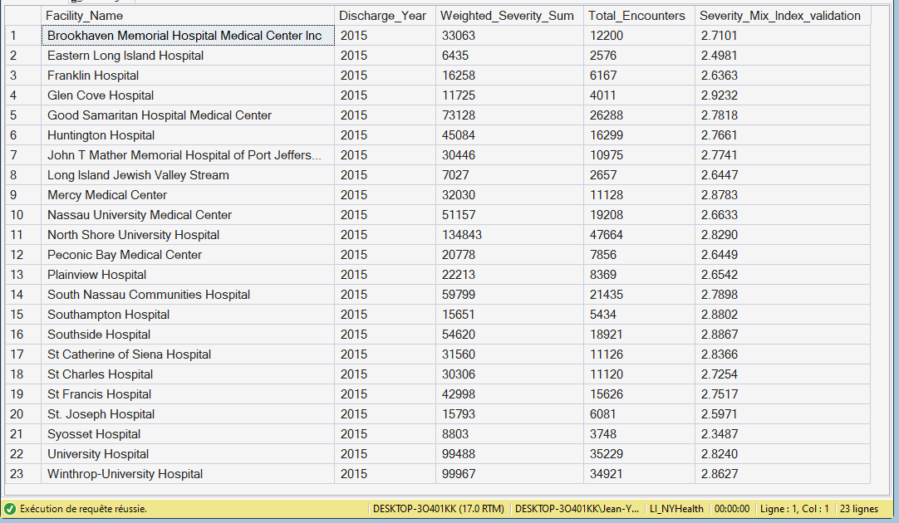

# KPI 06.01.02 - Fact_KPI_PayerMix

## Purpose

Creates payer-mix semantic facts for reimbursement exposure and financial interpretation.

## SQL Artifact

- [`06_01_02_Fact_KPI_PayerMix.sql`](/06_PBI_Semantic_Model/01_Fact_KPI_SQL/06_01_02_Fact_KPI_PayerMix/06_01_02_Fact_KPI_PayerMix.sql)

## Output Table

- `dbo.Fact_KPI_PayerMix`

## Grain

- One row per Facility x Discharge Year x Payer Group

## Core Fields

- `Payer_Encounter_Count`
- `Total_Encounters_Facility_Year`
- `Payer_Encounter_Share_validation` (reconciliation support)

## Key Relationships

- `Facility_Key` -> `Dim_Facility.Facility_Key`
- `Discharge_Year` -> `Dim_Year.Discharge_Year`
- `Payer_Key` -> `Dim_Payer.Payer_Key`

## Visual Snapshot

Show Screenshots

---

## Screenshot

- [`screenshots/image.png`](/06_PBI_Semantic_Model/01_Fact_KPI_SQL/06_01_02_Fact_KPI_PayerMix/screenshots/image.png)

