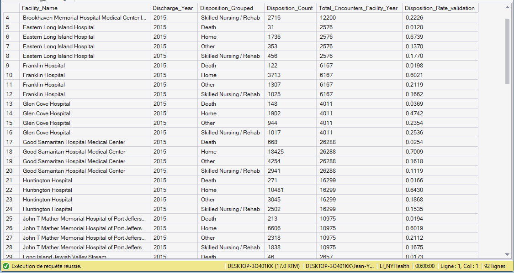

# 06.01.04 — `Fact_KPI_Disposition`

**Purpose**  
Describes **how inpatient encounters conclude**, connecting care to downstream systems.

**Grain**  
- One row per **Facility × Discharge Year × Disposition Group**

**Primary Measures**
- 4 Disposition Categories: `Disposition_Grouped`: Death - Home - Other - Skill Nursing / Rehab
- Numerator: `Disposition_Count`
- Denominator: `Total_Encounters_Facility_Year`
- Metric: `Disposition_Rate_validation` (stored for validation, recomputed in DAX)

🖼 See the Output Screenshot

**Key Dimensions**
- Facility
- Date (Year)
- Disposition

**Analytical Role**
- Flow completion KPI
- Interpreted alongside LOS and mortality

---