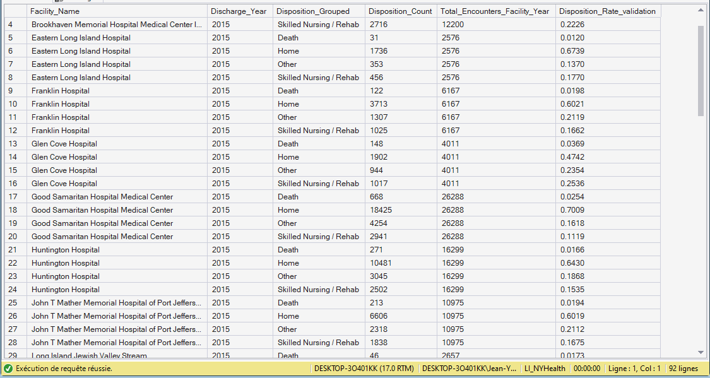

# KPI 06.01.04 - Fact_KPI_Disposition

## Purpose

Creates discharge-exit semantic facts for flow and downstream utilization analysis.

## SQL Artifact

- `06_01_04_Fact_KPI_Disposition.sql`

## Output Table

- `dbo.Fact_KPI_Disposition`

## Grain

- One row per Facility x Discharge Year x Disposition Group

## Core Fields

- `Disposition_Count`
- `Total_Encounters_Facility_Year`
- `Disposition_Rate_validation` (reconciliation support)

## Key Relationships

- `Facility_Key` -> `Dim_Facility.Facility_Key`
- `Discharge_Year` -> `Dim_Year.Discharge_Year`
- `Disposition_Key` -> `Dim_Disposition.Disposition_Key`

## Visual Snapshot

---

## Screenshot

- `screenshots/image.png`

