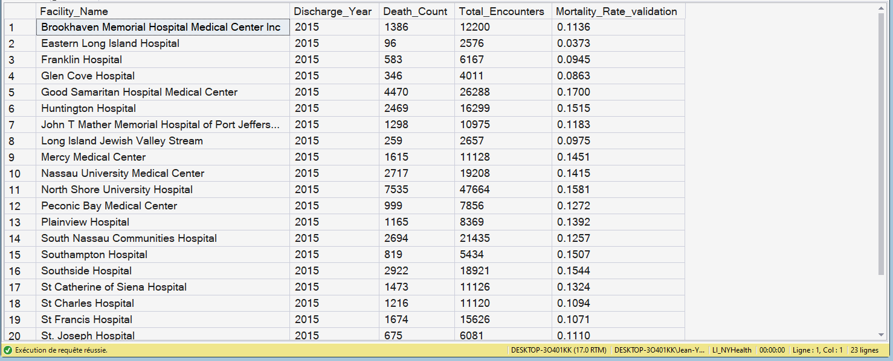

# KPI 06.01.06 - Fact_KPI_Mortality

## Purpose

Creates mortality semantic facts for outcome-risk interpretation.

## SQL Artifact

- [`06_01_06_Fact_KPI_Mortality.sql`](/06_PBI_Semantic_Model/01_Fact_KPI_SQL/06_01_06_Fact_KPI_Mortality/06_01_06_Fact_KPI_Mortality.sql)

## Output Table

- `dbo.Fact_KPI_Mortality`

## Grain

- One row per Facility x Discharge Year

## Core Fields

- `Death_Count`
- `Total_Encounters`
- `Mortality_Rate_validation` (reconciliation support)

## Key Relationships

- `Facility_Key` -> `Dim_Facility.Facility_Key`
- `Discharge_Year` -> `Dim_Year.Discharge_Year`

## Visual Snapshot

Show Screenshots

---

## Screenshot

- [`screenshots/fact_kpi_mortality_preview.png`](/06_PBI_Semantic_Model/01_Fact_KPI_SQL/06_01_06_Fact_KPI_Mortality/screenshots/fact_kpi_mortality_preview.png)

