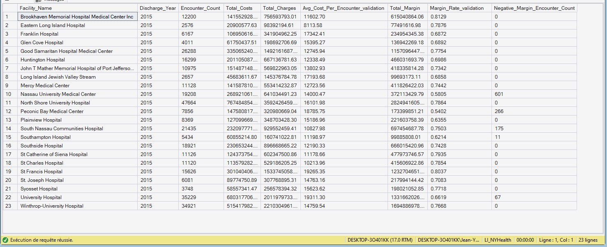

# KPI 06.01.07 - Fact_KPI_FinancialPressure

## Purpose

Creates financial-pressure semantic facts for cost intensity and margin stress interpretation.

## SQL Artifact

- `06_01_07_Fact_KPI_FinancialPressure.sql`

## Output Table

- `dbo.Fact_KPI_FinancialPressure`

## Grain

- One row per Facility x Discharge Year

## Core Fields

- `Total_Costs`
- `Total_Charges`
- `Encounter_Count`
- `Negative_Margin_Encounter_Count`
- `Avg_Cost_Per_Encounter_validation`, `Margin_Rate_validation` (reconciliation support)

## Key Relationships

- `Facility_Key` -> `Dim_Facility.Facility_Key`
- `Discharge_Year` -> `Dim_Year.Discharge_Year`

## Visual Snapshot

---

## Screenshot

- `screenshots/image.png`

