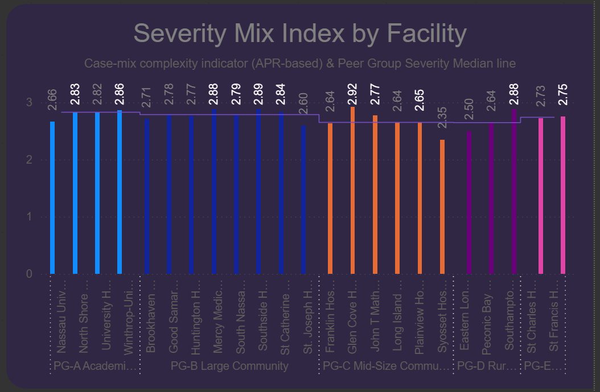

# 06.03 — Power BI Semantic Model

This folder documents the **Power BI semantic model** built on top of the
validated KPI facts (`06.01`) and governed dimensions (`06.02`).

It represents the transition from:

- **SQL-defined KPI contracts**
to
- **Certified analytical consumption** in Power BI and Excel

This is where business logic becomes **measures**, relationships are enforced,
and executive-safe analytics are exposed.

The Power BI semantic model is implemented as a Power BI Project (.pbip) to enable:
* source control
* explicit relationship management
* and governed measure versioning

---

<strong>📑 Table of Contents</strong>

- [06.03 — Power BI Semantic Model](#0603--power-bi-semantic-model)
  - [Purpose of This Step](#purpose-of-this-step)
  - [What This Folder Contains](#what-this-folder-contains)
  - [Semantic Model Design Principles](#semantic-model-design-principles)
  - [Model Structure Overview](#model-structure-overview)
    - [Fact Tables](#fact-tables)
    - [Dimensions](#dimensions)
  - [Relationship Rules (Non-Negotiable)](#relationship-rules-non-negotiable)
  - [Fact ↔ Dimension Wiring (Keys + Attributes)](#fact--dimension-wiring-keys--attributes)
  - [Measure Strategy](#measure-strategy)
    - [Additive vs Derived Measures](#additive-vs-derived-measures)
    - [KPI Guardrail Measures (Data Stability \& Interpretability)](#kpi-guardrail-measures-data-stability--interpretability)
      - [Rationale](#rationale)
      - [Guardrail Rule](#guardrail-rule)
      - [Implementation Pattern](#implementation-pattern)
    - [Certified KPI Measures](#certified-kpi-measures)
  - [Visual Interpretation Rules](#visual-interpretation-rules)
    - [Severity Context — Severity Mix Index by Facility](#severity-context--severity-mix-index-by-facility)
    - [Important Clarifications](#important-clarifications)
    - [How to Interpret “Above Median”](#how-to-interpret-above-median)
    - [Analytical Implication](#analytical-implication)
    - [Executive Shortcut](#executive-shortcut)
  - [Excel Compatibility \& Executive Access](#excel-compatibility--executive-access)
  - [Governance \& Change Control](#governance--change-control)
  - [Relationship to Other Steps](#relationship-to-other-steps)
  - [Final Principle](#final-principle)

---

## Purpose of This Step

The purpose of `06.03` is to implement a **clean, deterministic, and governed**
Power BI semantic model that:

- faithfully represents SQL KPI contracts
- prevents metric drift
- supports **both Power BI dashboards and Excel pivot analysis**
- is safe for executive self-service

This step answers the question:

> *How do we expose complex healthcare KPIs in a way that is accurate,
> reproducible, and usable by non-technical decision-makers?*

---

## What This Folder Contains

This folder documents:

- the **Power BI data model structure**
- relationship rules between facts and dimensions
- the **measure layer design philosophy**
- how KPIs are safely consumed in:
  - Power BI dashboards
  - Excel (via Analyze in Excel / PivotTables)

**Important:**  
No SQL logic lives here.  
All transformations are upstream (Steps 04–05).

---

## Semantic Model Design Principles

The Power BI model strictly follows these principles:

1. **Star schema only**
   - No snowflaking
   - No fact-to-fact relationships

2. **One KPI = one fact table**
   - Matches `Fact_KPI_*` design from `06.01`

3. **Dimensions are conformed**
   - Exactly as documented in `06.02`
   - No KPI-specific dimension variants

4. **No business logic in visuals**
   - All logic lives in measures
   - Visuals only consume certified measures

5. **Excel-safe by design**
   - No ambiguous filters
   - Deterministic aggregation behavior

---

## Model Structure Overview

### Fact Tables

The semantic model imports the following **KPI fact tables**:

| Fact Table | KPI Purpose | Grain |
|-----------|-------------|-------|
| `Fact_KPI_SeverityMix` | Clinical acuity context | Facility–Year |
| `Fact_KPI_PayerMix` | Payer distribution & risk | Facility–Year–Payer |
| `Fact_KPI_Unplanned` | Acute intake pressure | Facility–Year |
| `Fact_KPI_Disposition` | Discharge outcomes | Facility–Year–Disposition |
| `Fact_KPI_LOS_Summary` | Length of stay behavior | Facility–Year |
| `Fact_KPI_Mortality` | In-hospital mortality | Facility–Year |
| `Fact_KPI_FinancialPressure` | Cost & margin stress | Facility–Year |

Each fact:
- is imported at its **authoritative grain**
- contains only **additive components**
- does **not** store final KPI rates as authoritative values

Supporting Views:
- vw_Fact_KPI_SeverityMix_BySeverity  
  Facility-Year-Severity fact used for APR severity distribution visuals
  (context only, no performance interpretation).

---

### Dimensions

All facts connect to the conformed dimensions documented in `06.02`:

- `Dim_Date`
- `Dim_Facility`
- `Dim_Payer`
- `Dim_AdmissionType`
- `Dim_Disposition`
- `Dim_ClinicalClass` (selective usage)

No dimension logic is duplicated or redefined in Power BI.

---

## Relationship Rules (Non-Negotiable)

The following modeling rules are enforced:

- **One-to-many** relationships only  
  (Dimension → Fact)

- **Single-direction filtering**
  - Prevents ambiguous paths
  - Ensures Excel pivots behave predictably

- **No bi-directional filters**
- **No fact-to-fact joins**
- **One active date relationship per fact**
  - Anchored on **Discharge Date**

Violating any of these rules invalidates KPI certification.

---

## Fact ↔ Dimension Wiring (Keys + Attributes)

> Relationship pattern: Dim[PK] (1) → Fact[FK] (*), single-direction.
> Date is anchored on Discharge: Fact.Discharge_Date_Key → Dim_Date.Date_Key

| Fact Table | Fact FK (column) | Dimension | Dim PK | Common Dim Attributes to expose |
|---|---|---|---|---|
| Fact_KPI_SeverityMix | Facility_Key | Dim_Facility | Facility_Key | Facility_Name |
|  | Discharge_Date_Key | Dim_Date | Date_Key | Year, Quarter, Month, Month_Number |
|  | ClinicalClass_Key (optional) | Dim_ClinicalClass | ClinicalClass_Key | APR_Severity_Code, APR_Severity_Description, APR_Risk_Of_Mortality_Desc |
| Fact_KPI_PayerMix | Facility_Key | Dim_Facility | Facility_Key | Facility_Name |
|  | Discharge_Date_Key | Dim_Date | Date_Key | Year, Quarter, Month, Month_Number |
|  | Payer_Key | Dim_Payer | Payer_Key | Payment_Typology_Group, Payment_Typology_1 |
| Fact_KPI_Unplanned | Facility_Key | Dim_Facility | Facility_Key | Facility_Name |
|  | Discharge_Date_Key | Dim_Date | Date_Key | Year, Quarter, Month, Month_Number |
|  | AdmissionType_Key (optional) | Dim_AdmissionType | AdmissionType_Key | AdmissionType_Std |
| Fact_KPI_Disposition | Facility_Key | Dim_Facility | Facility_Key | Facility_Name |
|  | Discharge_Date_Key | Dim_Date | Date_Key | Year, Quarter, Month, Month_Number |
|  | Disposition_Key | Dim_Disposition | Disposition_Key | Disposition_Grouped |
| Fact_KPI_LOS_Summary | Facility_Key | Dim_Facility | Facility_Key | Facility_Name |
|  | Discharge_Date_Key | Dim_Date | Date_Key | Year, Quarter, Month, Month_Number |
|  | ClinicalClass_Key (optional) | Dim_ClinicalClass | ClinicalClass_Key | APR_Severity_Code, APR_Severity_Description |
| Fact_KPI_Mortality | Facility_Key | Dim_Facility | Facility_Key | Facility_Name |
|  | Discharge_Date_Key | Dim_Date | Date_Key | Year, Quarter, Month, Month_Number |
|  | Disposition_Key (optional) | Dim_Disposition | Disposition_Key | Disposition_Grouped |
|  | ClinicalClass_Key (optional) | Dim_ClinicalClass | ClinicalClass_Key | APR_Severity_Code, APR_Risk_Of_Mortality_Desc |
| Fact_KPI_FinancialPressure | Facility_Key | Dim_Facility | Facility_Key | Facility_Name |
|  | Discharge_Date_Key | Dim_Date | Date_Key | Year, Quarter, Month, Month_Number |
|  | Payer_Key (optional) | Dim_Payer | Payer_Key | Payment_Typology_Group |

---

## Measure Strategy

### Additive vs Derived Measures

**Authoritative data in the model is additive.**

Examples:
- Encounter_Count
- Total_Costs
- Total_Charges
- Death_Count
- Unplanned_Encounter_Count

All **rates, averages, and indexes** are computed as **DAX measures**.

This guarantees:
- correct aggregation at any slice level
- Excel and Power BI consistency
- auditability

---

### KPI Guardrail Measures (Data Stability & Interpretability)

To prevent misleading KPI interpretation caused by low encounter volumes, the semantic model implements **guardrail measures** for all rate-based KPIs.

#### Rationale
Rate and ratio KPIs (e.g., Mortality Rate, Unplanned Admission Rate, Average LOS) can fluctuate dramatically when calculated on very small denominators.  
To ensure analytical stability and executive trust, KPIs are suppressed when the underlying encounter volume is insufficient.

#### Guardrail Rule
- A **minimum denominator threshold of 30 encounters** is enforced.
- When the denominator is below this threshold:
  - KPI measures return `BLANK()`
  - Visuals automatically suppress the value
  - Totals and roll-ups remain mathematically correct

#### Implementation Pattern
Each guarded KPI follows a consistent DAX structure:
1. Explicit denominator measure
2. Volume sufficiency check (`>= 30`)
3. Guarded KPI using `DIVIDE()` and conditional blanking

This approach:
- avoids divide-by-zero errors
- prevents unstable or misleading rates
- keeps visuals clean without manual filtering
- preserves correct aggregation behavior across Facility and Year

**How to use them in reports:**

- **Guarded KPI measures** (e.g. *Mortality Rate (Guarded)*, *Average LOS (Guarded)*)  
  Use these measures in **all executive-facing visuals** (cards, tables, trend lines).  
  When encounter volume is below the defined threshold, the measure returns `BLANK()`, and the visual automatically suppresses the value.

- **Data coverage flags** (e.g. *Mortality Has Volume*)  
  Use these measures as **visual-level filters** with the condition `= 1`.  
  This ensures visuals only display results based on stable and interpretable data.

Guardrail logic is applied **at the measure level**, not in SQL, ensuring transparency and flexibility within the semantic model.

---

### Certified KPI Measures

Each KPI exposes **certified measures**, such as:

- Severity Mix Index
- Unplanned Admission Rate
- Average LOS
- Mortality Rate
- Average Medical Cost per Encounter
- Margin Pressure Ratio
- Payer Share (%)

Rules:
- Measures are documented
- Measures are reused across visuals
- Visuals do **not** recompute logic

Hidden columns:
- SQL validation fields
- pre-computed averages
- reconciliation helpers

---

## Visual Interpretation Rules

### Severity Context — Severity Mix Index by Facility

**Applies to:**
- **Report page:** *Severity Context*
- **Visual:** *Severity Mix Index by Facility*
- **Helper measure:** `Is Above PG Severity Median`

In the visual *Severity Mix Index by Facility*, a facility is flagged as **“above peer-group median severity”** when its **Severity Mix Index (SMI)** is *numerically greater* than the median SMI of its **own assigned peer group**.

This logic is implemented via the DAX helper measure:  
`Is Above PG Severity Median`

Facilities for which this measure evaluates to `TRUE` are rendered in **white** in the *Severity Mix Index by Facility* visual.  

See the Screenshot

This designation is **directional**, not a threshold of material clinical difference.

---

### Important Clarifications

- The **Severity Mix Index (SMI)** is calculated and evaluated at **full numeric precision**.
- Visual labels format SMI values to **two decimals** for readability, but **comparisons and medians use the underlying full-precision values**.
- As a result, facilities that appear visually equal to the peer median may still be classified as slightly above or below due to **decimal-level differences**.

---

### How to Interpret “Above Median”

**Above median means:**
- The facility’s case-mix complexity is **marginally higher** than the peer-group midpoint.
- The facility sits on the **upper half of its peer-group severity distribution**.

**Above median does *not* mean:**
- Clinically meaningfully sicker patients
- A materially different acuity profile
- A risk-adjustment requirement by default

---

### Analytical Implication

Because **Severity Mix Index values remain tightly clustered within each peer group**, small deviations above the peer median should be interpreted as **context-setting signals**, not as drivers of downstream performance variation on their own.

Accordingly:
- LOS, cost, and outcome KPIs should **not be over-attributed to acuity**
- **Operational factors** remain the primary focus when interpreting downstream KPIs
- **Peer-group comparisons** remain fair, proportional, and statistically honest

---

### Executive Shortcut

> *“Above peer median indicates relative position within the peer distribution, not a clinically material difference in patient acuity.”*

---

## Excel Compatibility & Executive Access

This semantic model is intentionally **Excel-first compatible**.

Executives can:
- connect using **Analyze in Excel**
- build PivotTables
- slice by Facility, Year, Payer, Disposition, etc.
- trust that totals and rates reconcile with Power BI

Why this matters:
- Many executives prefer Excel
- Excel is still the dominant executive analysis tool
- A governed semantic model enables **safe self-service**

Power BI becomes the **same truth**, just visualized differently.

---

## Governance & Change Control

Any change to the Power BI semantic model requires:

1. Upstream SQL change (Step 05)
2. Excel reconciliation (Step 06.05)
3. Measure impact review
4. README update
5. Re-certification of affected KPIs

No ad-hoc measures.
No silent changes.

---

## Relationship to Other Steps

- **06.01 — Fact KPI SQL**  
  Defines the authoritative KPI data contracts

- **06.02 — Dimensions Reference**  
  Defines the slicing vocabulary and keys

- **06.03 — Power BI Model**  
  Implements relationships and measures

- **06.05 — Validation**  
  Confirms Power BI results reconcile with Excel and SQL

---

## Final Principle

> **SQL defines truth.**  
> **The semantic model enforces it.**  
> **Power BI and Excel merely consume it.**

This step ensures that executive insight is built on
**discipline, not convenience**.
