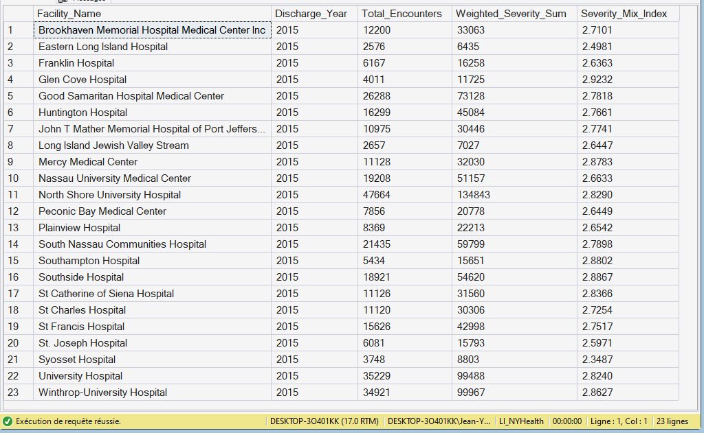

# 06.01.01 — `Fact_KPI_SeverityMix`
- SQL File: [here](.)
  
**Purpose**  
Establishes the **clinical acuity baseline** required to interpret all downstream KPIs fairly.

**Grain**  
- One row per **Facility × Discharge Year** - 2015

**Primary Measures**
- Total encounters
- Weighted severity sum
- Severity Mix Index (stored for validation, recomputed in DAX)

🖼 See the Output Screenshot

**Key Dimensions**
- Facility
- Date (Year)

**Analytical Role**
- Context KPI (not performance)
- Used to explain LOS, mortality, and cost differences

---