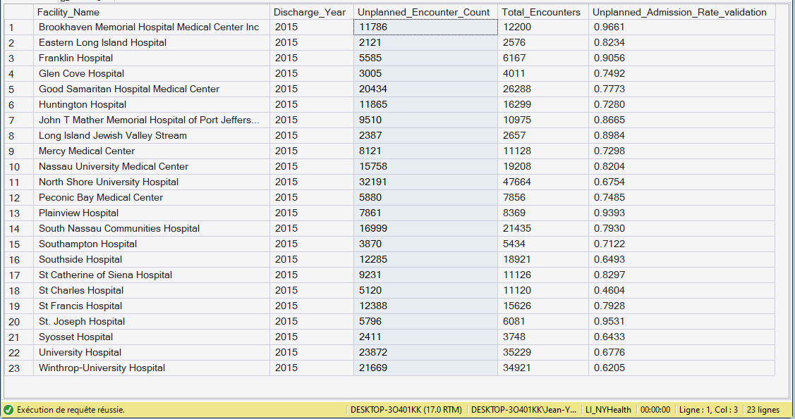

# 06.01.03 — `Fact_KPI_Unplanned`

**Purpose**  
Measures **acute intake pressure** driven by unplanned admissions.

**Grain**  
- One row per **Facility × Discharge Year**

**Primary Measures**
- Numerator: `Unplanned_Encounter_Count`
- Denominator: `Total_Encounters`
- Metric: `Unplanned_Admission_Rate_validation`

🖼 See the Output Screenshot

**Key Dimensions**
- Facility
- Date (Year)

**Analytical Role**
- Intake pressure indicator
- Interpreted before LOS and cost KPIs

---
