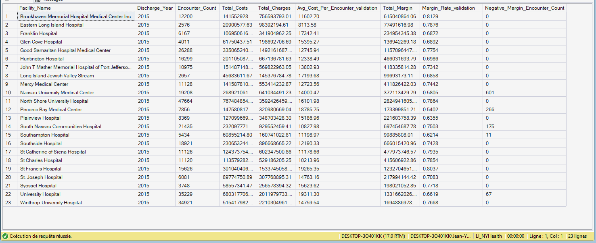

# 06.01.07 — `Fact_KPI_FinancialPressure`

**Purpose**  
Surfaces **cost intensity and margin stress** at the system level.

**Grain**  
- One row per **Facility × Discharge Year**

**Primary Measures**
- Numerator: `Total_Costs`
- Denominator: `Encounter_Count`
  - Metric: `Avg_Cost_Per_Encounter_validation` (stored for validation, recomputed in DAX)
- Numerator: `Total_Margin`
- Denominator: `Total_Charges`
  - Metric: `Margin_Rate_validation` (stored for validation, recomputed in DAX)
- `Negative_Margin_Encounter_Count`

🖼 See the Output Screenshot

**Key Dimensions**
- Facility
- Date (Year)

**Analytical Role**
- Financial sustainability indicator
- Contextualized by payer mix and severity

---